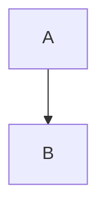

# GPandas Documentation

Source for the official [GPandas](https://github.com/apoplexi24/gpandas) documentation site,
built with [Fumadocs](https://fumadocs.dev) on Next.js.

GPandas is a high-performance data manipulation library for Go, inspired by Python's pandas.
The initial idea was to make it easy for python folks to transition to golang with as little
friction as possible.

## Prerequisites

- Node.js 20 or later
- npm (or pnpm/yarn/bun)

## Running locally

```bash
npm install
npm run dev
```

The site is served at `http://localhost:3000`.

| Script                 | Purpose                                     |
| ---------------------- | ------------------------------------------- |
| `npm run dev`          | Dev server with hot reload                  |
| `npm run build`        | Production build                            |
| `npm run start`        | Serve the production build                  |
| `npm run types:check`  | TypeScript check without emitting           |

## Project layout

```
app/
  (home)/            Landing page, uses Fumadocs HomeLayout
  docs/              Docs routes: layout + [[...slug]] catch-all page
  api/search/        Search endpoint backed by the content source
components/
  mdx.tsx            MDX component map (includes Mermaid)
  mermaid.tsx        Client-side Mermaid renderer
content/docs/        All documentation, as MDX + meta.json
lib/
  source.ts          Fumadocs content source + lucide icon resolver
  layout.shared.tsx  Nav options shared by the docs and home layouts
public/              Static assets (images, embedded plot examples)
scripts/             One-off migration script from the previous Hugo site
```

## Writing content

Pages live in `content/docs` and mirror the URL structure. A page is an `.mdx` file with
frontmatter:

```mdx
---
title: "Loading CSV Files"
description: "Learn how to load CSV files into a DataFrame using gpandas.Read_csv()"
icon: "FileUp"
---

## Overview

Content goes here.
```

`icon` is a [lucide-react](https://lucide.dev/icons/) icon name; it is resolved in
`lib/source.ts` and shown in the sidebar.

### Sections and ordering

Each folder carries a `meta.json` that names the section and fixes the order of its items.
Items not listed in `pages` are not rendered.

```json
{
  "title": "Loading Data",
  "description": "Read data into DataFrames from CSV, JSON, Excel, Parquet, SQL databases, and BigQuery",
  "icon": "FileUp",
  "pages": ["read-csv", "sql-integration", "json-excel-io"]
}
```

A folder's `index.mdx` is its landing page and makes the sidebar entry clickable.

### Diagrams

Write plain Mermaid code fences. The `remarkMdxMermaid` plugin configured in
`source.config.ts` turns them into the client-rendered `<Mermaid />` component.

````mdx

````

### MDX gotchas

MDX parses `<` as the start of a JSX element, so literal less-than signs in prose must be
written as `&lt;` (for example `(&lt;1000 rows)`). Inside code fences and inline code spans
no escaping is needed. HTML comments are not valid either; use `{/* ... */}`.

## Migrating from Hugo

This site replaces a Hugo + LotusDocs setup. `scripts/port_hugo_to_fumadocs.py` performed the
conversion and is kept for reference:

```bash
python3 scripts/port_hugo_to_fumadocs.py ../gpandas_docs/content content/docs
```

It maps `_index.md` to `index.mdx`, derives `meta.json` ordering from Hugo `weight` values,
translates `` shortcodes to real URLs, converts Material Symbols icon names to
lucide names, and escapes the constructs MDX cannot parse.

## Contributing

Contributions to the documentation are welcome. Please open an issue or a pull request if you
find any errors or have suggestions for improvement.

1. Fork this repository.
2. Create a new branch for your changes.
3. Make your edits in the `content/docs` directory.
4. Test your changes locally with `npm run dev`, and confirm `npm run build` passes.
5. Submit a pull request.

## License

The documentation is licensed under the [MIT License](LICENSE).

## Note from Apoplexi

I believe in keeping the docs open source like the gpandas package, hence here's the docs repo
made public. Most of the docs is AI generated and is manually vetted by me for misinformation
and hallucinations.
