Welcome to the GPandas documentation. GPandas is a high-performance data manipulation and analysis library written in Go, inspired by Python's popular pandas library.

<!-- IMAGE_PLACEHOLDER: GPandas logo and hero banner showing DataFrame visualization -->

&nbsp;

## Architecture Overview

GPandas uses a columnar architecture for efficient data operations:

```mermaid
graph TB
    subgraph GPandas["GPandas Library"]
        GP[GoPandas Instance]
        
        subgraph DataSources["Data Sources"]
            CSV[CSV Files]
            SQL[SQL Databases]
            GBQ[Google BigQuery]
            MEM[In-Memory Data]
        end
        
        subgraph Core["Core Components"]
            DF[DataFrame]
            SER[Series]
            IDX[Index]
        end
        
        subgraph Operations["Operations"]
            SEL[Select / Filter]
            MRG[Merge / Join]
            LOC[Loc / iLoc Indexing]
            EXP[Export]
        end
    end
    
    CSV --> GP
    SQL --> GP
    GBQ --> GP
    MEM --> GP
    GP --> DF
    DF --> SER
    DF --> IDX
    DF --> SEL
    DF --> MRG
    DF --> LOC
    DF --> EXP
    
    style GPandas fill:#1e293b,stroke:#3b82f6,stroke-width:2px
    style Core fill:#0f172a,stroke:#22c55e,stroke-width:2px
    style DataSources fill:#0f172a,stroke:#f59e0b,stroke-width:2px
    style Operations fill:#0f172a,stroke:#8b5cf6,stroke-width:2px
```



&nbsp;

## Quick Start

Install GPandas using `go get`:

```bash
go get github.com/apoplexi24/gpandas
```

&nbsp;

### Minimal Example

```go
package main

import (
    "fmt"
    "github.com/apoplexi24/gpandas"
)

func main() {
    gp := gpandas.GoPandas{}
    
    // Load data from CSV
    df, err := gp.Read_csv("data.csv")
    if err != nil {
        panic(err)
    }
    
    // Display the DataFrame
    fmt.Println(df.String())
}
```

&nbsp;

## Requirements

| Requirement | Version |
|-------------|---------|
| Go | 1.18 or above |
| Architecture | Any (amd64, arm64) |

GPandas requires **Go version 1.18 or above** due to its use of generics.

&nbsp;

## Core Features

### Data Loading

| Feature | Function | Description |
|---------|----------|-------------|
| CSV Files | `Read_csv()` | Load CSV files with concurrent parsing |
| SQL Databases | `Read_sql()` | Query SQL Server, PostgreSQL, and more |
| Google BigQuery | `From_gbq()` | Query BigQuery tables directly |
| In-Memory | `DataFrame()` | Create DataFrames from Go data structures |

&nbsp;

### DataFrame Operations

| Feature | Methods | Description |
|---------|---------|-------------|
| Column Selection | `Select()`, `SelectCol()` | Extract specific columns |
| Renaming | `Rename()` | Rename columns while preserving order |
| Merging | `Merge()` | Join DataFrames (inner, left, right, full) |
| Display | `String()` | Pretty-print DataFrame as table |
| Export | `ToCSV()` | Export to CSV file or string |
| Plotting | `PlotBar()`, `PlotLine()`, `PlotPie()` | Generate interactive charts |

&nbsp;

### Indexing

| Type | Accessor | Description |
|------|----------|-------------|
| Label-based | `Loc()` | Access by row labels and column names |
| Position-based | `ILoc()` | Access by integer positions |
| Index Management | `SetIndex()`, `ResetIndex()` | Custom row labels |

&nbsp;

## Documentation Guide

Explore the documentation to learn more about GPandas capabilities:

&nbsp;

### Getting Started

- [Installation & Setup]() - Install GPandas and run your first program

&nbsp;

### Loading Data

- [Loading CSV Files]() - Read CSV files into DataFrames
- [SQL Integration]() - Connect to databases and BigQuery

&nbsp;

### Working with DataFrames

- [Creating DataFrames]() - Build DataFrames from scratch
- [DataFrame Operations]() - Select, rename, display, and export
- [Merging Data]() - Join and combine DataFrames
- [Plotting Charts]() - Visualize data with bar, line, and pie charts

&nbsp;

### Indexing & Selection

- [Label-based Indexing (Loc)]() - Access data by labels
- [Position-based Indexing (iLoc)]() - Access data by position

&nbsp;

### Core Types

- [Series]() - The fundamental column type

&nbsp;

## Performance Highlights

GPandas is designed for speed:

- **Columnar Storage**: Efficient memory layout for analytical queries
- **Concurrent CSV Parsing**: Multi-core utilization for large files
- **Zero-Copy Operations**: Minimal data copying where possible
- **Thread-Safe Series**: RWMutex protection for concurrent access

<!-- IMAGE_PLACEHOLDER: Performance benchmark chart comparing GPandas vs Python pandas -->
