Learn how to add columns to a DataFrame in GPandas. `Assign` adds or replaces a column from a Series, `AssignFunc` computes a column from each row, and `Insert` places a column at a specific position.

<!-- IMAGE_PLACEHOLDER: Visual showing a new column being appended to a DataFrame -->

&nbsp;

## Overview

GPandas provides three column-adding methods:

| Operation | Method | Description |
|-----------|--------|-------------|
| Add / replace | `Assign()` | Add a new column (or replace an existing one) from a Series |
| Compute | `AssignFunc()` | Derive a column from each row using a function |
| Insert | `Insert()` | Add a column at a specific position |

**Note:** These methods modify the DataFrame in place and return an `error`, mirroring the behaviour of `Rename()`.

&nbsp;

---

&nbsp;

## Assign

Adds a new column, or replaces an existing column with the same name. The series length must match the number of rows. When the DataFrame is empty, the series defines the row count and a default integer index is created.

&nbsp;

### Function Signature

```go
func (df *DataFrame) Assign(name string, series collection.Series) error
```

&nbsp;

### Sample Data

```go
package main

import (
    "fmt"
    "log"

    "github.com/apoplexi24/gpandas"
    "github.com/apoplexi24/gpandas/utils/collection"
)

func main() {
    gp := gpandas.GoPandas{}

    df, _ := gp.DataFrame(
        []string{"Name", "Salary"},
        []gpandas.Column{
            {"Alice", "Bob", "Charlie"},
            {100.0, 200.0, 300.0},
        },
        map[string]any{
            "Name":   gpandas.StringCol{},
            "Salary": gpandas.FloatCol{},
        },
    )

    // Examples follow...
}
```

```
+---------+--------+
| Name    | Salary |
+---------+--------+
| Alice   | 100    |
| Bob     | 200    |
| Charlie | 300    |
+---------+--------+
[3 rows x 2 columns]
```

&nbsp;

### Example

Add an `Age` column from a Series:

```go
age, _ := collection.NewInt64SeriesFromData([]int64{10, 20, 30}, nil)
if err := df.Assign("Age", age); err != nil {
    log.Fatalf("Assign failed: %v", err)
}
fmt.Println(df.String())
```

&nbsp;

### Output

```
+---------+--------+-----+
| Name    | Salary | Age |
+---------+--------+-----+
| Alice   | 100    | 10  |
| Bob     | 200    | 20  |
| Charlie | 300    | 30  |
+---------+--------+-----+
[3 rows x 3 columns]
```

**Note:** If a column with the given name already exists, `Assign` replaces it while keeping its original position in the column order.

&nbsp;

---

&nbsp;

## AssignFunc

Adds (or replaces) a column whose values are computed from each row. The function receives a `map[string]any` for the row (nulls as `nil`) and returns the new column's value. The resulting column type is inferred from the returned values.

&nbsp;

### Function Signature

```go
func (df *DataFrame) AssignFunc(name string, fn func(row map[string]any) any) error
```

&nbsp;

### Example

Derive a `Tax` column as 30% of `Salary`:

```go
err := df.AssignFunc("Tax", func(row map[string]any) any {
    return row["Salary"].(float64) * 0.3
})
if err != nil {
    log.Fatalf("AssignFunc failed: %v", err)
}
fmt.Println(df.String())
```

&nbsp;

### Output

```
+---------+--------+-----+-----+
| Name    | Salary | Age | Tax |
+---------+--------+-----+-----+
| Alice   | 100    | 10  | 30  |
| Bob     | 200    | 20  | 60  |
| Charlie | 300    | 30  | 90  |
+---------+--------+-----+-----+
[3 rows x 4 columns]
```

&nbsp;

---

&nbsp;

## Insert

Adds a new column at a specific position in the column order. An error is returned if a column with the same name already exists, or if `loc` is outside the range `[0, number of columns]`.

&nbsp;

### Function Signature

```go
func (df *DataFrame) Insert(loc int, name string, series collection.Series) error
```

&nbsp;

### Example

Insert an `ID` column at the front:

```go
ids, _ := collection.NewInt64SeriesFromData([]int64{1, 2, 3}, nil)
if err := df.Insert(0, "ID", ids); err != nil {
    log.Fatalf("Insert failed: %v", err)
}
fmt.Println(df.String())
```

&nbsp;

### Output

```
+----+---------+--------+-----+-----+
| ID | Name    | Salary | Age | Tax |
+----+---------+--------+-----+-----+
| 1  | Alice   | 100    | 10  | 30  |
| 2  | Bob     | 200    | 20  | 60  |
| 3  | Charlie | 300    | 30  | 90  |
+----+---------+--------+-----+-----+
[3 rows x 5 columns]
```

&nbsp;

---

&nbsp;

## Column Addition Flow

```mermaid
flowchart TD
    subgraph Input["DataFrame"]
        I[N rows]
    end

    subgraph Validate["Validation"]
        V1[Series length == N]
        V2[Insert: name unique<br/>and loc in range]
    end

    subgraph Apply["In-Place Update"]
        A1[Set column data]
        A2[Update column order]
    end

    subgraph Output["Modified DataFrame"]
        O[N rows + new column]
    end

    I --> V1
    V1 --> V2
    V2 --> A1
    A1 --> A2
    A2 --> O

    style Input fill:#1e293b,stroke:#3b82f6,stroke-width:2px
    style Validate fill:#1e293b,stroke:#f59e0b,stroke-width:2px
    style Apply fill:#1e293b,stroke:#8b5cf6,stroke-width:2px
    style Output fill:#1e293b,stroke:#22c55e,stroke-width:2px
```



&nbsp;

---

&nbsp;

## Error Handling

### Common Errors

| Error | Cause | Solution |
|-------|-------|----------|
| "DataFrame is nil" | Operating on nil DataFrame | Check DataFrame initialization |
| "series must not be nil" | Passing a nil Series | Provide a valid Series |
| "fn must not be nil" | `AssignFunc` with nil function | Provide a function |
| "length mismatch" | Series length ≠ row count | Match the series length to the row count |
| "column 'X' already exists" | `Insert` with a duplicate name | Use a unique name or `Assign` to replace |
| "loc out of range" | `Insert` position invalid | Use `loc` in `[0, number of columns]` |

&nbsp;

### Error Handling Example

```go
col, _ := collection.NewInt64SeriesFromData([]int64{1, 2}, nil)
if err := df.Assign("Age", col); err != nil {
    if strings.Contains(err.Error(), "length mismatch") {
        log.Fatal("New column length must match the number of rows")
    }
    log.Fatalf("Assign error: %v", err)
}
```

&nbsp;

---

&nbsp;

## Thread Safety

Column-adding operations are thread-safe:

| Method | Lock Type | Description |
|--------|-----------|-------------|
| `Assign()` | Lock | Write lock during in-place update |
| `AssignFunc()` | Lock | Write lock during in-place update |
| `Insert()` | Lock | Write lock during in-place update |

Because these methods mutate the DataFrame in place, avoid sharing a DataFrame across goroutines while adding columns.

&nbsp;

---

&nbsp;

## Complete Example

```go
package main

import (
    "fmt"
    "log"

    "github.com/apoplexi24/gpandas"
    "github.com/apoplexi24/gpandas/utils/collection"
)

func main() {
    gp := gpandas.GoPandas{}

    df, err := gp.Read_csv_typed("employees.csv", map[string]any{
        "Salary": gpandas.FloatCol{},
    })
    if err != nil {
        log.Fatalf("Failed to load data: %v", err)
    }

    // Add a bonus column from a Series
    bonus, _ := collection.NewFloat64SeriesFromData(
        []float64{5000, 3000, 7000}, nil)
    if err := df.Assign("Bonus", bonus); err != nil {
        log.Fatalf("Assign failed: %v", err)
    }

    // Derive total compensation
    if err := df.AssignFunc("TotalComp", func(row map[string]any) any {
        return row["Salary"].(float64) + row["Bonus"].(float64)
    }); err != nil {
        log.Fatalf("AssignFunc failed: %v", err)
    }

    fmt.Println(df.String())
}
```

&nbsp;

---

&nbsp;

## See Also

- [DataFrame Operations]() - Select, rename, display, and export
- [Transforming Columns]() - Apply and map functions over columns
- [Handling Missing Data]() - Fill and drop null values
- [Series]() - The fundamental column type
