Learn how to use the categorical type in GPandas. `AsCategorical` converts a column with many repeated string values into a memory-efficient representation backed by integer codes into a shared category list.

<!-- IMAGE_PLACEHOLDER: Visual showing repeated string values compressed into integer codes plus a category list -->

&nbsp;

## Overview

| Operation | Method | Description |
|-----------|--------|-------------|
| Convert | `AsCategorical(column)` | Store values as codes into a category list |
| Inspect | `Categories(column)` | List the distinct categories |

A categorical column behaves like a string column when reading values (`At` returns the category string), but stores each value as a small integer code internally, which reduces memory for low-cardinality columns.

&nbsp;

---

&nbsp;

## AsCategorical

Returns a new DataFrame with the given column converted to a categorical column. Categories are discovered in order of first appearance. Null values are preserved.

&nbsp;

### Function Signature

```go
func (df *DataFrame) AsCategorical(column string) (*DataFrame, error)
```

&nbsp;

### Categories

Lists the distinct categories of a categorical column in code order.

```go
func (df *DataFrame) Categories(column string) ([]string, error)
```

&nbsp;

---

&nbsp;

## Example

```go
package main

import (
    "fmt"
    "log"

    "github.com/apoplexi24/gpandas/dataframe"
    "github.com/apoplexi24/gpandas/utils/collection"
)

func main() {
    id, _ := collection.NewInt64SeriesFromData([]int64{1, 2, 3, 4, 5}, nil)
    grade, _ := collection.NewStringSeriesFromData(
        []string{"A", "B", "A", "C", "B"}, nil)

    df := &dataframe.DataFrame{
        Columns:     map[string]collection.Series{"id": id, "grade": grade},
        ColumnOrder: []string{"id", "grade"},
        Index:       []string{"0", "1", "2", "3", "4"},
    }

    cat, err := df.AsCategorical("grade")
    if err != nil {
        log.Fatalf("AsCategorical failed: %v", err)
    }
    fmt.Println(cat.String())

    cats, _ := cat.Categories("grade")
    fmt.Printf("categories = %v\n", cats)
}
```

&nbsp;

### Output

```
+----+-------+
| id | grade |
+----+-------+
| 1  | A     |
| 2  | B     |
| 3  | A     |
| 4  | C     |
| 5  | B     |
+----+-------+
[5 rows x 2 columns]

categories = [A B C]
```

The `grade` column still displays its string values, but internally stores codes (`A`=0, `B`=1, `C`=2) referencing the category list.

&nbsp;

### Encoding

```mermaid
flowchart LR
    subgraph Values["grade values"]
        V["A, B, A, C, B"]
    end

    subgraph Codes["Integer codes"]
        C["0, 1, 0, 2, 1"]
    end

    subgraph Cats["Categories"]
        K["[A, B, C]"]
    end

    V --> C
    C -.references.-> K

    style Values fill:#1e293b,stroke:#3b82f6,stroke-width:2px
    style Codes fill:#1e293b,stroke:#f59e0b,stroke-width:2px
    style Cats fill:#1e293b,stroke:#22c55e,stroke-width:2px
```



&nbsp;

---

&nbsp;

## When to Use

Categorical columns are most beneficial when a string column has many rows but few distinct values (low cardinality), such as country codes, status flags, or category labels. For high-cardinality columns (mostly unique values), a plain string column is usually preferable.

&nbsp;

---

&nbsp;

## Error Handling

### Common Errors

| Error | Cause | Solution |
|-------|-------|----------|
| "column 'X' not found" | Invalid column name | Verify the column exists |
| "column 'X' is not categorical" | `Categories` on a non-categorical column | Call `AsCategorical` first |

&nbsp;

---

&nbsp;

## Thread Safety

`AsCategorical` reads under a read lock and returns a new DataFrame, leaving the original unchanged.

&nbsp;

---

&nbsp;

## See Also

- [Type Casting & Inspection]() - Convert numeric and boolean types
- [Unique Values & Deduplication]() - Inspect cardinality
- [String Methods]() - Operate on string columns
- [Summary Statistics]() - Value counts and frequencies
