Learn how to group a DataFrame by one or more columns and compute per-group results in GPandas. Use the built-in methods (`Mean`, `Std`, `Count`, `Size`, and more) for quick summaries, `Agg` for several functions per column, `Transform` to put a group's result next to each of its rows, `Cumcount` to number rows within a group, or `Apply` for arbitrary per-group logic.

{/* IMAGE_PLACEHOLDER: Visual showing rows being split into groups and aggregated */}

## Overview

A group-by operation splits the DataFrame into groups, applies a function to each group, and combines the results:

| Operation | Method | Result shape | Description |
|-----------|--------|--------------|-------------|
| Group | `GroupBy()` | `*GroupBy` | Split rows by one or more columns |
| Numeric reduce | `Mean()`, `Sum()`, `Min()`, `Max()`, `Std()`, `Var()`, `Median()` | One row per group | One statistic across the numeric columns |
| Count | `Count()` | One row per group | Non-null values in every column |
| Size | `Size()` | One row per group | Rows per group, nulls included |
| First / last | `First()`, `Last()` | One row per group | First or last non-null value in every column |
| Multi-aggregate | `Agg()` | One row per group | Several functions per column |
| Broadcast | `Transform()` | One row per source row | A group's result repeated on each of its rows |
| Number rows | `Cumcount()` | One value per source row | Position of each row within its group |
| Custom | `Apply()` | Whatever the function returns | Arbitrary function per group |

---

## GroupBy

Creates a grouped view of the DataFrame.

### Function Signature

```go
func (df *DataFrame) GroupBy(by []string, axis int) (*GroupBy, error)
```

| Parameter | Description |
|-----------|-------------|
| `by` | Column names to group by |
| `axis` | Must be `0` (group rows); other axes are not yet supported |

---

## Sample Data

All examples use this DataFrame. Eli's `Salary` is null and `Ops` has a single row, so null handling and one-row groups are both visible:

| Department | Name | Salary | Units |
|------------|------|--------|-------|
| Eng | Ana | 100 | 3 |
| Sales | Ben | 50 | 5 |
| Eng | Cai | 200 | 2 |
| Sales | Dev | 70 | 8 |
| Eng | Eli | *null* | 4 |
| Ops | Fay | 90 | 6 |

`Salary` is a `float64` column, `Units` is an `int64` column, and `Name` is a string column.

### Setup Code

```go
package main

import (
    "fmt"
    "log"

    "github.com/apoplexi24/gpandas"
    "github.com/apoplexi24/gpandas/dataframe"
)

func main() {
    gp := gpandas.GoPandas{}

    df, err := gp.DataFrame(
        []string{"Department", "Name", "Salary", "Units"},
        []gpandas.Column{
            {"Eng", "Sales", "Eng", "Sales", "Eng", "Ops"},
            {"Ana", "Ben", "Cai", "Dev", "Eli", "Fay"},
            {100.0, 50.0, 200.0, 70.0, nil, 90.0},
            {int64(3), int64(5), int64(2), int64(8), int64(4), int64(6)},
        },
        map[string]any{
            "Department": gpandas.StringCol{},
            "Name":       gpandas.StringCol{},
            "Salary":     gpandas.FloatCol{},
            "Units":      gpandas.IntCol{},
        },
    )
    if err != nil {
        log.Fatalf("Failed to create DataFrame: %v", err)
    }

    gb, err := df.GroupBy([]string{"Department"}, 0)
    if err != nil {
        log.Fatalf("GroupBy failed: %v", err)
    }

    // Examples follow...
}
```

---

## Aggregation Methods

Each method returns a DataFrame with one row per group, ordered by group key. The grouping columns come first, followed by one column per aggregated column under its original name.

### Function Signatures

```go
func (gb *GroupBy) Mean() (*DataFrame, error)
func (gb *GroupBy) Sum() (*DataFrame, error)
func (gb *GroupBy) Min() (*DataFrame, error)
func (gb *GroupBy) Max() (*DataFrame, error)
func (gb *GroupBy) Std() (*DataFrame, error)
func (gb *GroupBy) Var() (*DataFrame, error)
func (gb *GroupBy) Median() (*DataFrame, error)
func (gb *GroupBy) Count() (*DataFrame, error)
func (gb *GroupBy) First() (*DataFrame, error)
func (gb *GroupBy) Last() (*DataFrame, error)
func (gb *GroupBy) Size() (*DataFrame, error)
```

### Which Columns Each Method Covers

| Method | Columns covered | Result type | Group with no usable values |
|--------|-----------------|-------------|-----------------------------|
| `Mean()` | Numeric | `float64` | null |
| `Sum()` | Numeric | `float64` | `0`, as in pandas |
| `Min()` / `Max()` | Numeric | `float64` | null |
| `Std()` / `Var()` | Numeric | `float64` | `NaN` below two values |
| `Median()` | Numeric | `float64` | null |
| `Count()` | Every non-grouping column | `int64` | `0` |
| `First()` / `Last()` | Every non-grouping column | Same as the column | null |
| `Size()` | None; one `size` column | `int64` | Never empty |

Numeric methods skip non-numeric columns, the same rule `df.Mean()` and the other [summary statistics](/docs/computation/summary-statistics) follow. That is why `Name` appears in the `Count` and `First` results below but not in `Mean`.

### Mean

```go
means, err := gb.Mean() // Sum, Min, and Max work the same way
if err != nil {
    log.Fatalf("Mean failed: %v", err)
}
fmt.Println(means.String())
```

#### Output

```
+------------+--------+-------+
| Department | Salary | Units |
+------------+--------+-------+
| Eng        | 150    | 3     |
| Ops        | 90     | 6     |
| Sales      | 60     | 6.5   |
+------------+--------+-------+
[3 rows x 3 columns]
```

Eng's mean salary is `150`, the mean of `100` and `200`: Eli's null salary is skipped rather than counted as zero.

### Std and Var

Both are sample statistics (ddof=1), matching pandas and [`df.Std()` / `df.Var()`](/docs/computation/reductions):

```go
variances, _ := gb.Var()
fmt.Println(variances.String())
```

#### Output

```
+------------+--------+-------+
| Department | Salary | Units |
+------------+--------+-------+
| Eng        | 5000   | 1     |
| Ops        | NaN    | NaN   |
| Sales      | 200    | 4.5   |
+------------+--------+-------+
[3 rows x 3 columns]
```

Ops has a single row, and a sample variance needs at least two values, so it is `NaN`. `Std` gives the square root of each value, for example `70.71067811865476` for Eng's salary.

### Median

```go
medians, _ := gb.Median()
fmt.Println(medians.String())
```

#### Output

```
+------------+--------+-------+
| Department | Salary | Units |
+------------+--------+-------+
| Eng        | 150    | 3     |
| Ops        | 90     | 6     |
| Sales      | 60     | 6.5   |
+------------+--------+-------+
[3 rows x 3 columns]
```

An even-sized group takes the midpoint of its two middle values, so Sales' units, `5` and `8`, give `6.5`.

### Count vs Size

`Count` reports non-null values per column; `Size` reports rows per group:

```go
counts, _ := gb.Count()
fmt.Println(counts.String())

sizes, _ := gb.Size()
fmt.Println(sizes.String())
```

#### Output

```
+------------+------+--------+-------+
| Department | Name | Salary | Units |
+------------+------+--------+-------+
| Eng        | 3    | 2      | 3     |
| Ops        | 1    | 1      | 1     |
| Sales      | 2    | 2      | 2     |
+------------+------+--------+-------+
[3 rows x 4 columns]

+------------+------+
| Department | size |
+------------+------+
| Eng        | 3    |
| Ops        | 1    |
| Sales      | 2    |
+------------+------+
[3 rows x 2 columns]
```

Eng has three rows but only two salaries, because Eli's is null. `Size` does not look at values at all, so it returns a single `size` column rather than one per column. pandas returns a Series here; GPandas returns a DataFrame so the group keys stay attached.

### First and Last

Both skip nulls and work on any column type:

```go
last, _ := gb.Last()
fmt.Println(last.String())
```

#### Output

```
+------------+------+--------+-------+
| Department | Name | Salary | Units |
+------------+------+--------+-------+
| Eng        | Eli  | 200    | 4     |
| Ops        | Fay  | 90     | 6     |
| Sales      | Dev  | 70     | 8     |
+------------+------+--------+-------+
[3 rows x 4 columns]
```

Eng's last row is Eli, but Eli's salary is null, so `Last` reports Cai's `200`. Each column is resolved independently, which means a result row can combine values from different source rows.

### Grouping Columns Keep Their Type

The grouping columns in the result have the same type as in the source. Grouping by an `int64` column gives `int64` keys:

```go
// Year holds 2024, 2023, 2024, 2023; Revenue holds 10, 20, 30, 40
byYear, _ := years.GroupBy([]string{"Year"}, 0)
totals, _ := byYear.Sum()
fmt.Println(totals.String())
fmt.Println(totals.DTypes())
```

#### Output

```
+------+---------+
| Year | Revenue |
+------+---------+
| 2023 | 60      |
| 2024 | 40      |
+------+---------+
[2 rows x 2 columns]

map[Revenue:float64 Year:int64]
```

**Note:** Before v0.6.0, `Mean`, `Sum`, `Min`, and `Max` converted the grouping columns to strings and returned non-numeric columns filled with nulls. They now keep key types and skip non-numeric columns, like the other methods. If you read keys as strings, type-assert to the original type or format them with `fmt.Sprintf("%v", v)`. If you need a non-numeric column in the result, use `First`, `Last`, or `Agg`.

### Multiple Grouping Columns

Pass several columns to group by their combination. Each grouping column appears in the result:

```go
// Region: EU, US, EU, US, EU; Year: 2024, 2024, 2023, 2024, 2024
byRegionYear, _ := sales.GroupBy([]string{"Region", "Year"}, 0)
sizes, _ := byRegionYear.Size()
fmt.Println(sizes.String())
```

#### Output

```
+--------+------+------+
| Region | Year | size |
+--------+------+------+
| EU     | 2023 | 1    |
| EU     | 2024 | 2    |
| US     | 2024 | 2    |
+--------+------+------+
[3 rows x 3 columns]
```

---

## Agg — Multiple Functions per Column

`Agg` applies one or more aggregation functions to specific columns, producing a column named `<column>_<func>` for each pair.

### Function Signature

```go
func (gb *GroupBy) Agg(spec map[string][]AggFunc) (*DataFrame, error)
```

### Supported Functions

| Constant | Operation |
|----------|-----------|
| `AggSum` | Sum |
| `AggMean` | Mean |
| `AggCount` | Count of non-null values |
| `AggSize` | Count of rows, nulls included |
| `AggMin` / `AggMax` | Minimum / maximum |
| `AggStd` | Sample standard deviation (ddof=1) |
| `AggVar` | Sample variance (ddof=1) |
| `AggMedian` | Median |
| `AggFirst` / `AggLast` | First / last non-null value |

**Note:** Numeric functions ignore null and non-numeric values. `AggCount` counts non-null values and `AggSize` counts rows; `AggFirst`/`AggLast` work with any type.

### Example

```go
result, err := gb.Agg(map[string][]dataframe.AggFunc{
    "Salary": {dataframe.AggSum, dataframe.AggMean, dataframe.AggVar},
    "Units":  {dataframe.AggSum, dataframe.AggSize},
})
if err != nil {
    log.Fatalf("Agg failed: %v", err)
}
fmt.Println(result.String())
```

### Output

```
+------------+------------+-------------+------------+-----------+------------+
| Department | Salary_sum | Salary_mean | Salary_var | Units_sum | Units_size |
+------------+------------+-------------+------------+-----------+------------+
| Eng        | 300        | 150         | 5000       | 9         | 3          |
| Ops        | 90         | 90          | NaN        | 6         | 1          |
| Sales      | 120        | 60          | 200        | 13        | 2          |
+------------+------------+-------------+------------+-----------+------------+
[3 rows x 6 columns]
```

Result columns follow the source DataFrame's column order, then the order of the functions in each list.

### Methods and Agg Agree

Every aggregation method uses the same code as `Agg`, so `gb.Var()` and `gb.Agg(map[string][]dataframe.AggFunc{"Salary": {dataframe.AggVar}})` produce identical values. Use the method for one statistic over every applicable column, and `Agg` to pick columns or mix functions.

### Aggregation Flow

```mermaid
flowchart TD
    subgraph Split["Split"]
        S[Group rows by Department]
    end

    subgraph Apply["Apply"]
        A1[Eng: salaries 100, 200, null]
        A2[Sales: salaries 50, 70]
        A3[Ops: salary 90]
    end

    subgraph Combine["Combine"]
        C[One row per group<br/>with col_func columns]
    end

    S --> A1
    S --> A2
    S --> A3
    A1 --> C
    A2 --> C
    A3 --> C

    style Split fill:#1e293b,stroke:#3b82f6,stroke-width:2px
    style Apply fill:#1e293b,stroke:#f59e0b,stroke-width:2px
    style Combine fill:#1e293b,stroke:#22c55e,stroke-width:2px
```



---

## Transform — Broadcast Group Results to Rows

`Transform` computes an aggregation per group, then writes each group's result onto every row of that group. The result has the same rows and index labels as the source DataFrame, so its columns can be added back with [`Assign`](/docs/dataframe-basics/adding-columns). This is similar to pandas' `df.groupby(...).transform("mean")`.

### Function Signature

```go
func (gb *GroupBy) Transform(fn AggFunc) (*DataFrame, error)
```

`fn` is any of the `AggFunc` constants accepted by `Agg`. It covers the same columns as the matching method: numeric functions cover numeric columns, `AggCount`, `AggFirst`, and `AggLast` cover every non-grouping column, and `AggSize` produces a single `size` column. The grouping columns are left out, as in pandas.

### Example

```go
means, err := gb.Transform(dataframe.AggMean)
if err != nil {
    log.Fatalf("Transform failed: %v", err)
}
fmt.Println(means.String())
```

#### Output

```
+--------+-------+
| Salary | Units |
+--------+-------+
| 150    | 3     |
| 60     | 6.5   |
| 150    | 3     |
| 60     | 6.5   |
| 150    | 3     |
| 90     | 6     |
+--------+-------+
[6 rows x 2 columns]
```

Row 0 is Eng, so it gets Eng's means; row 1 is Sales, and so on. Compare this with `gb.Mean()`, which returns the same numbers as three rows, one per group.

### Comparing Each Row With Its Group

The typical use is putting a group statistic next to each row and comparing. Combine it with [`Sub`](/docs/computation/arithmetic-operations):

```go
report, _ := df.Select("Department", "Name", "Salary")
_ = report.Assign("DeptMean", means.Columns["Salary"])

gap, _ := report.Sub("Salary", "DeptMean")
_ = report.Assign("VsDeptMean", gap)
fmt.Println(report.String())
```

#### Output

```
+------------+------+--------+----------+------------+
| Department | Name | Salary | DeptMean | VsDeptMean |
+------------+------+--------+----------+------------+
| Eng        | Ana  | 100    | 150      | -50        |
| Sales      | Ben  | 50     | 60       | -10        |
| Eng        | Cai  | 200    | 150      | 50         |
| Sales      | Dev  | 70     | 60       | 10         |
| Eng        | Eli  | null   | 150      | null       |
| Ops        | Fay  | 90     | 90       | 0          |
+------------+------+--------+----------+------------+
[6 rows x 5 columns]
```

Eli's own salary is null, but Eli still receives Eng's mean of `150`, because the group result belongs to every row of the group. The difference is null because one side of the subtraction is null.

### Group Sizes per Row

```go
sizes, _ := gb.Transform(dataframe.AggSize)
fmt.Println(sizes.String())
```

#### Output

```
+------+
| size |
+------+
| 3    |
| 2    |
| 3    |
| 2    |
| 3    |
| 1    |
+------+
[6 rows x 1 columns]
```

This is handy for filtering out rows from small groups, or for turning a per-row count into a share of its group.

---

## Cumcount — Number Rows Within Each Group

`Cumcount` numbers the rows of each group `0, 1, 2, ...` in their original order, similar to pandas' `df.groupby(...).cumcount()`.

### Function Signature

```go
func (gb *GroupBy) Cumcount() (collection.Series, error)
```

It returns an `int64` Series aligned with the source rows, the same shape as the [arithmetic methods](/docs/computation/arithmetic-operations) return, so it goes straight into `Assign`.

### Example

```go
nth, err := gb.Cumcount()
if err != nil {
    log.Fatalf("Cumcount failed: %v", err)
}

withNth, _ := df.Select("Department", "Name")
_ = withNth.Assign("NthInDept", nth)
fmt.Println(withNth.String())
```

#### Output

```
+------------+------+-----------+
| Department | Name | NthInDept |
+------------+------+-----------+
| Eng        | Ana  | 0         |
| Sales      | Ben  | 0         |
| Eng        | Cai  | 1         |
| Sales      | Dev  | 1         |
| Eng        | Eli  | 2         |
| Ops        | Fay  | 0         |
+------------+------+-----------+
[6 rows x 3 columns]
```

The numbering follows row order, not value order, and so do `First` and `Last`. Sort the DataFrame first with [`SortValues`](/docs/selection-filtering/sorting-data) when the order matters, for example to number the highest earner in each department `0`.

---

## Apply — Custom Per-Group Logic

`Apply` runs an arbitrary function on each group's sub-DataFrame and concatenates the results in group-key order:

```go
func (gb *GroupBy) Apply(f func(*DataFrame) (*DataFrame, error)) (*DataFrame, error)
```

### Example: Top Earner per Department

```go
top, err := gb.Apply(func(group *dataframe.DataFrame) (*dataframe.DataFrame, error) {
    sorted, err := group.SortValues(dataframe.SortOptions{
        By:        []string{"Salary"},
        Ascending: []bool{false},
    })
    if err != nil {
        return nil, err
    }
    return sorted.Head(1), nil
})
if err != nil {
    log.Fatalf("Apply failed: %v", err)
}
fmt.Println(top.String())
```

#### Output

```
+------------+------+--------+-------+
| Department | Name | Salary | Units |
+------------+------+--------+-------+
| Eng        | Cai  | 200    | 2     |
| Ops        | Fay  | 90     | 6     |
| Sales      | Dev  | 70     | 8     |
+------------+------+--------+-------+
[3 rows x 4 columns]
```

Prefer the aggregation methods, `Agg`, or `Transform` when they fit: `Apply` builds a sub-DataFrame per group, which costs more.

---

## Null Handling

| Method | Null behaviour |
|--------|----------------|
| Numeric methods, `Agg` numeric functions | Nulls skipped; a group with no values gives null (`Sum` gives `0`) |
| `Std()` / `Var()` | Nulls skipped; fewer than two values gives `NaN` |
| `Count()` / `AggCount` | Nulls not counted |
| `Size()` / `AggSize` | Nulls counted; every row counts |
| `First()` / `Last()` | Nulls skipped; an all-null group gives null |
| `Transform()` | Each row gets its group's result, even if the row's own value is null |
| `Cumcount()` | Every row is numbered, whatever its values |

To treat nulls as values instead, fill them first with [`FillNA`](/docs/cleaning-types/missing-data).

---

## Error Handling

### Common Errors

| Error | Cause | Solution |
|-------|-------|----------|
| "column ... not found" | Invalid group or value column | Verify the column exists |
| "axis ... is not supported" | `axis` other than 0 | Use `0` to group rows |
| "spec must contain at least one column" | Empty `Agg` spec | Provide at least one column |
| "unsupported aggregation function 'X'" | An `AggFunc` outside the defined constants, in `Agg` or `Transform` | Use one of the constants in the table above |

### Error Handling Example

```go
spread, err := gb.Transform(fn)
if err != nil {
    if strings.Contains(err.Error(), "unsupported aggregation function") {
        log.Fatalf("Transform does not support %q", fn)
    }
    log.Fatalf("Transform failed: %v", err)
}
fmt.Println(spread.String())
```

---

## Thread Safety

All grouping operations read the source DataFrame and return new objects:

| Method | Lock type | Description |
|--------|-----------|-------------|
| Aggregation methods / `Agg()` | RLock | Read lock while computing each group's values |
| `Transform()` | RLock | Read lock while computing and broadcasting results |
| `Cumcount()` | None | Uses only the row positions recorded by `GroupBy` |
| `Apply()` | RLock per group | Read lock while each group's sub-DataFrame is sliced |

The source DataFrame is never mutated, so concurrent grouping is safe. A `GroupBy` records which rows belong to each group when it is created, so create a new one after adding or removing rows.

---

## Complete Example: Salary Report

```go
package main

import (
    "fmt"
    "log"

    "github.com/apoplexi24/gpandas"
    "github.com/apoplexi24/gpandas/dataframe"
)

func main() {
    gp := gpandas.GoPandas{}

    df, err := gp.Read_csv_typed("employees.csv", map[string]any{
        "Department": gpandas.StringCol{},
        "Name":       gpandas.StringCol{},
        "Salary":     gpandas.FloatCol{},
    })
    if err != nil {
        log.Fatalf("Failed to load data: %v", err)
    }

    // Cumcount, First, and Last follow row order, so fix the order first
    df, err = df.SortValues(dataframe.SortOptions{
        By:        []string{"Department", "Name"},
        Ascending: []bool{true},
    })
    if err != nil {
        log.Fatalf("SortValues failed: %v", err)
    }

    gb, err := df.GroupBy([]string{"Department"}, 0)
    if err != nil {
        log.Fatalf("GroupBy failed: %v", err)
    }

    // 1. One row per department: headcount, salaries on record, and spread
    summary, err := gb.Agg(map[string][]dataframe.AggFunc{
        "Salary": {dataframe.AggSize, dataframe.AggCount, dataframe.AggMean, dataframe.AggStd},
    })
    if err != nil {
        log.Fatalf("Agg failed: %v", err)
    }

    // 2. Each salary as a share of its department's highest salary
    maxes, err := gb.Transform(dataframe.AggMax)
    if err != nil {
        log.Fatalf("Transform failed: %v", err)
    }
    report, err := df.Select("Department", "Name", "Salary")
    if err != nil {
        log.Fatalf("Select failed: %v", err)
    }
    if err := report.Assign("DeptMax", maxes.Columns["Salary"]); err != nil {
        log.Fatalf("Assign failed: %v", err)
    }
    share, err := report.Div("Salary", "DeptMax")
    if err != nil {
        log.Fatalf("Div failed: %v", err)
    }
    if err := report.Assign("ShareOfMax", share); err != nil {
        log.Fatalf("Assign failed: %v", err)
    }

    // 3. Position of each employee within their department
    nth, err := gb.Cumcount()
    if err != nil {
        log.Fatalf("Cumcount failed: %v", err)
    }
    if err := report.Assign("NthInDept", nth); err != nil {
        log.Fatalf("Assign failed: %v", err)
    }

    fmt.Println("Per department:")
    fmt.Println(summary.String())
    fmt.Println("Per employee:")
    fmt.Println(report.String())
}
```

---

## See Also

- [Summary Statistics](/docs/computation/summary-statistics) - DataFrame-wide statistics
- [Reductions & Distribution Shape](/docs/computation/reductions) - Variance, quantiles, and mode across whole columns
- [Arithmetic & Comparison](/docs/computation/arithmetic-operations) - Compare rows against `Transform` results
- [Encoding & Binning](/docs/text-time-categorical/encoding-binning) - Bin a numeric column, then group by the bins
- [Pivot and Melt](/docs/reshaping-combining/pivot-melt) - Reshape with aggregation
- [Sorting Data](/docs/selection-filtering/sorting-data) - Order rows within groups
- [Window Functions](/docs/computation/window-functions) - Rolling and cumulative operations
