Learn how to clean up and transform numeric columns in GPandas. `Round`, `Clip`, and `Abs` reshape values in place, `Diff` and `PctChange` measure change against an earlier row, and `Rank` replaces values with their ordinal position. Unlike the [arithmetic methods](/docs/computation/arithmetic-operations), which return a single `Series`, these operate on the whole DataFrame and hand back a new one.

{/* IMAGE_PLACEHOLDER: Visual showing a numeric column rounded, bounded to a range, and converted to ranks */}

## Overview

| Operation | Method | Result type | Purpose |
|-----------|--------|-------------|---------|
| Round | `Round(decimals)` | Same as input | Drop unwanted precision |
| Bound | `Clip(lower, upper)` | Same as input | Force values into a range |
| Absolute value | `Abs()` | Same as input | Discard sign |
| Change | `Diff(periods)` | Same as input | Difference from an earlier row |
| Fractional change | `PctChange(periods)` | Always `float64` | Growth rate from an earlier row |
| Rank | `Rank(method)` | Always `float64` | Ordinal position, ties resolved by `method` |

Every method returns `(*DataFrame, error)`.

## Shared Behaviour

All six methods follow the same rules, which match `Shift` and the cumulative operations in [Window Functions](/docs/computation/window-functions):

| Aspect | Behaviour |
|--------|-----------|
| Scope | Every numeric column at once |
| Non-numeric columns | Passed through unchanged, not dropped and not an error |
| Nulls | Stay null; never filled, clamped, or ranked |
| Column order | Preserved |
| Index labels | Preserved |
| Original DataFrame | Never mutated; a new DataFrame is returned |

```mermaid
flowchart LR
    subgraph In["Source DataFrame"]
        A[Day, Price, Units]
    end

    subgraph Split["Per Column"]
        N[Price, Units<br/>numeric]
        S[Day<br/>non-numeric]
    end

    subgraph Op["Transform"]
        T[Round / Clip / Abs /<br/>Diff / PctChange / Rank]
    end

    subgraph Out["New DataFrame"]
        R[Same order,<br/>same index]
    end

    A --> N
    A --> S
    N --> T
    T --> R
    S --> R

    style In fill:#1e293b,stroke:#3b82f6,stroke-width:2px
    style Split fill:#1e293b,stroke:#f59e0b,stroke-width:2px
    style Op fill:#1e293b,stroke:#8b5cf6,stroke-width:2px
    style Out fill:#1e293b,stroke:#22c55e,stroke-width:2px
```



**Note:** Because the bounds and offsets apply to *every* numeric column, `df.Clip(100, 104)` also clamps unrelated columns. Select the columns you want first if that is not your intent.

---

## Sample Data

Most examples use this daily price DataFrame. `Price` has a null on Thursday and `Units` has a tie at 145, so null handling and tie-breaking are both visible:

| Day | Price | Units |
|-----|-------|-------|
| Mon | 101.4567 | 120 |
| Tue | 103.5 | 145 |
| Wed | 99.25 | 98 |
| Thu | *null* | 145 |
| Fri | 104.875 | 161 |

`Price` is a `float64` column and `Units` is an `int64` column, which matters for the type results below.

### Setup Code

```go
package main

import (
    "fmt"
    "log"
    "math"

    "github.com/apoplexi24/gpandas/dataframe"
    "github.com/apoplexi24/gpandas/utils/collection"
)

func main() {
    day, _ := collection.NewStringSeriesFromData(
        []string{"Mon", "Tue", "Wed", "Thu", "Fri"}, nil)

    // The mask marks Thursday's price as null
    price, _ := collection.NewFloat64SeriesFromData(
        []float64{101.4567, 103.5, 99.25, 0, 104.875},
        []bool{false, false, false, true, false})

    units, _ := collection.NewInt64SeriesFromData(
        []int64{120, 145, 98, 145, 161}, nil)

    df := &dataframe.DataFrame{
        Columns: map[string]collection.Series{
            "Day": day, "Price": price, "Units": units,
        },
        ColumnOrder: []string{"Day", "Price", "Units"},
        Index:       []string{"0", "1", "2", "3", "4"},
    }

    // Examples follow...
}
```

---

## Round

Rounds every numeric column to a number of decimal places, similar to pandas' `df.round(decimals)`.

### Function Signature

```go
func (df *DataFrame) Round(decimals int) (*DataFrame, error)
```

### Example

```go
rounded, err := df.Round(2)
if err != nil {
    log.Fatalf("Round failed: %v", err)
}
fmt.Println(rounded.String())
```

#### Output

```
+-----+--------+-------+
| Day | Price  | Units |
+-----+--------+-------+
| Mon | 101.46 | 120   |
| Tue | 103.5  | 145   |
| Wed | 99.25  | 98    |
| Thu | null   | 145   |
| Fri | 104.88 | 161   |
+-----+--------+-------+
[5 rows x 3 columns]
```

`Units` is untouched because an integer has no decimals to drop, and it stays `int64`.

### Halfway Values Round to Even

At an exact midpoint, `Round` picks the nearest **even** number rather than always rounding away from zero. This matches pandas and NumPy, and differs from Go's own `math.Round`:

```go
// V holds 0.5, 1.5, 2.5, 3.5, -0.5, -1.5, -2.5
result, _ := halves.Round(0)
fmt.Println(result.String())
```

#### Output

```
+----+
| V  |
+----+
| 0  |
| 2  |
| 2  |
| 4  |
| -0 |
| -2 |
| -2 |
+----+
[7 rows x 1 columns]
```

So `0.5` becomes `0` and `1.5` becomes `2`; both land on the neighbouring even value. The `-0` is a signed zero: IEEE-754 floats keep the sign of a negative value that rounds to zero, and NumPy prints it the same way.

### Negative Decimals

A negative `decimals` rounds to the left of the decimal point, so `-1` rounds to the nearest ten:

```go
coarse, _ := df.Round(-1)
fmt.Println(coarse.String())
```

#### Output

```
+-----+-------+-------+
| Day | Price | Units |
+-----+-------+-------+
| Mon | 100   | 120   |
| Tue | 100   | 140   |
| Wed | 100   | 100   |
| Thu | null  | 140   |
| Fri | 100   | 160   |
+-----+-------+-------+
[5 rows x 3 columns]
```

`145` becomes `140`, not `150`: rounding to tens makes it a `14.5` midpoint, and `14` is the even neighbour. Integer columns stay `int64` here too, because a value rounded to tens is still a whole number.

---

## Clip

Bounds every numeric value to the range `[lower, upper]`, similar to pandas' `df.clip(lower, upper)`. Values below `lower` become `lower` and values above `upper` become `upper`.

### Function Signature

```go
func (df *DataFrame) Clip(lower, upper float64) (*DataFrame, error)
```

### Example

```go
bounded, err := df.Clip(100, 104)
if err != nil {
    log.Fatalf("Clip failed: %v", err)
}
fmt.Println(bounded.String())
```

#### Output

```
+-----+----------+-------+
| Day | Price    | Units |
+-----+----------+-------+
| Mon | 101.4567 | 104   |
| Tue | 103.5    | 104   |
| Wed | 100      | 100   |
| Thu | null     | 104   |
| Fri | 104      | 104   |
+-----+----------+-------+
[5 rows x 3 columns]
```

Wednesday's price of `99.25` is lifted to the floor of `100`, Friday's `104.875` is cut to the ceiling of `104`, and Thursday's null is left alone rather than being clamped into the range. Note that `Units` is clamped to the same range, since the bounds apply to every numeric column.

### One-sided Bounds

Pass an infinity to leave one end open:

| Call | Effect |
|------|--------|
| `Clip(0, math.Inf(1))` | Floor at zero, no ceiling |
| `Clip(math.Inf(-1), 100)` | Ceiling at 100, no floor |

```go
floored, _ := df.Clip(100, math.Inf(1))
fmt.Println(floored.String())
```

#### Output

```
+-----+----------+-------+
| Day | Price    | Units |
+-----+----------+-------+
| Mon | 101.4567 | 120   |
| Tue | 103.5    | 145   |
| Wed | 100      | 100   |
| Thu | null     | 145   |
| Fri | 104.875  | 161   |
+-----+----------+-------+
[5 rows x 3 columns]
```

Only the values below the floor moved; everything above it is untouched.

### Invalid Bounds

A reversed range or a `NaN` bound is almost always a bug, so it returns an error rather than silently producing a degenerate result:

```go
if _, err := df.Clip(10, 5); err != nil {
    fmt.Println(err)
}
if _, err := df.Clip(math.NaN(), 5); err != nil {
    fmt.Println(err)
}
```

#### Output

```
Clip: lower bound 10 must not exceed upper bound 5
Clip: bounds must not be NaN
```

---

## Abs

Replaces every numeric value with its absolute value, similar to pandas' `df.abs()`.

### Function Signature

```go
func (df *DataFrame) Abs() (*DataFrame, error)
```

### Example

Using a DataFrame with signed values, where `Delta` is `float64` (with a null) and `Drift` is `int64`:

| Name | Delta | Drift |
|------|-------|-------|
| a | -1.5 | -3 |
| b | 2.5 | 4 |
| c | *null* | -5 |
| d | -0.25 | 0 |

```go
magnitudes, err := signed.Abs()
if err != nil {
    log.Fatalf("Abs failed: %v", err)
}
fmt.Println(magnitudes.String())
```

#### Output

```
+------+-------+-------+
| Name | Delta | Drift |
+------+-------+-------+
| a    | 1.5   | 3     |
| b    | 2.5   | 4     |
| c    | null  | 5     |
| d    | 0.25  | 0     |
+------+-------+-------+
[4 rows x 3 columns]
```

Both columns keep their original type: `Delta` stays `float64` and `Drift` stays `int64`.

---

## Diff

Subtracts the value `periods` rows away from each value, similar to pandas' `df.diff(periods)`.

### Function Signature

```go
func (df *DataFrame) Diff(periods int) (*DataFrame, error)
```

### Direction and Vacated Cells

| `periods` | Compares each row with | Cells left null |
|-----------|------------------------|-----------------|
| Positive | The row that many places **earlier** | The first `periods` rows |
| Negative | The row that many places **later** | The last `periods` rows |
| Zero | Itself, so every result is `0` | None |

Cells with no counterpart are null, exactly as in [`Shift`](/docs/computation/window-functions). A null on *either* side of the subtraction also produces null.

### Example

```go
delta, err := df.Diff(1)
if err != nil {
    log.Fatalf("Diff failed: %v", err)
}
fmt.Println(delta.String())
```

#### Output

```
+-----+-------------------+-------+
| Day | Price             | Units |
+-----+-------------------+-------+
| Mon | null              | null  |
| Tue | 2.043300000000002 | 25    |
| Wed | -4.25             | -47   |
| Thu | null              | 47    |
| Fri | null              | 16    |
+-----+-------------------+-------+
[5 rows x 3 columns]
```

Three things to read here:

- Monday is null because it has no previous row. It is not zero.
- Thursday's `Price` is null because Thursday's own value is null.
- Friday's `Price` is null because Thursday, its point of comparison, is null. A single missing value blanks out two rows of differences.
- `Units` has no nulls, so it differences cleanly and stays `int64`.

`2.043300000000002` is ordinary binary floating-point noise from `103.5 - 101.4567`, not a defect. Pipe the result through `Round` if you want a tidy figure.

### Looking Forward

```go
ahead, _ := df.Diff(-1)
fmt.Println(ahead.String())
```

#### Output

```
+-----+--------------------+-------+
| Day | Price              | Units |
+-----+--------------------+-------+
| Mon | -2.043300000000002 | -25   |
| Tue | 4.25               | 47    |
| Wed | null               | -47   |
| Thu | null               | -16   |
| Fri | null               | null  |
+-----+--------------------+-------+
[5 rows x 3 columns]
```

Now the *tail* is vacated instead of the head.

### Offset Larger Than the DataFrame

An offset with no overlap is not an error; every cell simply has no counterpart:

```go
tooFar, _ := df.Diff(10)
// every value in every numeric column is null
```

### Relationship to Shift

`Diff(n)` is equivalent to subtracting `Shift(n)` from the original, and it vacates exactly the same cells:

```go
shifted, _ := df.Shift(1)
previous, _ := shifted.Columns["Price"].At(1) // 101.4567, Monday's value moved to Tuesday
```

`Diff` exists so you do not have to shift, align, and subtract by hand.

---

## PctChange

Computes the fractional change against the value `periods` rows away, as `(current - previous) / previous`. Multiply by 100 for a percentage. This is similar to pandas' `df.pct_change(periods)`.

### Function Signature

```go
func (df *DataFrame) PctChange(periods int) (*DataFrame, error)
```

Direction, vacated cells, and null propagation work exactly as in `Diff`.

### Example

```go
growth, err := df.PctChange(1)
if err != nil {
    log.Fatalf("PctChange failed: %v", err)
}
fmt.Println(growth.String())
```

#### Output

```
+-----+----------------------+----------------------+
| Day | Price                | Units                |
+-----+----------------------+----------------------+
| Mon | null                 | null                 |
| Tue | 0.020139626067080856 | 0.20833333333333334  |
| Wed | -0.04106280193236715 | -0.32413793103448274 |
| Thu | null                 | 0.47959183673469385  |
| Fri | null                 | 0.1103448275862069   |
+-----+----------------------+----------------------+
[5 rows x 3 columns]
```

Tuesday's units grew by `0.208`, or 20.8%. Note that `Units` is now `float64`: unlike `Diff`, a fractional change cannot be represented as an integer, so `PctChange` always produces `float64` columns.

### Converting to Percentage Points

Combine it with the scalar arithmetic from [Arithmetic & Comparison](/docs/computation/arithmetic-operations):

```go
pctPoints, err := growth.MulScalar("Price", 100)
if err != nil {
    log.Fatalf("MulScalar failed: %v", err)
}
_ = growth.Assign("PricePct", pctPoints)
```

### Division by Zero

A previous value of zero yields an infinity rather than an error, consistent with [`Div`](/docs/computation/arithmetic-operations):

```go
// V holds 0, 5, 0, -5
result, _ := zeros.PctChange(1)
fmt.Println(result.String())
```

#### Output

```
+------+
| V    |
+------+
| null |
| +Inf |
| -1   |
| -Inf |
+------+
[4 rows x 1 columns]
```

Going from `0` to `5` is an infinite increase, and from `0` to `-5` an infinite decrease. Use `math.IsInf` to detect these before reporting the numbers.

---

## Rank

Replaces each numeric value with its ascending rank, starting at 1, similar to pandas' `df.rank(method=...)`.

### Function Signature

```go
func (df *DataFrame) Rank(method RankMethod) (*DataFrame, error)
```

### RankMethod Constants

The `method` argument decides how tied values share ranks:

| Constant | Behaviour |
|----------|-----------|
| `RankAverage` | Tied rows all take the mean of the ranks they span. The default. |
| `RankMin` | Tied rows all take the lowest rank of the group (competition ranking) |
| `RankMax` | Tied rows all take the highest rank of the group |
| `RankDense` | Distinct values get consecutive ranks, so no rank is skipped after a tie |
| `RankFirst` | Ties are broken by row order, so every row gets a distinct rank |

**Note:** The zero value (`""`) behaves as `RankAverage`, so `df.Rank("")` is the pandas default.

### Methods Compared

`Units` is `120, 145, 98, 145, 161`, so `145` is tied across Tuesday and Thursday. Ranking with all five methods and placing them side by side:

```go
// A display DataFrame holding just Day and Units, to collect the rank columns
display := &dataframe.DataFrame{
    Columns:     map[string]collection.Series{"Day": day, "Units": units},
    ColumnOrder: []string{"Day", "Units"},
    Index:       []string{"0", "1", "2", "3", "4"},
}

for _, method := range []dataframe.RankMethod{
    dataframe.RankAverage,
    dataframe.RankMin,
    dataframe.RankMax,
    dataframe.RankDense,
    dataframe.RankFirst,
} {
    ranked, err := df.Rank(method)
    if err != nil {
        log.Fatalf("Rank failed: %v", err)
    }
    if err := display.Assign(string(method), ranked.Columns["Units"]); err != nil {
        log.Fatalf("Assign failed: %v", err)
    }
}
fmt.Println(display.String())
```

#### Output

```
+-----+-------+---------+-----+-----+-------+-------+
| Day | Units | average | min | max | dense | first |
+-----+-------+---------+-----+-----+-------+-------+
| Mon | 120   | 2       | 2   | 2   | 2     | 2     |
| Tue | 145   | 3.5     | 3   | 4   | 3     | 3     |
| Wed | 98    | 1       | 1   | 1   | 1     | 1     |
| Thu | 145   | 3.5     | 3   | 4   | 3     | 4     |
| Fri | 161   | 5       | 5   | 5   | 4     | 5     |
+-----+-------+---------+-----+-----+-------+-------+
[5 rows x 7 columns]
```

Reading the tied rows (Tue and Thu) and the row above them (Fri):

- `average` splits the ranks the tie spans, 3 and 4, into `3.5` for both.
- `min` gives both `3`; `max` gives both `4`.
- `dense` gives both `3`, then continues at `4` for Friday instead of skipping to `5`.
- `first` breaks the tie by row order: Tuesday takes `3` and Thursday takes `4`.

Only `dense` changes Friday's rank, because it is the only method that closes the gap a tie leaves behind.

### Ranks Are Always float64

```go
ranked, _ := df.Rank(dataframe.RankAverage)
fmt.Println(ranked.String())
```

#### Output

```
+-----+-------+-------+
| Day | Price | Units |
+-----+-------+-------+
| Mon | 2     | 2     |
| Tue | 3     | 3.5   |
| Wed | 1     | 1     |
| Thu | null  | 3.5   |
| Fri | 4     | 5     |
+-----+-------+-------+
[5 rows x 3 columns]
```

`Units` starts as `int64` but ranks come back as `float64`, because `RankAverage` can produce halves.

### Nulls Take No Rank

Thursday's `Price` is null, so it is not ranked and the four real prices rank `1` through `4`. A null never occupies a rank or pushes the values around it, which matches pandas' default `na_option="keep"`:

```go
// V holds 10, null, 20, 20
result, _ := withNull.Rank(dataframe.RankAverage)
fmt.Println(result.String())
```

#### Output

```
+------+
| V    |
+------+
| 1    |
| null |
| 2.5  |
| 2.5  |
+------+
[4 rows x 1 columns]
```

Three values are ranked across three positions, and the null is simply skipped.

### Unsupported Methods

```go
if _, err := df.Rank("median"); err != nil {
    fmt.Println(err)
}
```

#### Output

```
Rank: unsupported method 'median'
```

**Note:** `Rank` sorts ascending only. To rank from the largest value down, negate the column first with [`MulScalar(column, -1)`](/docs/computation/arithmetic-operations), or use [`Nlargest`](/docs/selection-filtering/selection-helpers) when you only need the top rows.

---

## Integer Preservation

Whether an `int64` column stays `int64` depends on whether the operation can produce a fraction:

| Method | Integer column result | Why |
|--------|-----------------------|-----|
| `Round(decimals)` | `int64` | A rounded whole number is still whole |
| `Clip(lower, upper)` | `int64` if both bounds are whole, otherwise `float64` | A fractional bound gets substituted into the data |
| `Abs()` | `int64` | Magnitude of a whole number is whole |
| `Diff(periods)` | `int64` | A difference of whole numbers is whole |
| `PctChange(periods)` | `float64` | A ratio is rarely whole |
| `Rank(method)` | `float64` | `RankAverage` can produce halves |

`Diff` on an integer column is worth calling out: pandas returns floats there only because it needs `NaN` to mark the vacated first row. GPandas tracks nulls in a separate mask, so it can leave the column as `int64`.

### Clip Promotion in Action

```go
// Whole bounds: Units stays int64
whole, _ := df.Clip(100, 150)

// A fractional bound promotes it, because 100.5 must be representable
fractional, _ := df.Clip(100.5, 150)
fmt.Println(fractional.String())
```

#### Output

```
+-----+----------+-------+
| Day | Price    | Units |
+-----+----------+-------+
| Mon | 101.4567 | 120   |
| Tue | 103.5    | 145   |
| Wed | 100.5    | 100.5 |
| Thu | null     | 145   |
| Fri | 104.875  | 150   |
+-----+----------+-------+
[5 rows x 3 columns]
```

**Note:** Infinite bounds count as whole for this purpose, since an infinity is never written into the data. `Clip(0, math.Inf(1))` keeps integer columns integral.

---

## Null Handling

Nulls survive every operation on this page untouched. They are never filled with a default, clamped into a range, or given a rank:

| Method | Null behaviour |
|--------|----------------|
| `Round()` | Stays null |
| `Clip()` | Stays null; not pulled into `[lower, upper]` |
| `Abs()` | Stays null |
| `Diff()` | Null if the row itself *or* its counterpart is null |
| `PctChange()` | Null if the row itself *or* its counterpart is null |
| `Rank()` | Stays null and takes no rank |

The `Diff` and `PctChange` rule is the one to watch: a single null blanks out two result rows, its own and the one that compares against it. To fill gaps before differencing, see [Handling Missing Data](/docs/cleaning-types/missing-data).

---

## Error Handling

### Common Errors

| Error | Cause | Solution |
|-------|-------|----------|
| "DataFrame is nil" | Operating on a nil DataFrame | Check DataFrame initialization |
| "Clip: bounds must not be NaN" | A `NaN` passed as `lower` or `upper` | Validate the bound before the call |
| "Clip: lower bound X must not exceed upper bound Y" | A reversed range | Swap the arguments |
| "Rank: unsupported method 'X'" | A `RankMethod` outside the defined constants | Use `RankAverage`, `RankMin`, `RankMax`, `RankDense`, or `RankFirst` |

`Round`, `Abs`, `Diff`, and `PctChange` reject nothing beyond a nil DataFrame. Any `decimals` and any `periods`, including negative and oversized values, are valid.

### Error Handling Example

```go
bounded, err := df.Clip(lower, upper)
if err != nil {
    switch {
    case strings.Contains(err.Error(), "NaN"):
        log.Fatal("Clip bounds were not computed correctly")
    case strings.Contains(err.Error(), "must not exceed"):
        log.Fatal("Clip bounds are reversed")
    default:
        log.Fatalf("Clip error: %v", err)
    }
}
fmt.Println(bounded.String())
```

---

## Thread Safety

All six methods are thread-safe and read-only:

| Method | Lock type | Description |
|--------|-----------|-------------|
| `Round()` / `Clip()` / `Abs()` | RLock | Read lock during the element-wise pass |
| `Diff()` / `PctChange()` | RLock | Read lock while reading both offsets |
| `Rank()` | RLock | Read lock during sorting and rank assignment |

Each call builds a new DataFrame and never mutates the source, so concurrent transforms are safe. Non-numeric columns are shared with the source rather than copied, which is why they must not be mutated afterwards.

---

## Complete Example: Cleaning a Price Series

```go
package main

import (
    "fmt"
    "log"
    "math"

    "github.com/apoplexi24/gpandas"
    "github.com/apoplexi24/gpandas/dataframe"
)

func main() {
    gp := gpandas.GoPandas{}

    df, err := gp.Read_csv_typed("prices.csv", map[string]any{
        "Price": gpandas.FloatCol{},
        "Units": gpandas.IntCol{},
    })
    if err != nil {
        log.Fatalf("Failed to load data: %v", err)
    }

    // 1. Drop noise precision and reject impossible negatives
    cleaned, err := df.Round(2)
    if err != nil {
        log.Fatalf("Round failed: %v", err)
    }
    cleaned, err = cleaned.Clip(0, math.Inf(1))
    if err != nil {
        log.Fatalf("Clip failed: %v", err)
    }

    // 2. Day-over-day movement
    delta, err := cleaned.Diff(1)
    if err != nil {
        log.Fatalf("Diff failed: %v", err)
    }

    // 3. Size of the movement, ignoring direction
    magnitude, err := delta.Abs()
    if err != nil {
        log.Fatalf("Abs failed: %v", err)
    }

    // 4. Growth rate, reported in percentage points
    growth, err := cleaned.PctChange(1)
    if err != nil {
        log.Fatalf("PctChange failed: %v", err)
    }
    pctPoints, err := growth.MulScalar("Price", 100)
    if err != nil {
        log.Fatalf("MulScalar failed: %v", err)
    }
    if err := growth.Assign("PricePct", pctPoints); err != nil {
        log.Fatalf("Assign failed: %v", err)
    }

    // 5. Which days moved most? Dense ranks leave no gaps after ties
    ranked, err := magnitude.Rank(dataframe.RankDense)
    if err != nil {
        log.Fatalf("Rank failed: %v", err)
    }

    fmt.Println("Cleaned:")
    fmt.Println(cleaned.String())
    fmt.Println("Daily change:")
    fmt.Println(delta.String())
    fmt.Println("Growth (with percentage points):")
    fmt.Println(growth.String())
    fmt.Println("Movement ranked by size:")
    fmt.Println(ranked.String())
}
```

---

## See Also

- [Arithmetic & Comparison](/docs/computation/arithmetic-operations) - Element-wise arithmetic returning a single Series
- [Window Functions](/docs/computation/window-functions) - `Shift`, rolling windows, and cumulative operations
- [Summary Statistics](/docs/computation/summary-statistics) - `Describe` and whole-column aggregations
- [Reductions & Distribution Shape](/docs/computation/reductions) - Quantiles, mode, and boolean reductions
- [Handling Missing Data](/docs/cleaning-types/missing-data) - Fill the gaps that blank out `Diff` results
- [Membership, Range & Top-N](/docs/selection-filtering/selection-helpers) - Select top rows instead of ranking every row
