Learn how to reduce DataFrame columns in GPandas beyond the basic aggregations. `Var` and `Quantile` measure spread, `Skew` and `Kurt` describe distribution shape, `Mode` finds the most common value, `IdxMax`/`IdxMin` locate *where* the extremes are, and `Any`/`All` reduce columns to a single boolean. Each one returns a map keyed by column name, so they slot alongside `Mean`, `Sum`, and `Std`.

{/* IMAGE_PLACEHOLDER: Visual showing a numeric column reduced to spread, shape, mode, and a located extreme */}

## Overview

| Operation | Method | Returns | Columns covered |
|-----------|--------|---------|-----------------|
| Sample variance | `Var()` | `map[string]float64` | Numeric |
| Quantile | `Quantile(q)` | `(map[string]float64, error)` | Numeric |
| Skewness | `Skew()` | `map[string]float64` | Numeric |
| Excess kurtosis | `Kurt()` | `map[string]float64` | Numeric |
| Most frequent value(s) | `Mode()` | `map[string][]any` | **All** |
| Label of the maximum | `IdxMax()` | `map[string]string` | Numeric |
| Label of the minimum | `IdxMin()` | `map[string]string` | Numeric |
| At least one truthy | `Any()` | `map[string]bool` | Boolean and numeric |
| All truthy | `All()` | `map[string]bool` | Boolean and numeric |

**Note:** Null values are excluded from every reduction on this page. A missing value never counts as zero, and it never counts as a candidate for the mode or an extreme.

### Column Eligibility

```mermaid
flowchart LR
    subgraph Col["Column"]
        C[Series]
    end

    subgraph Kind["Type"]
        N[Numeric]
        B[Boolean]
        O[String, datetime, other]
    end

    subgraph Num["Var, Quantile, Skew,<br/>Kurt, IdxMax, IdxMin"]
        R1[Included]
    end

    subgraph Truth["Any, All"]
        R2[Included]
    end

    subgraph Mode["Mode"]
        R3[Included]
    end

    C --> N
    C --> B
    C --> O
    N --> R1
    N --> R2
    N --> R3
    B --> R2
    B --> R3
    O --> R3

    style Col fill:#1e293b,stroke:#3b82f6,stroke-width:2px
    style Kind fill:#1e293b,stroke:#f59e0b,stroke-width:2px
    style Num fill:#1e293b,stroke:#8b5cf6,stroke-width:2px
    style Truth fill:#1e293b,stroke:#ec4899,stroke-width:2px
    style Mode fill:#1e293b,stroke:#22c55e,stroke-width:2px
```



Columns that are not eligible are omitted from the returned map rather than reported as an error, so `df.Var()["Name"]` on a string column returns the zero value with no entry present.

---

## Sample Data

Most examples use this employee DataFrame:

### Employees DataFrame

| Name | Department | Age | Salary |
|------|------------|-----|--------|
| Alice | Engineering | 30 | 95000 |
| Bob | Sales | 25 | 55000 |
| Charlie | Engineering | 35 | 105000 |
| Diana | Sales | 28 | 62000 |
| Eve | Marketing | 32 | 72000 |
| Frank | Engineering | 27 | 88000 |

### Setup Code

```go
package main

import (
    "fmt"
    "log"

    "github.com/apoplexi24/gpandas"
)

func main() {
    gp := gpandas.GoPandas{}

    // Create employee DataFrame
    df, _ := gp.DataFrame(
        []string{"Name", "Department", "Age", "Salary"},
        []gpandas.Column{
            {"Alice", "Bob", "Charlie", "Diana", "Eve", "Frank"},
            {"Engineering", "Sales", "Engineering", "Sales", "Marketing", "Engineering"},
            {int64(30), int64(25), int64(35), int64(28), int64(32), int64(27)},
            {95000.0, 55000.0, 105000.0, 62000.0, 72000.0, 88000.0},
        },
        map[string]any{
            "Name":       gpandas.StringCol{},
            "Department": gpandas.StringCol{},
            "Age":        gpandas.IntCol{},
            "Salary":     gpandas.FloatCol{},
        },
    )

    // Examples follow...
}
```

---

## Var

Returns the sample variance (ddof=1) of each numeric column, similar to pandas' `df.var()`.

### Function Signature

```go
func (df *DataFrame) Var() map[string]float64
```

### Example

```go
fmt.Printf("Var: %v\n", df.Var())
fmt.Printf("Std: %v\n", df.Std())
```

#### Output

```
Var: map[Age:13.1 Salary:3.851e+08]
Std: map[Age:3.6193922141707713 Salary:19623.96494085739]
```

### Relationship to Std

`Var` and `Std` are computed from the same helper, so `Std` is always exactly `sqrt(Var)`:

```go
variances := df.Var()
stds := df.Std()

for _, col := range []string{"Age", "Salary"} {
    v := variances[col]
    fmt.Printf("%-7s var=%14.4f  sqrt(var)=%12.4f  std=%12.4f\n",
        col, v, math.Sqrt(v), stds[col])
}
```

#### Output

```
Age     var=       13.1000  sqrt(var)=      3.6194  std=      3.6194
Salary  var=385100000.0000  sqrt(var)=  19623.9649  std=  19623.9649
```

### Edge Cases

| Column contents | `Var()` |
|-----------------|---------|
| Two or more non-null values | Sample variance (ddof=1) |
| Exactly one non-null value | `NaN` (the estimator needs ≥ 2 values) |
| All values equal | `0` |
| All null or empty | `NaN` |

**Note:** `Var` is the *sample* variance, dividing by `n - 1`. This matches pandas' default `ddof=1`, not the population variance.

---

## Quantile

Returns the `q`-quantile of each numeric column using linear interpolation between neighbouring data points, similar to pandas' `df.quantile(q)`.

### Function Signature

```go
func (df *DataFrame) Quantile(q float64) (map[string]float64, error)
```

`q` must be in `[0, 1]`. Anything else, including `NaN`, returns an error instead of panicking.

### Example

```go
for _, q := range []float64{0.0, 0.25, 0.5, 0.75, 0.9, 1.0} {
    quantiles, err := df.Quantile(q)
    if err != nil {
        log.Fatalf("Quantile failed: %v", err)
    }
    fmt.Printf("q=%.2f -> %v\n", q, quantiles)
}
```

#### Output

```
q=0.00 -> map[Age:25 Salary:55000]
q=0.25 -> map[Age:27.25 Salary:64500]
q=0.50 -> map[Age:29 Salary:80000]
q=0.75 -> map[Age:31.5 Salary:93250]
q=0.90 -> map[Age:33.5 Salary:100000]
q=1.00 -> map[Age:35 Salary:105000]
```

### Consistency with Describe and Median

`Quantile` shares its interpolation code with [`Describe`](/docs/computation/summary-statistics), so the values line up exactly:

| Call | Equivalent to |
|------|---------------|
| `Quantile(0.0)` | `Min()` |
| `Quantile(0.25)` | The `25%` row of `Describe()` |
| `Quantile(0.5)` | `Median()`, and the `50%` row of `Describe()` |
| `Quantile(0.75)` | The `75%` row of `Describe()` |
| `Quantile(1.0)` | `Max()` |

Compare the `Age` column against the summary produced by `Describe`:

```
+-----------+--------------------+-------------------+
| statistic | Age                | Salary            |
+-----------+--------------------+-------------------+
| count     | 6                  | 6                 |
| mean      | 29.5               | 79500             |
| std       | 3.6193922141707713 | 19623.96494085739 |
| min       | 25                 | 55000             |
| 25%       | 27.25              | 64500             |
| 50%       | 29                 | 80000             |
| 75%       | 31.5               | 93250             |
| max       | 35                 | 105000            |
+-----------+--------------------+-------------------+
[8 rows x 3 columns]
```

### How Interpolation Works

For `n` sorted non-null values, the position is `q × (n - 1)`. When that position falls between two data points, the result is a weighted blend of them.

`Age` sorted is `25, 27, 28, 30, 32, 35`, so `n = 6` and:

| `q` | Position | Calculation | Result |
|-----|----------|-------------|--------|
| `0.25` | `1.25` | `27 × 0.75 + 28 × 0.25` | `27.25` |
| `0.5` | `2.5` | `28 × 0.5 + 30 × 0.5` | `29` |
| `0.9` | `4.5` | `32 × 0.5 + 35 × 0.5` | `33.5` |

### Invalid q

```go
if _, err := df.Quantile(1.5); err != nil {
    fmt.Println(err)
}
if _, err := df.Quantile(-0.1); err != nil {
    fmt.Println(err)
}
```

#### Output

```
Quantile: q must be in [0, 1], got 1.5
Quantile: q must be in [0, 1], got -0.1
```

---

## Skew & Kurt

`Skew` measures asymmetry and `Kurt` measures tailedness. Both use the unbiased estimators that pandas uses by default, so they match `df.skew()` and `df.kurt()` (equivalently, scipy's `skew(bias=False)` and `kurtosis(bias=False)`).

### Function Signatures

```go
func (df *DataFrame) Skew() map[string]float64
func (df *DataFrame) Kurt() map[string]float64
```

### Definitions

| Method | Estimator | Reference value |
|--------|-----------|-----------------|
| `Skew()` | Adjusted Fisher-Pearson standardized moment coefficient (G1) | `0` for a symmetric distribution |
| `Kurt()` | Unbiased Fisher excess kurtosis (G2) | `0` for a normal distribution |

Because `Kurt` reports *excess* kurtosis, negative values mean lighter tails than a normal distribution and positive values mean heavier tails.

### Example

```go
fmt.Printf("Skew: %v\n", df.Skew())
fmt.Printf("Kurt: %v\n", df.Kurt())
```

#### Output

```
Skew: map[Age:0.45556128329403106 Salary:0.017149233893290584]
Kurt: map[Age:-0.5052153137929025 Salary:-1.7988609864424632]
```

`Age` is mildly right-skewed (a long tail toward 35), while `Salary` is almost perfectly symmetric. Both have negative excess kurtosis, which is typical of a small, evenly spread sample.

### Interpreting the Sign

| Value | `Skew()` means | `Kurt()` means |
|-------|----------------|----------------|
| `> 0` | Right tail is longer; mean above median | Heavier tails than normal |
| `≈ 0` | Symmetric | Normal-like tails |
| `< 0` | Left tail is longer; mean below median | Lighter tails than normal |

### Minimum Sample Sizes

The unbiased estimators are undefined for very small samples, so they return `NaN` rather than a misleading number:

| Non-null values | `Skew()` | `Kurt()` |
|-----------------|----------|----------|
| 0 – 2 | `NaN` | `NaN` |
| 3 | value | `NaN` |
| 4 or more | value | value |
| Any count, all values equal | `NaN` (zero variance) | `NaN` (zero variance) |

```go
// Two: 1, 2, null, null    Three: 1, 2, 4, null    Constant: 5, 5, 5, 5
fmt.Printf("Var:  %v\n", tiny.Var())
fmt.Printf("Skew: %v\n", tiny.Skew())
fmt.Printf("Kurt: %v\n", tiny.Kurt())
```

#### Output

```
Var:  map[Constant:0 Three:2.3333333333333335 Two:0.5]
Skew: map[Constant:NaN Three:0.9352195295828235 Two:NaN]
Kurt: map[Constant:NaN Three:NaN Two:NaN]
```

**Note:** Use `math.IsNaN` to test the result. A `NaN` never equals anything, including itself, so `value == math.NaN()` is always `false`.

---

## Mode

Returns the most frequent value(s) of **every** column, not just numeric ones, similar to pandas' `df.mode()`. The most common value is just as useful for a category or a flag as it is for a number.

### Function Signature

```go
func (df *DataFrame) Mode() map[string][]any
```

The value is a slice because ties are all returned.

### Behaviour

| Aspect | Behaviour |
|--------|-----------|
| Columns covered | Every column, including strings and booleans |
| Ties | All tied values are returned, sorted ascending |
| Sort order | Numeric for numbers, lexicographic for strings, `false` before `true` |
| Nulls | Excluded, even when null is the most common state |
| All-null column | Empty slice (the key is still present) |
| Every value distinct | Every value is a mode |

### Basic Example

`Department` has one clear mode; the other columns hold six distinct values each, so every value ties:

```go
modes := df.Mode()
fmt.Printf("Department: %v\n", modes["Department"])
fmt.Printf("Name:       %v\n", modes["Name"])
```

#### Output

```
Department: [Engineering]
Name:       [Alice Bob Charlie Diana Eve Frank]
```

### Ties

Using a product DataFrame where two prices appear twice each:

| Product | Price | Units |
|---------|-------|-------|
| Widget | 9.99 | 120 |
| Gadget | 24.50 | 45 |
| Doohickey | 9.99 | 120 |
| Gizmo | 149.00 | 3 |
| Thingamajig | 24.50 | 60 |
| Whatsit | 12.75 | 0 |

```go
modes := products.Mode()
fmt.Printf("Price: %v\n", modes["Price"])
fmt.Printf("Units: %v\n", modes["Units"])
```

#### Output

```
Price: [9.99 24.5]
Units: [120]
```

Both `9.99` and `24.5` occur twice, so both are returned in ascending order. `120` occurs twice while every other unit count occurs once, so it is the sole mode.

### Nulls Are Never the Mode

With a `Score` column of `88, null, 95, null, 72`, null is the most common *state* but never a mode:

```go
fmt.Printf("Mode: %v\n", reviews.Mode()["Score"])
```

#### Output

```
Mode: [72 88 95]
```

All three non-null values occur once, so all three tie. To count nulls instead, use [`NullCount`](/docs/computation/summary-statistics).

**Note:** Values are compared by exact equality, the same rule [`ValueCounts`](/docs/computation/summary-statistics) uses. In an untyped column, `int64(1)` and `float64(1)` are counted separately.

---

## IdxMax & IdxMin

Return the index label where each numeric column reaches its maximum or minimum, similar to pandas' `df.idxmax()` and `df.idxmin()`. Where `Max` tells you the value, `IdxMax` tells you the row it came from.

### Function Signatures

```go
func (df *DataFrame) IdxMax() map[string]string
func (df *DataFrame) IdxMin() map[string]string
```

### Behaviour

| Aspect | Behaviour |
|--------|-----------|
| Return value | The index *label*, not the row position or the value |
| Ties | The earliest row wins, matching pandas |
| Nulls | Skipped |
| `NaN` values | Skipped, so the label always points at a real number |
| No usable value | The column is omitted (there is no label to report) |
| Index shorter than the column | The row number is used as the label |

### With the Default Index

A freshly constructed DataFrame is indexed `0, 1, 2, ...`, so the labels are row numbers as strings:

```go
fmt.Printf("IdxMax: %v\n", df.IdxMax())
fmt.Printf("IdxMin: %v\n", df.IdxMin())
fmt.Printf("Max:    %v\n", df.Max())
```

#### Output

```
IdxMax: map[Age:2 Salary:2]
IdxMin: map[Age:1 Salary:1]
Max:    map[Age:35 Salary:105000]
```

Row `2` is Charlie, who is both the oldest and the highest paid.

### With a Meaningful Index

Set the index to something descriptive and the labels become readable:

```go
if err := df.SetIndex([]string{"Alice", "Bob", "Charlie", "Diana", "Eve", "Frank"}); err != nil {
    log.Fatalf("SetIndex failed: %v", err)
}

fmt.Printf("IdxMax: %v\n", df.IdxMax())
fmt.Printf("IdxMin: %v\n", df.IdxMin())
```

#### Output

```
IdxMax: map[Age:Charlie Salary:Charlie]
IdxMin: map[Age:Bob Salary:Bob]
```

### Ties

When values tie, the earliest row wins. In this standings DataFrame, Red, Blue, and Green all have 10 points:

| Team | Points |
|------|--------|
| Red | 10 |
| Blue | 10 |
| Green | 10 |
| Gold | 4 |

```go
fmt.Printf("IdxMax: %v\n", standings.IdxMax())
fmt.Printf("IdxMin: %v\n", standings.IdxMin())
```

#### Output

```
IdxMax: map[Points:Red]
IdxMin: map[Points:Gold]
```

### Nulls and Missing Labels

With a `Score` column of `88, null, 95, null, 72`, the nulls at rows 1 and 3 are skipped:

```go
fmt.Printf("IdxMax: %v\n", reviews.IdxMax()) // row 2 holds 95
fmt.Printf("IdxMin: %v\n", reviews.IdxMin()) // row 4 holds 72
```

#### Output

```
IdxMax: map[Score:2]
IdxMin: map[Score:4]
```

A column with no usable value has nothing to point at, so it is left out of the map entirely:

```go
labels := allNullDF.IdxMax()
if _, ok := labels["Score"]; !ok {
    fmt.Println("no maximum: the column has no non-null value")
}
```

**Note:** Check for presence with the two-value map lookup rather than comparing against `""`, since an empty string can be a legitimate index label.

---

## Any & All

Reduce a column to a single boolean, similar to pandas' `df.any()` and `df.all()`.

### Function Signatures

```go
func (df *DataFrame) Any() map[string]bool
func (df *DataFrame) All() map[string]bool
```

### Truthiness Rules

| Column type | Truthy when | Included |
|-------------|-------------|----------|
| `bool` | The value is `true` | Yes |
| `float64` / `int64` / `int` | The value is non-zero (negatives count as truthy) | Yes |
| `string`, datetime, other | — | No, omitted from the map |

| Value | Treatment |
|-------|-----------|
| Null | Skipped |
| `NaN` | Skipped |
| `0` / `0.0` | Falsy |
| Negative number | Truthy |

### Boolean Columns

| Product | InStock | OnSale | Discontinued |
|---------|---------|--------|--------------|
| Widget | true | true | false |
| Gadget | true | true | false |
| Gizmo | false | true | false |

```go
fmt.Printf("Any: %v\n", flags.Any())
fmt.Printf("All: %v\n", flags.All())
```

#### Output

```
Any: map[Discontinued:false InStock:true OnSale:true]
All: map[Discontinued:false InStock:false OnSale:true]
```

`Product` is a string column, so it is absent from both maps.

### Numeric Columns

A numeric column is truthy where it is non-zero, so `All` is a compact way to assert "no zeros in this column":

```go
// Units: 120, 45, 120, 3, 60, 0
fmt.Printf("Any: %v\n", products.Any())
fmt.Printf("All: %v\n", products.All())
```

#### Output

```
Any: map[Price:true Units:true]
All: map[Price:true Units:false]
```

`All(Units)` is `false` because Whatsit has `0` units.

### Empty Selections

When a column has no usable value, GPandas follows pandas' convention for an empty reduction:

| Column contents | `Any()` | `All()` |
|-----------------|---------|---------|
| All null | `false` | `true` |
| All `NaN` | `false` | `true` |
| Empty | `false` | `true` |

`All` over nothing is `true` because there is no counter-example, and `Any` over nothing is `false` because there is no example. If that distinction matters for your data, check `NullCount()` alongside the reduction.

### Practical Use

```go
if !df.All()["InStock"] {
    log.Println("warning: at least one product is out of stock")
}

if df.Any()["Discontinued"] {
    log.Println("catalog contains discontinued products")
}
```

---

## Null Handling

Nulls are excluded from every reduction on this page, so a missing value is never treated as a zero, a candidate mode, or an extreme.

| Method | Null behaviour |
|--------|----------------|
| `Var()` | Excluded from the mean and the sum of squares; the count drops accordingly |
| `Quantile()` | Excluded before sorting, so positions are computed over non-null values only |
| `Skew()` / `Kurt()` | Excluded; the minimum sample size applies to the non-null count |
| `Mode()` | Never counted, even when null is the most common state |
| `IdxMax()` / `IdxMin()` | Never ranked; the column is omitted if nothing is left |
| `Any()` / `All()` | Skipped; an all-null column gives `Any=false`, `All=true` |

### Example

Using a DataFrame where `Score` contains two nulls:

| Name | Score |
|------|-------|
| Ana | 88 |
| Ben | *null* |
| Cleo | 95 |
| Dev | *null* |
| Ela | 72 |

```go
fmt.Printf("NullCount: %v\n", reviews.NullCount())
fmt.Printf("Var:       %v\n", reviews.Var())
fmt.Printf("Skew:      %v\n", reviews.Skew())
fmt.Printf("Kurt:      %v\n", reviews.Kurt())

q50, _ := reviews.Quantile(0.5)
fmt.Printf("Median:    %v\n", q50)
```

#### Output

```
NullCount: map[Name:0 Score:2]
Var:       map[Score:139]
Skew:      map[Score:-1.070914799703848]
Kurt:      map[Score:NaN]
Median:    map[Score:88]
```

Only three values survive, which is enough for `Var` and `Skew` but one short of the four `Kurt` requires, hence the `NaN`. The median is `88`, the middle of `72, 88, 95`, rather than a blend that treats the nulls as data.

---

## Error Handling

Only `Quantile` can fail. The other reductions return a map directly and simply omit columns they cannot handle.

### Common Errors

| Error | Cause | Solution |
|-------|-------|----------|
| "Quantile: q must be in [0, 1], got X" | `q` outside the valid range | Pass a fraction between `0` and `1` |
| "Quantile: q must not be NaN" | `q` is `NaN` | Validate the value before passing it |

### Missing Entries Are Not Errors

A column absent from the result means it was not eligible, not that something went wrong. Use the two-value map lookup to tell "not eligible" apart from "zero":

```go
variances := df.Var()

if v, ok := variances["Name"]; ok {
    fmt.Printf("Var(Name) = %v\n", v)
} else {
    fmt.Println("Name is not numeric, so it has no variance")
}
```

### Handling NaN Results

A `NaN` means the statistic is undefined for that column, most often because there were too few values or no variance at all:

```go
for col, s := range df.Skew() {
    if math.IsNaN(s) {
        fmt.Printf("%s: skewness undefined (fewer than 3 values, or zero variance)\n", col)
        continue
    }
    fmt.Printf("%s: skewness %.4f\n", col, s)
}
```

---

## Thread Safety

Every reduction on this page is thread-safe and read-only:

| Method | Lock type | Description |
|--------|-----------|-------------|
| `Var()` / `Quantile()` / `Skew()` / `Kurt()` | RLock | Read lock during reduction |
| `Mode()` | RLock | Read lock during counting |
| `IdxMax()` / `IdxMin()` | RLock | Read lock during the scan |
| `Any()` / `All()` | RLock | Read lock during evaluation |

The DataFrame is never mutated, so these methods are safe to call concurrently. `SetIndex`, used in the `IdxMax` examples above, *does* mutate the DataFrame and takes a write lock.

---

## Complete Example: Distribution Report

```go
package main

import (
    "fmt"
    "log"
    "math"

    "github.com/apoplexi24/gpandas"
)

func main() {
    gp := gpandas.GoPandas{}

    df, err := gp.Read_csv_typed("employees.csv", map[string]any{
        "Age":    gpandas.IntCol{},
        "Salary": gpandas.FloatCol{},
    })
    if err != nil {
        log.Fatalf("Failed to load data: %v", err)
    }

    // Label rows by employee name so IdxMax/IdxMin are readable
    names := make([]string, df.Len())
    for i := range names {
        v, _ := df.Columns["Name"].At(i)
        names[i] = fmt.Sprintf("%v", v)
    }
    if err := df.SetIndex(names); err != nil {
        log.Fatalf("SetIndex failed: %v", err)
    }

    // Spread
    variances := df.Var()
    stds := df.Std()

    // Shape
    skews := df.Skew()
    kurts := df.Kurt()

    // Where the extremes are
    maxAt := df.IdxMax()
    minAt := df.IdxMin()

    // Tail percentile
    p90, err := df.Quantile(0.9)
    if err != nil {
        log.Fatalf("Quantile failed: %v", err)
    }

    // Iterate a fixed list so the report order is stable
    for _, col := range []string{"Age", "Salary"} {
        fmt.Printf("%s\n", col)
        fmt.Printf("  var  %14.4f   std %12.4f\n", variances[col], stds[col])
        fmt.Printf("  p90  %14.4f\n", p90[col])

        if math.IsNaN(skews[col]) {
            fmt.Printf("  skew           undefined\n")
        } else {
            fmt.Printf("  skew %14.4f   kurt %11.4f\n", skews[col], kurts[col])
        }

        fmt.Printf("  max at %-12s min at %s\n\n", maxAt[col], minAt[col])
    }

    // Most common category
    fmt.Printf("Most common department: %v\n", df.Mode()["Department"])

    // Data quality assertion
    if !df.All()["Salary"] {
        log.Println("warning: at least one salary is zero")
    }
}
```

---

## See Also

- [Summary Statistics](/docs/computation/summary-statistics) - `Describe`, `Mean`, `Sum`, `Std`, `Median`, `Min`, `Max`, and `ValueCounts`
- [Correlation, Sampling & Pipe](/docs/computation/correlation-sampling) - Correlation and covariance matrices
- [Grouping & Aggregation](/docs/computation/grouping-aggregation) - Aggregate within groups instead of whole columns
- [Handling Missing Data](/docs/cleaning-types/missing-data) - Detect, fill, and drop the nulls these reductions skip
- [Membership, Range & Top-N](/docs/selection-filtering/selection-helpers) - Select the rows behind an extreme value
