Learn how to analyze relationships between numeric columns with `Corr` and `Cov`, draw reproducible random samples with `Sample`, and compose operations fluently with `Pipe`.

<!-- IMAGE_PLACEHOLDER: Visual showing a correlation matrix and a random subset of rows -->

&nbsp;

## Overview

| Operation | Method | Description |
|-----------|--------|-------------|
| Correlation | `Corr()` | Pairwise Pearson correlation matrix |
| Covariance | `Cov()` | Pairwise sample covariance matrix |
| Sampling | `Sample(n, seed...)` | Random rows without replacement |
| Chaining | `Pipe(fn)` | Apply a custom function in a pipeline |

&nbsp;

---

&nbsp;

## Sample Data

All examples use this DataFrame:

| Temp | Sales |
|------|-------|
| 20 | 100 |
| 25 | 150 |
| 30 | 200 |
| 35 | 180 |
| 40 | 220 |

&nbsp;

### Setup Code

```go
package main

import (
    "fmt"
    "log"

    "github.com/apoplexi24/gpandas"
    "github.com/apoplexi24/gpandas/dataframe"
)

func main() {
    gp := gpandas.GoPandas{}

    df, _ := gp.DataFrame(
        []string{"Temp", "Sales"},
        []gpandas.Column{
            {20.0, 25.0, 30.0, 35.0, 40.0},
            {100.0, 150.0, 200.0, 180.0, 220.0},
        },
        map[string]any{"Temp": gpandas.FloatCol{}, "Sales": gpandas.FloatCol{}},
    )

    // Examples follow...
}
```

&nbsp;

---

&nbsp;

## Corr

Computes the pairwise Pearson correlation matrix over the numeric columns. The result is a square DataFrame whose columns and index are the numeric column names.

&nbsp;

### Function Signature

```go
func (df *DataFrame) Corr() (*DataFrame, error)
```

Correlations use rows where both columns are non-null (pairwise complete). A pair with fewer than two overlapping values, or with zero variance, yields NaN.

&nbsp;

### Example

```go
corr, err := df.Corr()
if err != nil {
    log.Fatalf("Corr failed: %v", err)
}
fmt.Println(corr.String())
```

```
+--------------------+--------------------+
| Temp               | Sales              |
+--------------------+--------------------+
| 1                  | 0.9101698143253768 |
| 0.9101698143253768 | 0.9999999999999998 |
+--------------------+--------------------+
[2 rows x 2 columns]
```

The diagonal is 1 (each column correlates perfectly with itself), and the off-diagonal shows a strong positive correlation between `Temp` and `Sales`.

&nbsp;

---

&nbsp;

## Cov

Computes the pairwise sample covariance matrix (ddof=1), structured like `Corr`.

&nbsp;

### Function Signature

```go
func (df *DataFrame) Cov() (*DataFrame, error)
```

&nbsp;

### Example

```go
cov, _ := df.Cov()
fmt.Println(cov.String())
```

```
+-------+-------+
| Temp  | Sales |
+-------+-------+
| 62.5  | 337.5 |
| 337.5 | 2200  |
+-------+-------+
[2 rows x 2 columns]
```

The diagonal holds each column's variance (e.g., `Temp` variance is 62.5).

**Note:** To visualize a correlation matrix as a heatmap, pass the result of `Corr()` to `PlotHeatmap`. See [Plotting Charts]().

&nbsp;

---

&nbsp;

## Sample

Returns `n` rows selected at random without replacement, in random order. An optional seed makes the selection deterministic.

&nbsp;

### Function Signature

```go
func (df *DataFrame) Sample(n int, seed ...int64) (*DataFrame, error)
```

&nbsp;

### Example

```go
s, err := df.Sample(3, 7) // deterministic with seed 7
if err != nil {
    log.Fatalf("Sample failed: %v", err)
}
fmt.Println(s.String())
```

```
+------+-------+
| Temp | Sales |
+------+-------+
| 30   | 200   |
| 20   | 100   |
| 40   | 220   |
+------+-------+
[3 rows x 2 columns]
```

Calling `Sample(3, 7)` again returns the same rows; omit the seed for a new random sample each time. Index labels of the selected rows are preserved.

&nbsp;

---

&nbsp;

## Pipe

Applies a custom function to the DataFrame and returns its result, enabling fluent pipelines of reusable steps.

&nbsp;

### Function Signature

```go
func (df *DataFrame) Pipe(fn func(*DataFrame) (*DataFrame, error)) (*DataFrame, error)
```

&nbsp;

### Example

```go
result, err := df.Pipe(func(d *dataframe.DataFrame) (*dataframe.DataFrame, error) {
    return d.Filter("Sales", dataframe.GreaterThan, 150.0).Result()
})
if err != nil {
    log.Fatalf("Pipe failed: %v", err)
}
fmt.Println(result.String())
```

```
+------+-------+
| Temp | Sales |
+------+-------+
| 30   | 200   |
| 35   | 180   |
| 40   | 220   |
+------+-------+
[3 rows x 2 columns]
```

`Pipe` is equivalent to calling the function directly, but reads naturally when several steps are composed:

```go
result, err := df.
    Pipe(normalize).
    Pipe(addFeatures)
```

&nbsp;

---

&nbsp;

## Analysis Flow

```mermaid
flowchart LR
    subgraph DF["DataFrame"]
        D[numeric columns]
    end

    subgraph Stats["Statistics"]
        C[Corr / Cov matrix]
    end

    subgraph Subset["Sampling"]
        S[Sample n rows]
    end

    subgraph Chain["Pipeline"]
        P[Pipe custom steps]
    end

    D --> C
    D --> S
    D --> P

    style DF fill:#1e293b,stroke:#3b82f6,stroke-width:2px
    style Stats fill:#1e293b,stroke:#f59e0b,stroke-width:2px
    style Subset fill:#1e293b,stroke:#8b5cf6,stroke-width:2px
    style Chain fill:#1e293b,stroke:#22c55e,stroke-width:2px
```



&nbsp;

---

&nbsp;

## Error Handling

### Common Errors

| Error | Cause | Solution |
|-------|-------|----------|
| "no numeric columns" | `Corr`/`Cov` on a non-numeric DataFrame | Ensure numeric columns exist |
| "n ... must be in range" | `Sample(n)` with n > row count | Use n between 0 and the row count |
| "fn must not be nil" | `Pipe(nil)` | Provide a function |

&nbsp;

---

&nbsp;

## Thread Safety

These operations read under a read lock and return new DataFrames, leaving the original unchanged.

&nbsp;

---

&nbsp;

## See Also

- [Summary Statistics]() - Describe and column aggregations
- [Plotting Charts]() - Visualize correlations as a heatmap
- [Filtering Data]() - Subset rows by condition
- [Grouping & Aggregation]() - Group-wise statistics
