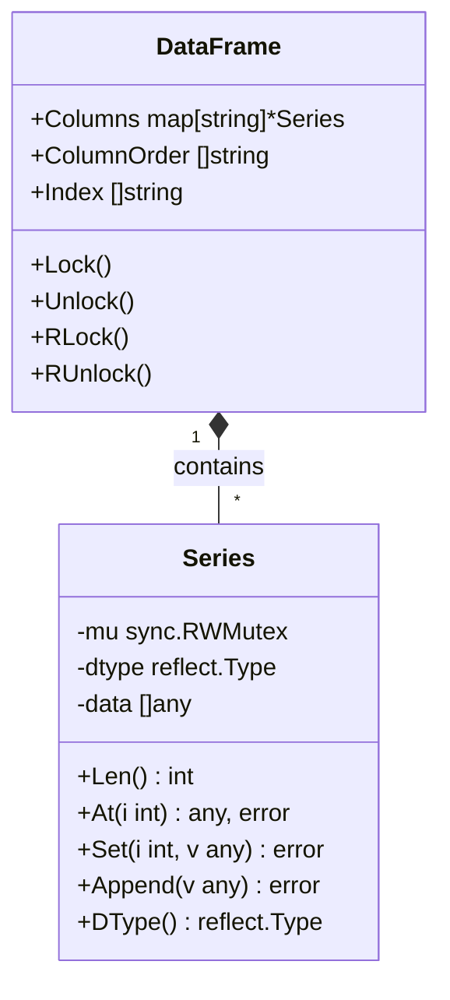

Learn how to create DataFrames from in-memory Go data structures using the `DataFrame()` constructor function.

<!-- IMAGE_PLACEHOLDER: Diagram showing Go slices being transformed into a DataFrame with columns -->

&nbsp;

## Overview

While `Read_csv()` loads data from files, the `DataFrame()` constructor allows you to create DataFrames directly from Go slices and maps. This is useful when:

- Building DataFrames from computed data
- Creating test fixtures
- Transforming data from APIs or other sources
- Building DataFrames incrementally

&nbsp;

## Function Signature

```go
func (GoPandas) DataFrame(
    columns []string,
    data []Column,
    columns_types map[string]any,
) (*dataframe.DataFrame, error)
```

&nbsp;

## Parameters

| Parameter | Type | Description |
|-----------|------|-------------|
| `columns` | `[]string` | Ordered list of column names |
| `data` | `[]Column` | Slice of columns, each containing row values |
| `columns_types` | `map[string]any` | Map defining the type for each column |

&nbsp;

## Column Types

GPandas provides several column type definitions for type safety:

| Type | Go Type | Description |
|------|---------|-------------|
| `FloatCol` | `[]float64` | Floating-point numbers |
| `IntCol` | `[]int64` | Integer numbers |
| `StringCol` | `[]string` | Text strings |
| `BoolCol` | `[]bool` | Boolean values |
| `Column` | `[]any` | Generic type (any values) |
| `TypeColumn[T]` | `[]T` | Generic typed column |

&nbsp;

## Basic Example

Here's a simple example creating a DataFrame with different column types:

```go
package main

import (
    "fmt"
    "log"

    "github.com/apoplexi24/gpandas"
)

func main() {
    gp := gpandas.GoPandas{}

    // Define column names
    columns := []string{"name", "age", "salary", "active"}

    // Define data for each column
    data := []gpandas.Column{
        {"Alice", "Bob", "Charlie", "Diana"},  // name
        {int64(30), int64(25), int64(35), int64(28)},  // age
        {75000.0, 65000.0, 85000.0, 72000.0},  // salary
        {true, true, false, true},  // active
    }

    // Define column types
    columnTypes := map[string]any{
        "name":   gpandas.StringCol{},
        "age":    gpandas.IntCol{},
        "salary": gpandas.FloatCol{},
        "active": gpandas.BoolCol{},
    }

    // Create the DataFrame
    df, err := gp.DataFrame(columns, data, columnTypes)
    if err != nil {
        log.Fatalf("Error creating DataFrame: %v", err)
    }

    fmt.Println(df.String())
}
```

&nbsp;

### Output

```
+---------+-----+--------+--------+
| name    | age | salary | active |
+---------+-----+--------+--------+
| Alice   | 30  | 75000  | true   |
| Bob     | 25  | 65000  | true   |
| Charlie | 35  | 85000  | false  |
| Diana   | 28  | 72000  | true   |
+---------+-----+--------+--------+
[4 rows x 4 columns]
```

&nbsp;

## Data Flow

The DataFrame creation process follows this flow:

```mermaid
flowchart TD
    subgraph Input["Input Data"]
        COLS[Column Names]
        DATA[Data Slices]
        TYPES[Type Definitions]
    end
    
    subgraph Validation["Validation"]
        V1[Check columns not empty]
        V2[Check data not empty]
        V3[Verify column count matches]
        V4[Validate row counts equal]
        V5[Verify all types defined]
    end
    
    subgraph Creation["Series Creation"]
        S1[Create Series 1]
        S2[Create Series 2]
        SN[Create Series N]
    end
    
    subgraph Output["DataFrame"]
        DF[DataFrame]
        MAP[Columns Map]
        ORD[Column Order]
        IDX[Default Index]
    end
    
    COLS --> V1
    DATA --> V2
    TYPES --> V5
    V1 --> V3
    V2 --> V3
    V3 --> V4
    V4 --> V5
    V5 --> S1
    V5 --> S2
    V5 --> SN
    S1 --> MAP
    S2 --> MAP
    SN --> MAP
    MAP --> DF
    ORD --> DF
    IDX --> DF
    
    style Input fill:#1e293b,stroke:#22c55e,stroke-width:2px
    style Validation fill:#1e293b,stroke:#f59e0b,stroke-width:2px
    style Creation fill:#1e293b,stroke:#3b82f6,stroke-width:2px
    style Output fill:#1e293b,stroke:#8b5cf6,stroke-width:2px
```



&nbsp;

## Validation Rules

The `DataFrame()` function performs several validation checks:

| Check | Error Message |
|-------|---------------|
| `columns_types` is nil | "columns_types map is required to assert column types" |
| No columns provided | "at least one column name is required" |
| No data provided | "data cannot be empty" |
| Column count mismatch | "number of columns must match number of data columns" |
| Inconsistent row count | "inconsistent row count in column X: expected Y, got Z" |
| Missing type definition | "missing type definition for column: X" |

&nbsp;

## Working with Different Types

### String Columns

```go
columns := []string{"first_name", "last_name", "email"}

data := []gpandas.Column{
    {"John", "Jane", "Bob"},
    {"Doe", "Smith", "Johnson"},
    {"john@example.com", "jane@example.com", "bob@example.com"},
}

columnTypes := map[string]any{
    "first_name": gpandas.StringCol{},
    "last_name":  gpandas.StringCol{},
    "email":      gpandas.StringCol{},
}

df, _ := gp.DataFrame(columns, data, columnTypes)
```

&nbsp;

### Numeric Columns

```go
columns := []string{"product_id", "price", "quantity"}

data := []gpandas.Column{
    {int64(1001), int64(1002), int64(1003)},
    {29.99, 49.99, 19.99},
    {int64(100), int64(50), int64(200)},
}

columnTypes := map[string]any{
    "product_id": gpandas.IntCol{},
    "price":      gpandas.FloatCol{},
    "quantity":   gpandas.IntCol{},
}

df, _ := gp.DataFrame(columns, data, columnTypes)
```

&nbsp;

### Boolean Columns

```go
columns := []string{"user", "is_admin", "is_active", "email_verified"}

data := []gpandas.Column{
    {"admin", "user1", "user2"},
    {true, false, false},
    {true, true, false},
    {true, true, true},
}

columnTypes := map[string]any{
    "user":           gpandas.StringCol{},
    "is_admin":       gpandas.BoolCol{},
    "is_active":      gpandas.BoolCol{},
    "email_verified": gpandas.BoolCol{},
}

df, _ := gp.DataFrame(columns, data, columnTypes)
```

&nbsp;

### Mixed Types with Generic Column

For columns with mixed or unknown types, use the generic `Column` type:

```go
columns := []string{"id", "value", "metadata"}

data := []gpandas.Column{
    {int64(1), int64(2), int64(3)},
    {"text", 42.5, true},  // Mixed types
    {nil, "info", nil},    // Can include nil
}

columnTypes := map[string]any{
    "id":       gpandas.IntCol{},
    "value":    gpandas.Column{},  // Generic - accepts any type
    "metadata": gpandas.Column{},
}

df, _ := gp.DataFrame(columns, data, columnTypes)
```

&nbsp;

## Complete Example: Building a Report

Here's a practical example building a sales report DataFrame:

```go
package main

import (
    "fmt"
    "log"
    "time"

    "github.com/apoplexi24/gpandas"
)

func main() {
    gp := gpandas.GoPandas{}

    // Simulated data from business logic
    products := []string{"Widget A", "Widget B", "Gadget X", "Gadget Y"}
    categories := []string{"Widgets", "Widgets", "Gadgets", "Gadgets"}
    prices := []float64{19.99, 29.99, 49.99, 79.99}
    quantities := []int64{150, 85, 200, 45}
    dates := []string{
        time.Now().AddDate(0, 0, -3).Format("2006-01-02"),
        time.Now().AddDate(0, 0, -2).Format("2006-01-02"),
        time.Now().AddDate(0, 0, -1).Format("2006-01-02"),
        time.Now().Format("2006-01-02"),
    }

    // Calculate revenue
    revenues := make([]float64, len(prices))
    for i := range prices {
        revenues[i] = prices[i] * float64(quantities[i])
    }

    // Convert to Column slices
    toColumn := func(slice interface{}) gpandas.Column {
        col := gpandas.Column{}
        switch v := slice.(type) {
        case []string:
            for _, s := range v {
                col = append(col, s)
            }
        case []float64:
            for _, f := range v {
                col = append(col, f)
            }
        case []int64:
            for _, i := range v {
                col = append(col, i)
            }
        }
        return col
    }

    // Build DataFrame
    columns := []string{"product", "category", "price", "quantity", "revenue", "date"}
    
    data := []gpandas.Column{
        toColumn(products),
        toColumn(categories),
        toColumn(prices),
        toColumn(quantities),
        toColumn(revenues),
        toColumn(dates),
    }

    columnTypes := map[string]any{
        "product":  gpandas.StringCol{},
        "category": gpandas.StringCol{},
        "price":    gpandas.FloatCol{},
        "quantity": gpandas.IntCol{},
        "revenue":  gpandas.FloatCol{},
        "date":     gpandas.StringCol{},
    }

    df, err := gp.DataFrame(columns, data, columnTypes)
    if err != nil {
        log.Fatalf("Error: %v", err)
    }

    fmt.Println("=== Sales Report ===")
    fmt.Println(df.String())

    // Export the report
    _, err = df.ToCSV("sales_report.csv", ",")
    if err != nil {
        log.Printf("Could not export: %v", err)
    }
}
```

&nbsp;

## DataFrame Structure

Understanding the internal structure helps when working with DataFrames:



| Component | Description |
|-----------|-------------|
| `Columns` | Map of column names to Series pointers |
| `ColumnOrder` | Preserves the order columns were defined |
| `Index` | Row labels (defaults to "0", "1", "2", ...) |

&nbsp;

## Error Handling

Always handle errors when creating DataFrames:

```go
df, err := gp.DataFrame(columns, data, columnTypes)
if err != nil {
    // Handle specific error cases
    switch {
    case strings.Contains(err.Error(), "columns_types"):
        log.Fatal("Missing column type definitions")
    case strings.Contains(err.Error(), "row count"):
        log.Fatal("Columns have different lengths")
    default:
        log.Fatalf("DataFrame creation failed: %v", err)
    }
}
```

&nbsp;

## Best Practices

| Practice | Description |
|----------|-------------|
| **Define types explicitly** | Always provide `columns_types` for type safety |
| **Consistent row counts** | Ensure all columns have the same number of rows |
| **Use appropriate types** | Choose `IntCol` for integers, `FloatCol` for decimals |
| **Handle nil values** | Use `Column` type for columns that may contain nil |
| **Validate data** | Check your data before creating DataFrames |

&nbsp;

## See Also

- [Loading CSV Files]() - Load DataFrames from files
- [Series]() - Understand the Series type
- [DataFrame Operations]() - Manipulate your DataFrames

