Learn the essential DataFrame operations for manipulating and transforming your data in GPandas.

<!-- IMAGE_PLACEHOLDER: Visual showing DataFrame transformation operations -->

&nbsp;

## Overview

GPandas DataFrames support several core operations:

| Operation | Method(s) | Description |
|-----------|-----------|-------------|
| Column Selection | `Select()`, `SelectCol()` | Extract specific columns |
| Renaming | `Rename()` | Change column names |
| Display | `String()` | Pretty-print as table |
| Export | `ToCSV()` | Save to CSV format |

&nbsp;

---

&nbsp;

## Column Selection

GPandas provides two methods for selecting columns from a DataFrame.

&nbsp;

### Select() - Multiple Columns

Returns a new DataFrame containing only the specified columns.

```go
func (df *DataFrame) Select(columns ...string) (*DataFrame, error)
```

&nbsp;

#### Parameters

| Parameter | Type | Description |
|-----------|------|-------------|
| `columns` | `...string` | One or more column names to select |

&nbsp;

#### Example

```go
package main

import (
    "fmt"
    "log"

    "github.com/apoplexi24/gpandas"
)

func main() {
    gp := gpandas.GoPandas{}
    
    // Load sample data
    df, _ := gp.Read_csv("employees.csv")
    
    fmt.Println("Original DataFrame:")
    fmt.Println(df.String())
    
    // Select specific columns
    subset, err := df.Select("name", "department", "salary")
    if err != nil {
        log.Fatalf("Selection failed: %v", err)
    }
    
    fmt.Println("\nSelected Columns:")
    fmt.Println(subset.String())
}
```

&nbsp;

#### Output

```
Original DataFrame:
+------+-------------+--------+-------+
| name | department  | salary | years |
+------+-------------+--------+-------+
| Alice| Engineering | 85000  | 5     |
| Bob  | Marketing   | 72000  | 3     |
+------+-------------+--------+-------+
[2 rows x 4 columns]

Selected Columns:
+------+-------------+--------+
| name | department  | salary |
+------+-------------+--------+
| Alice| Engineering | 85000  |
| Bob  | Marketing   | 72000  |
+------+-------------+--------+
[2 rows x 3 columns]
```

&nbsp;

### SelectCol() - Single Column as Series

Returns a single column as a Series reference (not a DataFrame).

```go
func (df *DataFrame) SelectCol(column string) (*collection.Series, error)
```

&nbsp;

#### Example

```go
// Get a single column as Series
salarySeries, err := df.SelectCol("salary")
if err != nil {
    log.Fatalf("Column not found: %v", err)
}

// Access individual values
firstSalary, _ := salarySeries.At(0)
fmt.Printf("First salary: %v\n", firstSalary)

// Get series length
fmt.Printf("Total entries: %d\n", salarySeries.Len())
```

&nbsp;

### Selection Data Flow

```mermaid
flowchart LR
    subgraph Original["Original DataFrame"]
        C1[Column A]
        C2[Column B]
        C3[Column C]
        C4[Column D]
    end
    
    subgraph Select["Select('A', 'C')"]
        OP[Select Operation]
    end
    
    subgraph Result["New DataFrame"]
        R1[Column A]
        R2[Column C]
    end
    
    C1 --> OP
    C2 -.->|skipped| OP
    C3 --> OP
    C4 -.->|skipped| OP
    OP --> R1
    OP --> R2
    
    style Original fill:#1e293b,stroke:#3b82f6,stroke-width:2px
    style Select fill:#1e293b,stroke:#f59e0b,stroke-width:2px
    style Result fill:#1e293b,stroke:#22c55e,stroke-width:2px
```



&nbsp;

---

&nbsp;

## Renaming Columns

The `Rename()` method changes column names while preserving column order and data.

&nbsp;

### Function Signature

```go
func (df *DataFrame) Rename(columns map[string]string) error
```

&nbsp;

### Parameters

| Parameter | Type | Description |
|-----------|------|-------------|
| `columns` | `map[string]string` | Map of old names to new names |

&nbsp;

### Example

```go
package main

import (
    "fmt"
    "log"

    "github.com/apoplexi24/gpandas"
)

func main() {
    gp := gpandas.GoPandas{}
    df, _ := gp.Read_csv("data.csv")
    
    fmt.Println("Before renaming:")
    fmt.Println(df.String())
    
    // Rename columns
    err := df.Rename(map[string]string{
        "emp_name":   "employee_name",
        "dept":       "department",
        "sal":        "salary",
    })
    if err != nil {
        log.Fatalf("Rename failed: %v", err)
    }
    
    fmt.Println("\nAfter renaming:")
    fmt.Println(df.String())
}
```

&nbsp;

### Rename Behavior

| Scenario | Behavior |
|----------|----------|
| Valid column | Renamed successfully |
| Non-existent column | Error returned |
| Empty map | Error returned |
| Partial rename | Only specified columns renamed |

&nbsp;

### Error Handling

```go
err := df.Rename(map[string]string{
    "nonexistent_column": "new_name",
})
if err != nil {
    // Error: "the column 'nonexistent_column' is not present in DataFrame"
    log.Printf("Rename error: %v", err)
}
```

&nbsp;

---

&nbsp;

## Display with String()

The `String()` method returns a formatted table representation of the DataFrame.

&nbsp;

### Function Signature

```go
func (df *DataFrame) String() string
```

&nbsp;

### Features

| Feature | Description |
|---------|-------------|
| ASCII table format | Uses `+`, `-`, `|` for borders |
| Auto-column sizing | Columns adjust to content width |
| Row limiting | Shows first 10 rows for large DataFrames |
| Dimension info | Displays `[rows x columns]` summary |

&nbsp;

### Example Output

```
+---------+-------------+--------+
| name    | department  | salary |
+---------+-------------+--------+
| Alice   | Engineering | 85000  |
| Bob     | Marketing   | 72000  |
| Charlie | Engineering | 92000  |
+---------+-------------+--------+
[3 rows x 3 columns]
```

&nbsp;

### Large DataFrame Display

For DataFrames with more than 10 rows:

```
+---------+-------------+--------+
| name    | department  | salary |
+---------+-------------+--------+
| Row 1   | ...         | ...    |
| Row 2   | ...         | ...    |
| ...     | ...         | ...    |
| Row 10  | ...         | ...    |
+---------+-------------+--------+
Showing first 10 rows of 1000 rows x 3 columns
```

&nbsp;

---

&nbsp;

## Export with ToCSV()

The `ToCSV()` method exports DataFrame contents to CSV format.

&nbsp;

### Function Signature

```go
func (df *DataFrame) ToCSV(filepath string, separator ...string) (string, error)
```

&nbsp;

### Parameters

| Parameter | Type | Description | Default |
|-----------|------|-------------|---------|
| `filepath` | `string` | Output file path (empty for string output) | - |
| `separator` | `string` | Column separator | `,` |

&nbsp;

### Returns

| Return | When |
|--------|------|
| `(string, nil)` | `filepath` is empty - returns CSV as string |
| `("", nil)` | `filepath` is provided - writes to file |
| `("", error)` | Operation failed |

&nbsp;

### Export to File

```go
// Export with default comma separator
_, err := df.ToCSV("output/data.csv")
if err != nil {
    log.Fatalf("Export failed: %v", err)
}

// Export with custom separator (tab-separated)
_, err = df.ToCSV("output/data.tsv", "\t")
if err != nil {
    log.Fatalf("Export failed: %v", err)
}

// Export with semicolon (European format)
_, err = df.ToCSV("output/data_eu.csv", ";")
if err != nil {
    log.Fatalf("Export failed: %v", err)
}
```

&nbsp;

### Export to String

```go
// Get CSV as string (pass empty filepath)
csvString, err := df.ToCSV("", ",")
if err != nil {
    log.Fatalf("Export failed: %v", err)
}

fmt.Println("CSV Content:")
fmt.Println(csvString)

// Use the string for other purposes
// e.g., send via API, write to custom location, etc.
```

&nbsp;

### CSV Output Format

```csv
name,department,salary,years
Alice,Engineering,85000,5
Bob,Marketing,72000,3
Charlie,Engineering,92000,7
```

&nbsp;

---

&nbsp;

## Operations Pipeline

Combine operations for complex transformations:

```mermaid
flowchart TD
    subgraph Input["Load Data"]
        CSV[Read CSV]
    end
    
    subgraph Transform["Transform"]
        SEL[Select Columns]
        REN[Rename Columns]
    end
    
    subgraph Output["Output"]
        DSP[Display String]
        EXP[Export CSV]
    end
    
    CSV --> SEL
    SEL --> REN
    REN --> DSP
    REN --> EXP
    
    style Input fill:#1e293b,stroke:#22c55e,stroke-width:2px
    style Transform fill:#1e293b,stroke:#3b82f6,stroke-width:2px
    style Output fill:#1e293b,stroke:#8b5cf6,stroke-width:2px
```



&nbsp;

### Complete Pipeline Example

```go
package main

import (
    "fmt"
    "log"

    "github.com/apoplexi24/gpandas"
)

func main() {
    gp := gpandas.GoPandas{}
    
    // Step 1: Load data
    df, err := gp.Read_csv("raw_data.csv")
    if err != nil {
        log.Fatalf("Load failed: %v", err)
    }
    fmt.Println("Step 1 - Loaded:")
    fmt.Println(df.String())
    
    // Step 2: Select relevant columns
    df, err = df.Select("emp_id", "emp_name", "dept", "sal")
    if err != nil {
        log.Fatalf("Select failed: %v", err)
    }
    fmt.Println("\nStep 2 - Selected:")
    fmt.Println(df.String())
    
    // Step 3: Rename for clarity
    err = df.Rename(map[string]string{
        "emp_id":   "employee_id",
        "emp_name": "name",
        "dept":     "department",
        "sal":      "salary",
    })
    if err != nil {
        log.Fatalf("Rename failed: %v", err)
    }
    fmt.Println("\nStep 3 - Renamed:")
    fmt.Println(df.String())
    
    // Step 4: Export cleaned data
    _, err = df.ToCSV("cleaned_data.csv", ",")
    if err != nil {
        log.Fatalf("Export failed: %v", err)
    }
    fmt.Println("\nStep 4 - Exported to cleaned_data.csv")
}
```

&nbsp;

---

&nbsp;

## Thread Safety

All DataFrame operations are thread-safe:

| Method | Lock Type | Description |
|--------|-----------|-------------|
| `Select()` | RLock | Read lock for concurrent reads |
| `SelectCol()` | RLock | Read lock for concurrent reads |
| `Rename()` | Lock | Write lock for exclusive access |
| `String()` | None | Uses column data directly |
| `ToCSV()` | None | Uses column data directly |

&nbsp;

### Concurrent Access Example

```go
package main

import (
    "fmt"
    "sync"

    "github.com/apoplexi24/gpandas"
)

func main() {
    gp := gpandas.GoPandas{}
    df, _ := gp.Read_csv("data.csv")
    
    var wg sync.WaitGroup
    
    // Multiple goroutines can read simultaneously
    for i := 0; i < 5; i++ {
        wg.Add(1)
        go func(id int) {
            defer wg.Done()
            
            // Safe concurrent read
            subset, _ := df.Select("name", "salary")
            fmt.Printf("Goroutine %d: %d rows\n", id, len(subset.Index))
        }(i)
    }
    
    wg.Wait()
}
```

&nbsp;

## Error Reference

| Error | Cause | Solution |
|-------|-------|----------|
| "DataFrame is nil" | Operating on nil DataFrame | Check DataFrame initialization |
| "column 'X' not found" | Invalid column name | Verify column exists |
| "columns slice is empty" | Empty map to Rename | Provide at least one column |
| "failed to write CSV" | File system error | Check permissions and path |

&nbsp;

## See Also

- [Merging Data]() - Join multiple DataFrames
- [Indexing (Loc)]() - Label-based data access
- [Indexing (iLoc)]() - Position-based data access
- [Series]() - Work with individual columns

