Learn how to work with dates and times in GPandas. `ToDatetime` parses a string column into a datetime column, and the `Dt` accessor extracts components such as year, month, day, and weekday.

<!-- IMAGE_PLACEHOLDER: Visual showing a string date column being parsed and split into year/month parts -->

&nbsp;

## Overview

| Operation | Method | Description |
|-----------|--------|-------------|
| Parse | `ToDatetime(column, layout)` | Convert a string column to datetime |
| Extract | `Dt(column)` | Access year, month, day, weekday, etc. |

The datetime column is backed by a `DateTimeSeries` of `time.Time` values with null support.

&nbsp;

---

&nbsp;

## ToDatetime

Returns a new DataFrame with the given column parsed into a datetime column.

&nbsp;

### Function Signature

```go
func (df *DataFrame) ToDatetime(column string, layout string) (*DataFrame, error)
```

The `layout` is a Go reference-time layout (e.g. `"2006-01-02"`). If `layout` is empty, common formats are tried automatically: RFC3339, `"2006-01-02 15:04:05"`, `"2006-01-02T15:04:05"`, `"2006-01-02"`, and `"01/02/2006"`. Values that cannot be parsed return an error; null values are preserved.

&nbsp;

---

&nbsp;

## Dt Accessor

Returns a datetime accessor for a datetime column. Each method returns a new Series (nulls preserved) that can be added back with `Assign`.

&nbsp;

### Function Signature

```go
func (df *DataFrame) Dt(column string) (*collection.DtAccessor, error)
```

| Method | Returns | Description |
|--------|---------|-------------|
| `Year()` | `*Int64Series` | Four-digit year |
| `Month()` | `*Int64Series` | Month (1-12) |
| `Day()` | `*Int64Series` | Day of month |
| `Hour()` / `Minute()` / `Second()` | `*Int64Series` | Time components |
| `Weekday()` | `*Int64Series` | Day of week (0=Sunday) |
| `Date()` | `*StringSeries` | Value formatted as `2006-01-02` |

&nbsp;

---

&nbsp;

## Example

```go
package main

import (
    "fmt"
    "log"

    "github.com/apoplexi24/gpandas/dataframe"
    "github.com/apoplexi24/gpandas/utils/collection"
)

func main() {
    event, _ := collection.NewStringSeriesFromData(
        []string{"launch", "update", "release"}, nil)
    ts, _ := collection.NewStringSeriesFromData(
        []string{"2021-01-15", "2021-06-30", "2022-03-10"}, nil)

    df := &dataframe.DataFrame{
        Columns:     map[string]collection.Series{"event": event, "ts": ts},
        ColumnOrder: []string{"event", "ts"},
        Index:       []string{"0", "1", "2"},
    }

    // Parse the string column into datetimes
    dated, err := df.ToDatetime("ts", "2006-01-02")
    if err != nil {
        log.Fatalf("ToDatetime failed: %v", err)
    }

    // Extract components and add them as new columns
    acc, _ := dated.Dt("ts")
    dated.Assign("year", acc.Year())

    acc2, _ := dated.Dt("ts")
    dated.Assign("month", acc2.Month())

    fmt.Println(dated.String())
}
```

&nbsp;

### Output

```
+---------+-------------------------------+------+-------+
| event   | ts                            | year | month |
+---------+-------------------------------+------+-------+
| launch  | 2021-01-15 00:00:00 +0000 UTC | 2021 | 1     |
| update  | 2021-06-30 00:00:00 +0000 UTC | 2021 | 6     |
| release | 2022-03-10 00:00:00 +0000 UTC | 2022 | 3     |
+---------+-------------------------------+------+-------+
[3 rows x 4 columns]
```

The `ts` column now holds `time.Time` values (rendered with their full timestamp), and `year`/`month` are derived integer columns.

&nbsp;

### Parsing Flow

```mermaid
flowchart LR
    subgraph Strings["String Column"]
        S["2021-01-15<br/>2021-06-30<br/>2022-03-10"]
    end

    subgraph Parse["ToDatetime(layout)"]
        P["time.Time values"]
    end

    subgraph Extract["Dt() accessor"]
        E["Year / Month / Day<br/>Weekday / Date"]
    end

    S --> P
    P --> E

    style Strings fill:#1e293b,stroke:#3b82f6,stroke-width:2px
    style Parse fill:#1e293b,stroke:#f59e0b,stroke-width:2px
    style Extract fill:#1e293b,stroke:#22c55e,stroke-width:2px
```



&nbsp;

---

&nbsp;

## Error Handling

### Common Errors

| Error | Cause | Solution |
|-------|-------|----------|
| "column 'X' not found" | Invalid column name | Verify the column exists |
| "cannot parse ... as datetime" | Value doesn't match the layout | Provide the correct layout, or clean the data |
| "column 'X' is not a datetime column" | `Dt` on a non-datetime column | Call `ToDatetime` first |

&nbsp;

---

&nbsp;

## Thread Safety

`ToDatetime` reads under a read lock and returns a new DataFrame. The `Dt` accessor builds new Series without mutating the source.

&nbsp;

---

&nbsp;

## See Also

- [Type Casting & Inspection]() - Convert other column types
- [Adding Columns]() - Add extracted components with Assign
- [Sorting Data]() - Order rows chronologically
- [Window Functions]() - Time-series rolling operations
