Learn how to subset DataFrame rows in GPandas using boolean comparisons or arbitrary predicates. Both `Filter` and `Where` return a chainable, error-deferred builder so conditions can be combined fluently.

<!-- IMAGE_PLACEHOLDER: Visual showing rows being filtered out of a DataFrame by a condition -->

&nbsp;

## Overview

GPandas provides two ways to filter rows:

| Operation | Method | Description |
|-----------|--------|-------------|
| Comparison Filter | `Filter()` | Keep rows where a column satisfies a comparison |
| Predicate Filter | `Where()` | Keep rows for which a custom function returns true |

Both methods start a `FilterChain` that is terminated with `Result()`, `MustResult()`, or `Err()`.

&nbsp;

---

&nbsp;

## Filter

Keeps rows where the value in a column satisfies the comparison `column <op> value`, similar to pandas boolean indexing such as `df[df["Age"] > 25]`.

&nbsp;

### Function Signature

```go
func (df *DataFrame) Filter(column string, op FilterOp, value any) *FilterChain
```

&nbsp;

### FilterOp Constants

| Constant | Operator | Keeps rows where |
|----------|----------|------------------|
| `Equals` | `==` | value equals target |
| `NotEquals` | `!=` | value differs from target |
| `GreaterThan` | `>` | value greater than target |
| `GreaterThanOrEqual` | `>=` | value greater than or equal to target |
| `LessThan` | `<` | value less than target |
| `LessThanOrEqual` | `<=` | value less than or equal to target |

&nbsp;

### Comparison Rules

| Column Type | Comparison |
|-------------|------------|
| `float64` / `int64` / `int` | Numeric (cross-type, e.g. an `int` column compares with a `float64` literal) |
| `string` | Lexicographic |
| `bool` | `false < true` |

**Note:** Null values never satisfy a comparison and are always excluded from the result, mirroring pandas behaviour where comparisons against `NaN` are `False`.

&nbsp;

---

&nbsp;

## Sample Data

All examples use this employee DataFrame:

### Employees DataFrame

| Name | Department | Age | Salary |
|------|------------|-----|--------|
| Alice | Engineering | 30 | 95000 |
| Bob | Sales | 25 | 55000 |
| Charlie | Engineering | 35 | 105000 |
| Diana | Sales | 28 | 62000 |
| Eve | Marketing | 32 | 72000 |
| Frank | Engineering | 27 | 88000 |

&nbsp;

### Setup Code

```go
package main

import (
    "fmt"
    "log"

    "github.com/apoplexi24/gpandas"
    "github.com/apoplexi24/gpandas/dataframe"
)

func main() {
    gp := gpandas.GoPandas{}

    // Create employee DataFrame
    df, _ := gp.DataFrame(
        []string{"Name", "Department", "Age", "Salary"},
        []gpandas.Column{
            {"Alice", "Bob", "Charlie", "Diana", "Eve", "Frank"},
            {"Engineering", "Sales", "Engineering", "Sales", "Marketing", "Engineering"},
            {int64(30), int64(25), int64(35), int64(28), int64(32), int64(27)},
            {95000.0, 55000.0, 105000.0, 62000.0, 72000.0, 88000.0},
        },
        map[string]any{
            "Name":       gpandas.StringCol{},
            "Department": gpandas.StringCol{},
            "Age":        gpandas.IntCol{},
            "Salary":     gpandas.FloatCol{},
        },
    )

    // Examples follow...
}
```

&nbsp;

---

&nbsp;

## Single Comparison

Keep rows where `Salary` is greater than 80,000:

```go
result, err := df.Filter("Salary", dataframe.GreaterThan, 80000.0).Result()
if err != nil {
    log.Fatalf("Filter failed: %v", err)
}
fmt.Println(result.String())
```

&nbsp;

### Output

```
+---------+-------------+-----+--------+
| Name    | Department  | Age | Salary |
+---------+-------------+-----+--------+
| Alice   | Engineering | 30  | 95000  |
| Charlie | Engineering | 35  | 105000 |
| Frank   | Engineering | 27  | 88000  |
+---------+-------------+-----+--------+
[3 rows x 4 columns]
```

&nbsp;

---

&nbsp;

## Chained Filters

Each `Filter`/`Where` call returns a `FilterChain`, so conditions can be combined to form an `AND` of all predicates. Terminate the chain with `Result()`:

```go
result, err := df.
    Filter("Department", dataframe.Equals, "Engineering").
    Filter("Salary", dataframe.GreaterThan, 90000.0).
    Result()
if err != nil {
    log.Fatalf("Filter failed: %v", err)
}
fmt.Println(result.String())
```

&nbsp;

### Output

```
+---------+-------------+-----+--------+
| Name    | Department  | Age | Salary |
+---------+-------------+-----+--------+
| Alice   | Engineering | 30  | 95000  |
| Charlie | Engineering | 35  | 105000 |
+---------+-------------+-----+--------+
[2 rows x 4 columns]
```

&nbsp;

### Chain Evaluation Flow

```mermaid
flowchart LR
    subgraph Start["df"]
        D[6 rows]
    end

    subgraph F1["Filter: Department == Engineering"]
        S1[3 rows]
    end

    subgraph F2["Filter: Salary > 90000"]
        S2[2 rows]
    end

    subgraph End["Result()"]
        R[DataFrame, error]
    end

    D --> S1
    S1 --> S2
    S2 --> R

    style Start fill:#1e293b,stroke:#3b82f6,stroke-width:2px
    style F1 fill:#1e293b,stroke:#f59e0b,stroke-width:2px
    style F2 fill:#1e293b,stroke:#8b5cf6,stroke-width:2px
    style End fill:#1e293b,stroke:#22c55e,stroke-width:2px
```



&nbsp;

---

&nbsp;

## Where

Keeps rows for which a predicate returns true. The predicate receives a `map[string]any` for the row (null values are passed as `nil`), enabling arbitrary multi-column conditions.

&nbsp;

### Function Signature

```go
func (df *DataFrame) Where(predicate func(row map[string]any) bool) *FilterChain
```

&nbsp;

### Example

```go
result, err := df.Where(func(row map[string]any) bool {
    age, _ := row["Age"].(int64)
    return age < 32 && row["Department"] == "Engineering"
}).Result()
if err != nil {
    log.Fatalf("Where failed: %v", err)
}
fmt.Println(result.String())
```

&nbsp;

### Output

```
+-------+-------------+-----+--------+
| Name  | Department  | Age | Salary |
+-------+-------------+-----+--------+
| Alice | Engineering | 30  | 95000  |
| Frank | Engineering | 27  | 88000  |
+-------+-------------+-----+--------+
[2 rows x 4 columns]
```

**Note:** `Filter` and `Where` can be mixed in the same chain, for example `df.Filter(...).Where(...).Result()`.

&nbsp;

---

&nbsp;

## Terminating a Chain

A `FilterChain` is lazy with respect to errors: the first error encountered is carried through and surfaced when the chain is terminated.

| Method | Returns | Behaviour |
|--------|---------|-----------|
| `Result()` | `(*DataFrame, error)` | Returns the result and the first error (if any) |
| `Err()` | `error` | Returns the first error only |
| `MustResult()` | `*DataFrame` | Returns the result, panics if the chain holds an error |

&nbsp;

### Error Propagation

If any step fails (for example a missing column), subsequent steps become no-ops and the error is returned by the terminal call:

```go
_, err := df.
    Filter("Department", dataframe.Equals, "Engineering").
    Filter("Missing", dataframe.Equals, 1). // error captured here
    Filter("Age", dataframe.GreaterThan, 0). // skipped
    Result()
if err != nil {
    log.Fatalf("Filter failed: %v", err) // "column 'Missing' not found"
}
```

&nbsp;

### MustResult

Use `MustResult()` when inputs are known to be valid (such as in tests). It panics on error instead of returning one:

```go
adults := df.Filter("Age", dataframe.GreaterThanOrEqual, int64(30)).MustResult()
fmt.Println(adults.String())
```

&nbsp;

---

&nbsp;

## Null Values

Comparisons never match null values, so rows with a null in the filtered column are dropped:

```go
// Score column: 10.0, null, 30.0, null, 5.0
result, _ := df.Filter("Score", dataframe.GreaterThanOrEqual, 0.0).Result()
// Only the 3 non-null rows remain (10.0, 30.0, 5.0)
```

To select rows where a value *is* null, use `Where`:

```go
nullsOnly, _ := df.Where(func(row map[string]any) bool {
    return row["Score"] == nil
}).Result()
```

&nbsp;

---

&nbsp;

## Filtering Workflow

```mermaid
flowchart TD
    subgraph Input["Original DataFrame"]
        I[All rows]
    end

    subgraph Build["Build Chain"]
        B1[Filter / Where]
        B2[Additional Filter / Where]
    end

    subgraph Eval["Per-Row Evaluation"]
        E1[Skip nulls on comparison]
        E2[Collect matching row indices]
    end

    subgraph Output["Terminate"]
        O1{Error?}
        O2[Return error]
        O3[Return new DataFrame]
    end

    I --> B1
    B1 --> B2
    B2 --> E1
    E1 --> E2
    E2 --> O1
    O1 -->|Yes| O2
    O1 -->|No| O3

    style Input fill:#1e293b,stroke:#3b82f6,stroke-width:2px
    style Build fill:#1e293b,stroke:#f59e0b,stroke-width:2px
    style Eval fill:#1e293b,stroke:#8b5cf6,stroke-width:2px
    style Output fill:#1e293b,stroke:#22c55e,stroke-width:2px
```



&nbsp;

---

&nbsp;

## Error Handling

### Common Errors

| Error | Cause | Solution |
|-------|-------|----------|
| "DataFrame is nil" | Operating on nil DataFrame | Check DataFrame initialization |
| "unsupported operator" | Invalid `FilterOp` value | Use a defined operator constant |
| "column 'X' not found" | Invalid column name | Verify the column exists |
| "predicate must not be nil" | `Where(nil)` | Provide a predicate function |
| "type mismatch: cannot compare" | Comparing incompatible types | Compare against a value of the column's type |

&nbsp;

### Error Handling Example

```go
result, err := df.
    Filter("Age", dataframe.GreaterThan, int64(25)).
    Filter("City", dataframe.Equals, "NYC").
    Result()
if err != nil {
    switch {
    case strings.Contains(err.Error(), "not found"):
        log.Fatal("Column doesn't exist in DataFrame")
    case strings.Contains(err.Error(), "type mismatch"):
        log.Fatal("Cannot compare values of different types")
    default:
        log.Fatalf("Filter error: %v", err)
    }
}
```

&nbsp;

---

&nbsp;

## Index Preservation

Filtering preserves the original index labels of the matching rows:

```go
// Original index: 0, 1, 2, 3
// Filter keeps rows 0 and 2
result, _ := df.Filter("City", dataframe.Equals, "NYC").Result()
fmt.Println(result.Index) // [0 2]
```

&nbsp;

---

&nbsp;

## Thread Safety

Filtering operations are thread-safe:

| Method | Lock Type | Description |
|--------|-----------|-------------|
| `Filter()` | RLock | Read lock during row evaluation |
| `Where()` | RLock | Read lock during row evaluation |

Each step produces a new DataFrame, so the original is never mutated and concurrent filtering is safe.

&nbsp;

---

&nbsp;

## Complete Example

```go
package main

import (
    "fmt"
    "log"

    "github.com/apoplexi24/gpandas"
    "github.com/apoplexi24/gpandas/dataframe"
)

func main() {
    gp := gpandas.GoPandas{}

    df, err := gp.Read_csv("employees.csv")
    if err != nil {
        log.Fatalf("Failed to load data: %v", err)
    }

    // Engineers earning more than 90k
    seniorEngineers, err := df.
        Filter("Department", dataframe.Equals, "Engineering").
        Filter("Salary", dataframe.GreaterThan, 90000.0).
        Result()
    if err != nil {
        log.Fatalf("Filter failed: %v", err)
    }

    fmt.Println("Senior engineers:")
    fmt.Println(seniorEngineers.String())

    // Export the subset
    if _, err := seniorEngineers.ToCSV("senior_engineers.csv", ","); err != nil {
        log.Printf("Export warning: %v", err)
    }
}
```

&nbsp;

---

&nbsp;

## See Also

- [DataFrame Operations]() - Select and transform data
- [Transforming Columns]() - Apply and map functions over columns
- [Summary Statistics]() - Describe and aggregate numeric data
- [Sorting Data]() - Order rows by values or index
