This guide will help you install GPandas and write your first data analysis program in Go.

<!-- IMAGE_PLACEHOLDER: Getting started hero image with code editor showing GPandas -->

&nbsp;

## Prerequisites

Before installing GPandas, ensure you have the following:

| Requirement | Minimum Version | Check Command |
|-------------|-----------------|---------------|
| Go | 1.18+ | `go version` |
| Git | Any | `git --version` |

&nbsp;

### Why Go 1.18+?

GPandas uses Go generics extensively for type-safe operations. Generics were introduced in Go 1.18, making it the minimum required version.

&nbsp;

## Installation

Install GPandas using the `go get` command:

```bash
go get github.com/apoplexi24/gpandas
```

&nbsp;

### Verify Installation

Create a simple test file to verify the installation:

```go
package main

import (
    "fmt"
    "github.com/apoplexi24/gpandas"
)

func main() {
    gp := gpandas.GoPandas{}
    fmt.Printf("GPandas ready: %T\n", gp)
}
```

Run it:

```bash
go run main.go
```

Expected output:

```
GPandas ready: gpandas.GoPandas
```

&nbsp;

## Project Setup

Here's a recommended project structure for a GPandas-based application:

```
my-data-project/
    go.mod
    go.sum
    main.go
    data/
        input.csv
        output/
```

&nbsp;

### Initialize Your Project

```bash
mkdir my-data-project
cd my-data-project
go mod init my-data-project
go get github.com/apoplexi24/gpandas
```

&nbsp;

## Your First Program

Let's create a complete example that demonstrates core GPandas functionality.

&nbsp;

### Step 1: Create Sample Data

Create a file `data/sales.csv`:

```csv
product,category,price,quantity,date
Laptop,Electronics,999.99,5,2024-01-15
Mouse,Electronics,29.99,50,2024-01-15
Desk,Furniture,299.99,10,2024-01-16
Chair,Furniture,149.99,25,2024-01-16
Monitor,Electronics,399.99,15,2024-01-17
```

&nbsp;

### Step 2: Write the Analysis Code

Create `main.go`:

```go
package main

import (
    "fmt"
    "log"

    "github.com/apoplexi24/gpandas"
)

func main() {
    // Initialize GPandas
    gp := gpandas.GoPandas{}

    // Load the CSV file
    df, err := gp.Read_csv("data/sales.csv")
    if err != nil {
        log.Fatalf("Failed to load CSV: %v", err)
    }

    // Display the full DataFrame
    fmt.Println("=== Sales Data ===")
    fmt.Println(df.String())

    // Select specific columns
    subset, err := df.Select("product", "price", "quantity")
    if err != nil {
        log.Fatalf("Failed to select columns: %v", err)
    }
    
    fmt.Println("\n=== Product Details ===")
    fmt.Println(subset.String())

    // Access data by position
    firstProduct, _ := df.ILoc().At(0, 0)
    fmt.Printf("\nFirst product: %v\n", firstProduct)

    // Access data by label
    price, _ := df.Loc().At("0", "price")
    fmt.Printf("First product price: %v\n", price)

    // Get a range of rows
    topThree, _ := df.ILoc().Range(0, 3)
    fmt.Println("\n=== Top 3 Rows ===")
    fmt.Println(topThree.String())

    // Export to a new CSV file
    _, err = df.ToCSV("data/output/sales_copy.csv", ",")
    if err != nil {
        log.Printf("Warning: Could not export CSV: %v", err)
    } else {
        fmt.Println("\nExported to data/output/sales_copy.csv")
    }
}
```

&nbsp;

### Step 3: Run the Program

```bash
mkdir -p data/output
go run main.go
```

&nbsp;

### Expected Output

```
=== Sales Data ===
+---------+-------------+--------+----------+------------+
| product | category    | price  | quantity | date       |
+---------+-------------+--------+----------+------------+
| Laptop  | Electronics | 999.99 | 5        | 2024-01-15 |
| Mouse   | Electronics | 29.99  | 50       | 2024-01-15 |
| Desk    | Furniture   | 299.99 | 10       | 2024-01-16 |
| Chair   | Furniture   | 149.99 | 25       | 2024-01-16 |
| Monitor | Electronics | 399.99 | 15       | 2024-01-17 |
+---------+-------------+--------+----------+------------+
[5 rows x 5 columns]

=== Product Details ===
+---------+--------+----------+
| product | price  | quantity |
+---------+--------+----------+
| Laptop  | 999.99 | 5        |
| Mouse   | 29.99  | 50       |
| Desk    | 299.99 | 10       |
| Chair   | 149.99 | 25       |
| Monitor | 399.99 | 15       |
+---------+--------+----------+
[5 rows x 3 columns]

First product: Laptop
First product price: 999.99

=== Top 3 Rows ===
+---------+-------------+--------+----------+------------+
| product | category    | price  | quantity | date       |
+---------+-------------+--------+----------+------------+
| Laptop  | Electronics | 999.99 | 5        | 2024-01-15 |
| Mouse   | Electronics | 29.99  | 50       | 2024-01-15 |
| Desk    | Furniture   | 299.99 | 10       | 2024-01-16 |
+---------+-------------+--------+----------+------------+
[3 rows x 5 columns]

Exported to data/output/sales_copy.csv
```

&nbsp;

## Common Workflow

Here's a typical GPandas workflow visualized:

```mermaid
flowchart TD
    subgraph Load["1. Load Data"]
        CSV[Read CSV]
        SQL[Query SQL]
        MEM[From Memory]
    end
    
    subgraph Transform["2. Transform"]
        SEL[Select Columns]
        REN[Rename Columns]
        MRG[Merge DataFrames]
        IDX[Index Operations]
    end
    
    subgraph Analyze["3. Analyze"]
        ACC[Access Values]
        SLC[Slice Rows]
        FLT[Filter Data]
    end
    
    subgraph Export["4. Export"]
        EXP[To CSV]
        STR[To String]
    end
    
    CSV --> SEL
    SQL --> SEL
    MEM --> SEL
    SEL --> REN
    REN --> MRG
    MRG --> IDX
    IDX --> ACC
    ACC --> SLC
    SLC --> FLT
    FLT --> EXP
    FLT --> STR
    
    style Load fill:#1e293b,stroke:#22c55e,stroke-width:2px
    style Transform fill:#1e293b,stroke:#3b82f6,stroke-width:2px
    style Analyze fill:#1e293b,stroke:#f59e0b,stroke-width:2px
    style Export fill:#1e293b,stroke:#8b5cf6,stroke-width:2px
```



&nbsp;

## Quick Reference

### Core Functions

| Function | Purpose | Example |
|----------|---------|---------|
| `Read_csv()` | Load CSV file | `gp.Read_csv("data.csv")` |
| `DataFrame()` | Create from memory | `gp.DataFrame(cols, data, types)` |
| `Read_sql()` | Query SQL database | `gp.Read_sql(query, config)` |
| `From_gbq()` | Query BigQuery | `gp.From_gbq(query, projectID)` |

&nbsp;

### DataFrame Methods

| Method | Purpose | Example |
|--------|---------|---------|
| `String()` | Pretty print | `df.String()` |
| `Select()` | Select columns | `df.Select("col1", "col2")` |
| `SelectCol()` | Get single column | `df.SelectCol("col1")` |
| `Rename()` | Rename columns | `df.Rename(map[string]string{"old": "new"})` |
| `Merge()` | Join DataFrames | `df.Merge(other, "key", InnerMerge)` |
| `ToCSV()` | Export to CSV | `df.ToCSV("out.csv", ",")` |

&nbsp;

### Indexing

| Accessor | Method | Purpose |
|----------|--------|---------|
| `Loc()` | `.At(label, col)` | Get value by label |
| `Loc()` | `.Row(label)` | Get row by label |
| `Loc()` | `.Col(name)` | Get column by name |
| `ILoc()` | `.At(row, col)` | Get value by position |
| `ILoc()` | `.Row(pos)` | Get row by position |
| `ILoc()` | `.Range(start, end)` | Get row range |

&nbsp;

## Next Steps

Now that you have GPandas installed and running, explore these topics:

- [Loading CSV Files]() - Deep dive into CSV loading
- [Creating DataFrames]() - Build DataFrames from scratch
- [DataFrame Operations]() - Master data manipulation
- [SQL Integration]() - Connect to databases

&nbsp;

## Troubleshooting

### Common Issues

| Issue | Solution |
|-------|----------|
| `go: module not found` | Run `go mod tidy` to resolve dependencies |
| `undefined: gpandas` | Ensure import path is `github.com/apoplexi24/gpandas` |
| Go version error | Upgrade to Go 1.18+ |
| CSV not found | Check file path is relative to where you run `go run` |

&nbsp;

### Getting Help

- Check the [GitHub Issues](https://github.com/apoplexi24/gpandas/issues)
- Review the source code documentation
- Run tests: `go test ./...` in the gpandas directory

