Learn how to group a DataFrame by one or more columns and compute aggregations in GPandas. Use the built-in reducers (`Mean`, `Sum`, `Min`, `Max`) for quick summaries, `Agg` for multiple functions per column, or `Apply` for arbitrary per-group logic.

<!-- IMAGE_PLACEHOLDER: Visual showing rows being split into groups and aggregated -->

&nbsp;

## Overview

A group-by operation splits the DataFrame into groups, applies a function to each group, and combines the results:

| Operation | Method | Description |
|-----------|--------|-------------|
| Group | `GroupBy()` | Split rows by one or more columns |
| Reduce | `Mean()`, `Sum()`, `Min()`, `Max()` | Single aggregation across numeric columns |
| Multi-aggregate | `Agg()` | Multiple functions per column |
| Custom | `Apply()` | Arbitrary function per group |

&nbsp;

---

&nbsp;

## GroupBy

Creates a grouped view of the DataFrame.

&nbsp;

### Function Signature

```go
func (df *DataFrame) GroupBy(by []string, axis int) (*GroupBy, error)
```

| Parameter | Description |
|-----------|-------------|
| `by` | Column names to group by |
| `axis` | Must be `0` (group rows); other axes are not yet supported |

&nbsp;

---

&nbsp;

## Sample Data

All examples use this DataFrame:

| Department | Salary | Units |
|------------|--------|-------|
| Eng | 100 | 3 |
| Sales | 50 | 5 |
| Eng | 200 | 2 |
| Sales | 70 | 8 |
| Eng | 150 | 4 |

&nbsp;

### Setup Code

```go
package main

import (
    "fmt"
    "log"

    "github.com/apoplexi24/gpandas"
    "github.com/apoplexi24/gpandas/dataframe"
)

func main() {
    gp := gpandas.GoPandas{}

    df, _ := gp.DataFrame(
        []string{"Department", "Salary", "Units"},
        []gpandas.Column{
            {"Eng", "Sales", "Eng", "Sales", "Eng"},
            {100.0, 50.0, 200.0, 70.0, 150.0},
            {int64(3), int64(5), int64(2), int64(8), int64(4)},
        },
        map[string]any{
            "Department": gpandas.StringCol{},
            "Salary":     gpandas.FloatCol{},
            "Units":      gpandas.IntCol{},
        },
    )

    // Examples follow...
}
```

&nbsp;

---

&nbsp;

## Single Aggregations

The reducers compute one statistic across all numeric columns of each group, returning a new DataFrame:

```go
gb, err := df.GroupBy([]string{"Department"}, 0)
if err != nil {
    log.Fatalf("GroupBy failed: %v", err)
}

means, _ := gb.Mean()  // also: Sum(), Min(), Max()
fmt.Println(means.String())
```

Each reducer returns a DataFrame with one row per group, ordered by group key.

&nbsp;

---

&nbsp;

## Agg — Multiple Functions per Column

`Agg` applies one or more aggregation functions to specific columns, producing a column named `<column>_<func>` for each pair.

&nbsp;

### Function Signature

```go
func (gb *GroupBy) Agg(spec map[string][]AggFunc) (*DataFrame, error)
```

&nbsp;

### Supported Functions

| Constant | Operation |
|----------|-----------|
| `AggSum` | Sum |
| `AggMean` | Mean |
| `AggCount` | Count of non-null values |
| `AggMin` / `AggMax` | Minimum / maximum |
| `AggStd` | Sample standard deviation (ddof=1) |
| `AggMedian` | Median |
| `AggFirst` / `AggLast` | First / last non-null value |

**Note:** Numeric functions ignore null and non-numeric values. `AggCount` counts non-null values; `AggFirst`/`AggLast` work with any type.

&nbsp;

### Example

```go
gb, _ := df.GroupBy([]string{"Department"}, 0)
result, err := gb.Agg(map[string][]dataframe.AggFunc{
    "Salary": {dataframe.AggSum, dataframe.AggMean, dataframe.AggMax},
    "Units":  {dataframe.AggSum},
})
if err != nil {
    log.Fatalf("Agg failed: %v", err)
}
fmt.Println(result.String())
```

&nbsp;

### Output

```
+------------+------------+-------------+------------+-----------+
| Department | Salary_sum | Salary_mean | Salary_max | Units_sum |
+------------+------------+-------------+------------+-----------+
| Eng        | 450        | 150         | 200        | 9         |
| Sales      | 120        | 60          | 70         | 13        |
+------------+------------+-------------+------------+-----------+
[2 rows x 5 columns]
```

&nbsp;

### Aggregation Flow

```mermaid
flowchart TD
    subgraph Split["Split"]
        S[Group rows by Department]
    end

    subgraph Apply["Apply"]
        A1[Eng: salaries 100,200,150]
        A2[Sales: salaries 50,70]
    end

    subgraph Combine["Combine"]
        C[One row per group<br/>with col_func columns]
    end

    S --> A1
    S --> A2
    A1 --> C
    A2 --> C

    style Split fill:#1e293b,stroke:#3b82f6,stroke-width:2px
    style Apply fill:#1e293b,stroke:#f59e0b,stroke-width:2px
    style Combine fill:#1e293b,stroke:#22c55e,stroke-width:2px
```



&nbsp;

---

&nbsp;

## Apply — Custom Per-Group Logic

`Apply` runs an arbitrary function on each group's sub-DataFrame and concatenates the results:

```go
func (gb *GroupBy) Apply(f func(*DataFrame) (*DataFrame, error)) (*DataFrame, error)
```

```go
gb, _ := df.GroupBy([]string{"Department"}, 0)
result, _ := gb.Apply(func(group *dataframe.DataFrame) (*dataframe.DataFrame, error) {
    // e.g. return the top earner per department
    return group.SortValues(dataframe.SortOptions{
        By:        []string{"Salary"},
        Ascending: []bool{false},
    })
})
```

&nbsp;

---

&nbsp;

## Error Handling

### Common Errors

| Error | Cause | Solution |
|-------|-------|----------|
| "column ... not found" | Invalid group or value column | Verify the column exists |
| "axis ... is not supported" | `axis` other than 0 | Use `0` to group rows |
| "spec must contain at least one column" | Empty `Agg` spec | Provide at least one column |

&nbsp;

---

&nbsp;

## Thread Safety

Grouping reads the DataFrame under a read lock and produces new DataFrames, so the original is never mutated and concurrent grouping is safe.

&nbsp;

---

&nbsp;

## See Also

- [Summary Statistics]() - DataFrame-wide statistics
- [Pivot and Melt]() - Reshape with aggregation
- [Sorting Data]() - Order rows within groups
- [Window Functions]() - Rolling and cumulative operations
