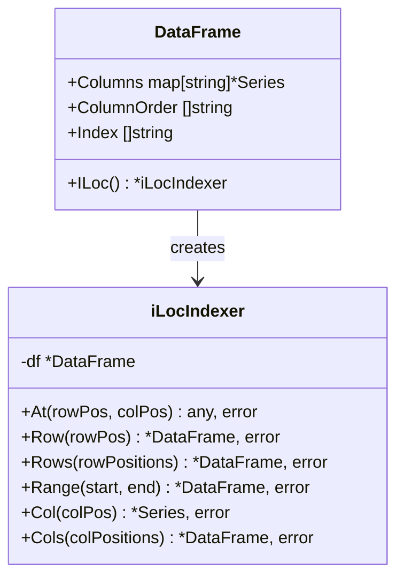

The `ILoc()` accessor provides integer position-based indexing for DataFrames, allowing you to access data using numeric row and column positions (0-indexed).

<!-- IMAGE_PLACEHOLDER: Visual showing DataFrame with numbered positions, highlighting iLoc access pattern -->

&nbsp;

## Overview

`ILoc()` provides numeric position-based data access:

| Method | Description | Returns |
|--------|-------------|---------|
| `.At(rowPos, colPos)` | Single value | `any, error` |
| `.Row(rowPos)` | Single row | `*DataFrame, error` |
| `.Rows(rowPositions)` | Multiple rows | `*DataFrame, error` |
| `.Range(start, end)` | Row range [start, end) | `*DataFrame, error` |
| `.Col(colPos)` | Single column | `*Series, error` |
| `.Cols(colPositions)` | Multiple columns | `*DataFrame, error` |

&nbsp;

## Accessing ILoc

Get the `iLocIndexer` from a DataFrame:

```go
df, _ := gp.Read_csv("data.csv")

// Access the ILoc indexer
ilocIndexer := df.ILoc()

// Chain methods
value, _ := df.ILoc().At(0, 1)
```

&nbsp;

---

&nbsp;

## At() - Single Value Access

Retrieve a single value by row and column positions.

&nbsp;

### Function Signature

```go
func (il *iLocIndexer) At(rowPos int, colPos int) (any, error)
```

&nbsp;

### Parameters

| Parameter | Type | Description |
|-----------|------|-------------|
| `rowPos` | `int` | Row position (0-indexed) |
| `colPos` | `int` | Column position (0-indexed) |

&nbsp;

### Example

```go
package main

import (
    "fmt"
    "log"

    "github.com/apoplexi24/gpandas"
)

func main() {
    gp := gpandas.GoPandas{}
    df, _ := gp.Read_csv("employees.csv")
    
    // DataFrame columns: name(0), department(1), salary(2)
    
    // Access first row, first column (name)
    name, err := df.ILoc().At(0, 0)
    if err != nil {
        log.Fatalf("Access failed: %v", err)
    }
    fmt.Printf("First employee: %v\n", name)
    
    // Access third row (index 2), third column (salary)
    salary, err := df.ILoc().At(2, 2)
    if err != nil {
        log.Fatalf("Access failed: %v", err)
    }
    fmt.Printf("Third employee salary: %v\n", salary)
}
```

&nbsp;

### Position Mapping

```mermaid
flowchart TB
    subgraph DataFrame["DataFrame Grid"]
        direction TB
        
        subgraph Header["Columns"]
            C0["Col 0<br/>name"]
            C1["Col 1<br/>dept"]
            C2["Col 2<br/>salary"]
        end
        
        subgraph Rows["Rows"]
            R0["Row 0: Alice | Eng | 85000"]
            R1["Row 1: Bob | Mkt | 72000"]
            R2["Row 2: Charlie | Eng | 92000"]
        end
    end
    
    subgraph Access["ILoc().At(1, 2)"]
        TARGET["Row 1, Col 2<br/>= 72000"]
    end
    
    R1 --> TARGET
    C2 --> TARGET
    
    style DataFrame fill:#1e293b,stroke:#3b82f6,stroke-width:2px
    style Access fill:#1e293b,stroke:#22c55e,stroke-width:2px
```



&nbsp;

---

&nbsp;

## Row() - Single Row Access

Retrieve a single row at a position as a new DataFrame.

&nbsp;

### Function Signature

```go
func (il *iLocIndexer) Row(rowPos int) (*DataFrame, error)
```

&nbsp;

### Example

```go
// Get the third row (position 2)
row, err := df.ILoc().Row(2)
if err != nil {
    log.Fatalf("Row access failed: %v", err)
}

fmt.Println("Row at position 2:")
fmt.Println(row.String())
```

&nbsp;

### Output

```
Row at position 2:
+---------+-------------+--------+
| name    | department  | salary |
+---------+-------------+--------+
| Charlie | Engineering | 92000  |
+---------+-------------+--------+
[1 rows x 3 columns]
```

&nbsp;

---

&nbsp;

## Rows() - Multiple Rows Access

Retrieve multiple rows by their positions as a new DataFrame.

&nbsp;

### Function Signature

```go
func (il *iLocIndexer) Rows(rowPositions []int) (*DataFrame, error)
```

&nbsp;

### Example

```go
// Get rows at positions 0, 2, and 4
rows, err := df.ILoc().Rows([]int{0, 2, 4})
if err != nil {
    log.Fatalf("Rows access failed: %v", err)
}

fmt.Println("Rows at positions 0, 2, 4:")
fmt.Println(rows.String())
```

&nbsp;

### Output

```
Rows at positions 0, 2, 4:
+---------+-------------+--------+
| name    | department  | salary |
+---------+-------------+--------+
| Alice   | Engineering | 85000  |
| Charlie | Engineering | 92000  |
| Eve     | HR          | 78000  |
+---------+-------------+--------+
[3 rows x 3 columns]
```

&nbsp;

---

&nbsp;

## Range() - Row Range Access

Retrieve a contiguous range of rows `[start, end)` as a new DataFrame.

&nbsp;

### Function Signature

```go
func (il *iLocIndexer) Range(start int, end int) (*DataFrame, error)
```

&nbsp;

### Parameters

| Parameter | Type | Description |
|-----------|------|-------------|
| `start` | `int` | Starting position (inclusive) |
| `end` | `int` | Ending position (exclusive) |

&nbsp;

### Example

```go
// Get rows 0, 1, 2 (positions 0 to 3, exclusive)
firstThree, err := df.ILoc().Range(0, 3)
if err != nil {
    log.Fatalf("Range access failed: %v", err)
}

fmt.Println("First three rows:")
fmt.Println(firstThree.String())

// Get rows 5-9 (positions 5 to 10)
subset, err := df.ILoc().Range(5, 10)
if err != nil {
    log.Fatalf("Range access failed: %v", err)
}

fmt.Println("Rows 5-9:")
fmt.Println(subset.String())
```

&nbsp;

### Range Visualization

```mermaid
flowchart LR
    subgraph Original["Original DataFrame (10 rows)"]
        R0[Row 0]
        R1[Row 1]
        R2[Row 2]
        R3[Row 3]
        R4[Row 4]
        R5[Row 5]
        R6[...]
        R9[Row 9]
    end
    
    subgraph Range["Range(2, 5)"]
        OP[Select rows 2,3,4]
    end
    
    subgraph Result["Result DataFrame"]
        S2[Row 2]
        S3[Row 3]
        S4[Row 4]
    end
    
    R0 -.->|excluded| OP
    R1 -.->|excluded| OP
    R2 -->|included| OP
    R3 -->|included| OP
    R4 -->|included| OP
    R5 -.->|excluded| OP
    OP --> S2
    OP --> S3
    OP --> S4
    
    style Original fill:#1e293b,stroke:#3b82f6,stroke-width:2px
    style Range fill:#1e293b,stroke:#f59e0b,stroke-width:2px
    style Result fill:#1e293b,stroke:#22c55e,stroke-width:2px
```



&nbsp;

---

&nbsp;

## Col() - Single Column Access

Retrieve a single column at a position as a Series reference.

&nbsp;

### Function Signature

```go
func (il *iLocIndexer) Col(colPos int) (*collection.Series, error)
```

&nbsp;

### Example

```go
// Get the second column (position 1)
deptSeries, err := df.ILoc().Col(1)
if err != nil {
    log.Fatalf("Column access failed: %v", err)
}

fmt.Printf("Column 1 has %d entries\n", deptSeries.Len())

// Iterate through values
for i := 0; i < deptSeries.Len(); i++ {
    val, _ := deptSeries.At(i)
    fmt.Printf("  Position %d: %v\n", i, val)
}
```

&nbsp;

---

&nbsp;

## Cols() - Multiple Columns Access

Retrieve multiple columns by their positions as a new DataFrame.

&nbsp;

### Function Signature

```go
func (il *iLocIndexer) Cols(colPositions []int) (*DataFrame, error)
```

&nbsp;

### Example

```go
// Get first and third columns (positions 0 and 2)
subset, err := df.ILoc().Cols([]int{0, 2})
if err != nil {
    log.Fatalf("Columns access failed: %v", err)
}

fmt.Println("Columns 0 and 2:")
fmt.Println(subset.String())
```

&nbsp;

### Output

```
Columns 0 and 2:
+---------+--------+
| name    | salary |
+---------+--------+
| Alice   | 85000  |
| Bob     | 72000  |
| Charlie | 92000  |
+---------+--------+
[3 rows x 2 columns]
```

&nbsp;

---

&nbsp;

## Comparison: ILoc vs Loc

| Feature | `ILoc()` | `Loc()` |
|---------|----------|---------|
| Access by | Integer position | String label |
| Range slicing | Yes (`.Range()`) | No |
| More intuitive for | Loop iteration | Named access |
| Column access | By position | By name |

&nbsp;

### When to Use ILoc

```go
// Loop through first N rows
for i := 0; i < 10; i++ {
    row, _ := df.ILoc().Row(i)
    // Process row...
}

// Slice specific range
subset, _ := df.ILoc().Range(100, 200)

// Access by calculated position
pos := calculatePosition()
value, _ := df.ILoc().At(pos, 0)
```

&nbsp;

### When to Use Loc

```go
// Access by meaningful label
value, _ := df.Loc().At("employee_123", "salary")

// Access by column name (more readable)
series, _ := df.Loc().Col("salary")
```

&nbsp;

---

&nbsp;

## Common Patterns

### Iterate Through All Rows

```go
rowCount := df.Columns[df.ColumnOrder[0]].Len()

for i := 0; i < rowCount; i++ {
    row, _ := df.ILoc().Row(i)
    
    // Process each row
    name, _ := row.ILoc().At(0, 0)
    fmt.Printf("Processing: %v\n", name)
}
```

&nbsp;

### Pagination

```go
pageSize := 10
totalRows := df.Columns[df.ColumnOrder[0]].Len()
totalPages := (totalRows + pageSize - 1) / pageSize

for page := 0; page < totalPages; page++ {
    start := page * pageSize
    end := start + pageSize
    if end > totalRows {
        end = totalRows
    }
    
    pageData, _ := df.ILoc().Range(start, end)
    fmt.Printf("Page %d:\n", page+1)
    fmt.Println(pageData.String())
}
```

&nbsp;

### Head and Tail

```go
// Get first 5 rows (head)
head, _ := df.ILoc().Range(0, 5)
fmt.Println("Head:")
fmt.Println(head.String())

// Get last 5 rows (tail)
totalRows := df.Columns[df.ColumnOrder[0]].Len()
tail, _ := df.ILoc().Range(totalRows-5, totalRows)
fmt.Println("Tail:")
fmt.Println(tail.String())
```

&nbsp;

### Sample Rows

```go
import "math/rand"

// Get random sample of 5 rows
totalRows := df.Columns[df.ColumnOrder[0]].Len()
samplePositions := make([]int, 5)
for i := range samplePositions {
    samplePositions[i] = rand.Intn(totalRows)
}

sample, _ := df.ILoc().Rows(samplePositions)
fmt.Println("Random Sample:")
fmt.Println(sample.String())
```

&nbsp;

---

&nbsp;

## Method Summary



&nbsp;

## Error Handling

| Error | Cause | Solution |
|-------|-------|----------|
| "DataFrame is nil" | Operating on nil DataFrame | Initialize DataFrame first |
| "row position X out of range [0, Y)" | Invalid row position | Check row count first |
| "column position X out of range [0, Y)" | Invalid column position | Check column count |
| "start position X out of range" | Invalid range start | Validate start <= rowCount |
| "end position X out of range" | Invalid range end | Validate end <= rowCount |
| "DataFrame has no columns" | Empty DataFrame | Check DataFrame before access |

&nbsp;

### Bounds Checking Example

```go
rowCount := df.Columns[df.ColumnOrder[0]].Len()
colCount := len(df.ColumnOrder)

rowPos := 5
colPos := 2

// Validate before access
if rowPos >= rowCount {
    log.Fatalf("Row position %d out of bounds (max: %d)", rowPos, rowCount-1)
}
if colPos >= colCount {
    log.Fatalf("Column position %d out of bounds (max: %d)", colPos, colCount-1)
}

value, err := df.ILoc().At(rowPos, colPos)
if err != nil {
    log.Fatalf("Access error: %v", err)
}
```

&nbsp;

## Thread Safety

All `ILoc()` methods use read locks (`RLock`) for thread-safe concurrent access:

```go
var wg sync.WaitGroup

// Safe concurrent reads
for i := 0; i < 10; i++ {
    wg.Add(1)
    go func(pos int) {
        defer wg.Done()
        
        // Multiple goroutines can read simultaneously
        value, _ := df.ILoc().At(pos, 0)
        fmt.Printf("Position %d: %v\n", pos, value)
    }(i % 4)
}

wg.Wait()
```

&nbsp;

## See Also

- [Label-based Indexing (Loc)]() - Access by labels
- [DataFrame Operations]() - Other DataFrame methods
- [Series]() - Working with Series returned by Col()

