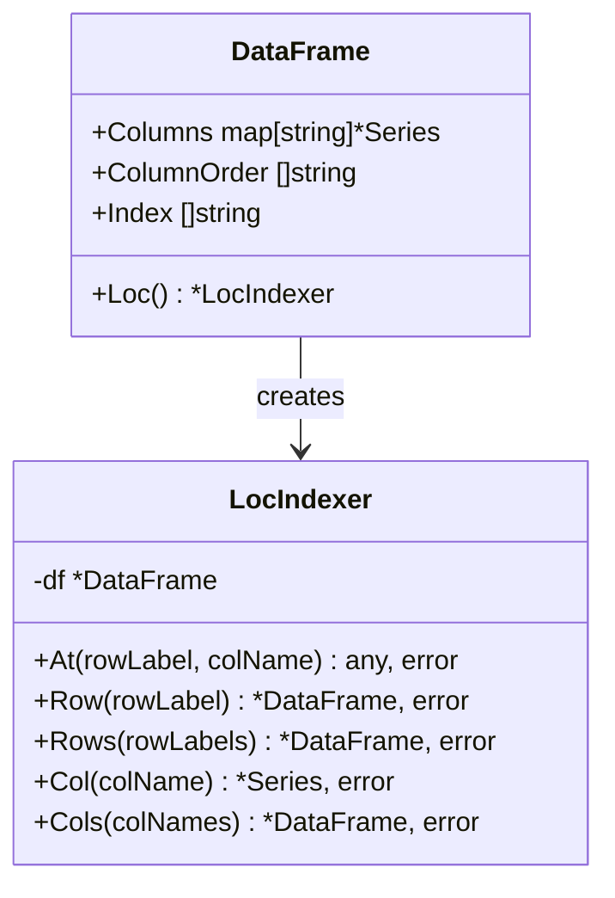

The `Loc()` accessor provides label-based indexing for DataFrames, allowing you to access data using row labels and column names.

<!-- IMAGE_PLACEHOLDER: Visual showing DataFrame with labeled rows and columns, highlighting Loc access pattern -->

&nbsp;

## Overview

`Loc()` provides intuitive data access by label:

| Method | Description | Returns |
|--------|-------------|---------|
| `.At(rowLabel, colName)` | Single value | `any, error` |
| `.Row(rowLabel)` | Single row | `*DataFrame, error` |
| `.Rows(rowLabels)` | Multiple rows | `*DataFrame, error` |
| `.Col(colName)` | Single column | `*Series, error` |
| `.Cols(colNames)` | Multiple columns | `*DataFrame, error` |

&nbsp;

## Accessing Loc

Get the `LocIndexer` from a DataFrame:

```go
df, _ := gp.Read_csv("data.csv")

// Access the Loc indexer
locIndexer := df.Loc()

// Chain methods
value, _ := df.Loc().At("0", "name")
```

&nbsp;

---

&nbsp;

## At() - Single Value Access

Retrieve a single value by row label and column name.

&nbsp;

### Function Signature

```go
func (l *LocIndexer) At(rowLabel string, columnName string) (any, error)
```

&nbsp;

### Parameters

| Parameter | Type | Description |
|-----------|------|-------------|
| `rowLabel` | `string` | Row index label |
| `columnName` | `string` | Column name |

&nbsp;

### Example

```go
package main

import (
    "fmt"
    "log"

    "github.com/apoplexi24/gpandas"
)

func main() {
    gp := gpandas.GoPandas{}
    df, _ := gp.Read_csv("employees.csv")
    
    // Access single value at row "0", column "name"
    name, err := df.Loc().At("0", "name")
    if err != nil {
        log.Fatalf("Access failed: %v", err)
    }
    fmt.Printf("First employee name: %v\n", name)
    
    // Access salary for row "2"
    salary, err := df.Loc().At("2", "salary")
    if err != nil {
        log.Fatalf("Access failed: %v", err)
    }
    fmt.Printf("Third employee salary: %v\n", salary)
}
```

&nbsp;

### Data Flow

```mermaid
flowchart LR
    subgraph DataFrame
        IDX[Index<br/>0, 1, 2, 3]
        COL[Columns<br/>name, dept, salary]
        DATA[Data Grid]
    end
    
    subgraph Loc["Loc().At('1', 'salary')"]
        FIND_ROW[Find Row Label '1']
        FIND_COL[Find Column 'salary']
        GET[Get Value]
    end
    
    subgraph Result
        VAL[72000]
    end
    
    IDX --> FIND_ROW
    COL --> FIND_COL
    FIND_ROW --> GET
    FIND_COL --> GET
    GET --> VAL
    
    style DataFrame fill:#1e293b,stroke:#3b82f6,stroke-width:2px
    style Loc fill:#1e293b,stroke:#f59e0b,stroke-width:2px
    style Result fill:#1e293b,stroke:#22c55e,stroke-width:2px
```



&nbsp;

---

&nbsp;

## Row() - Single Row Access

Retrieve a single row as a new DataFrame.

&nbsp;

### Function Signature

```go
func (l *LocIndexer) Row(rowLabel string) (*DataFrame, error)
```

&nbsp;

### Example

```go
// Get the row with label "2"
row, err := df.Loc().Row("2")
if err != nil {
    log.Fatalf("Row access failed: %v", err)
}

fmt.Println("Row 2:")
fmt.Println(row.String())
```

&nbsp;

### Output

```
Row 2:
+---------+-------------+--------+
| name    | department  | salary |
+---------+-------------+--------+
| Charlie | Engineering | 92000  |
+---------+-------------+--------+
[1 rows x 3 columns]
```

&nbsp;

---

&nbsp;

## Rows() - Multiple Rows Access

Retrieve multiple rows by their labels as a new DataFrame.

&nbsp;

### Function Signature

```go
func (l *LocIndexer) Rows(rowLabels []string) (*DataFrame, error)
```

&nbsp;

### Example

```go
// Get rows with labels "0", "2", and "3"
rows, err := df.Loc().Rows([]string{"0", "2", "3"})
if err != nil {
    log.Fatalf("Rows access failed: %v", err)
}

fmt.Println("Selected Rows:")
fmt.Println(rows.String())
```

&nbsp;

### Output

```
Selected Rows:
+---------+-------------+--------+
| name    | department  | salary |
+---------+-------------+--------+
| Alice   | Engineering | 85000  |
| Charlie | Engineering | 92000  |
| Diana   | Sales       | 68000  |
+---------+-------------+--------+
[3 rows x 3 columns]
```

&nbsp;

### Selection Visualization

```mermaid
flowchart TD
    subgraph Original["Original DataFrame"]
        R0[Row 0: Alice]
        R1[Row 1: Bob]
        R2[Row 2: Charlie]
        R3[Row 3: Diana]
        R4[Row 4: Eve]
    end
    
    subgraph Select["Rows(['0', '2', '3'])"]
        OP[Select Operation]
    end
    
    subgraph Result["Result DataFrame"]
        S0[Row 0: Alice]
        S2[Row 2: Charlie]
        S3[Row 3: Diana]
    end
    
    R0 -->|selected| OP
    R1 -.->|skipped| OP
    R2 -->|selected| OP
    R3 -->|selected| OP
    R4 -.->|skipped| OP
    OP --> S0
    OP --> S2
    OP --> S3
    
    style Original fill:#1e293b,stroke:#3b82f6,stroke-width:2px
    style Select fill:#1e293b,stroke:#f59e0b,stroke-width:2px
    style Result fill:#1e293b,stroke:#22c55e,stroke-width:2px
```



&nbsp;

---

&nbsp;

## Col() - Single Column Access

Retrieve a single column as a Series reference.

&nbsp;

### Function Signature

```go
func (l *LocIndexer) Col(columnName string) (*collection.Series, error)
```

&nbsp;

### Example

```go
// Get the "salary" column as a Series
salarySeries, err := df.Loc().Col("salary")
if err != nil {
    log.Fatalf("Column access failed: %v", err)
}

// Work with the Series
fmt.Printf("Salary column has %d entries\n", salarySeries.Len())

// Access individual values
for i := 0; i < salarySeries.Len(); i++ {
    val, _ := salarySeries.At(i)
    fmt.Printf("  Row %d: %v\n", i, val)
}
```

&nbsp;

### Output

```
Salary column has 4 entries
  Row 0: 85000
  Row 1: 72000
  Row 2: 92000
  Row 3: 68000
```

&nbsp;

---

&nbsp;

## Cols() - Multiple Columns Access

Retrieve multiple columns as a new DataFrame.

&nbsp;

### Function Signature

```go
func (l *LocIndexer) Cols(columnNames []string) (*DataFrame, error)
```

&nbsp;

### Example

```go
// Get "name" and "salary" columns
subset, err := df.Loc().Cols([]string{"name", "salary"})
if err != nil {
    log.Fatalf("Columns access failed: %v", err)
}

fmt.Println("Name and Salary columns:")
fmt.Println(subset.String())
```

&nbsp;

### Output

```
Name and Salary columns:
+---------+--------+
| name    | salary |
+---------+--------+
| Alice   | 85000  |
| Bob     | 72000  |
| Charlie | 92000  |
| Diana   | 68000  |
+---------+--------+
[4 rows x 2 columns]
```

&nbsp;

---

&nbsp;

## Custom Index Labels

By default, DataFrames have string index labels "0", "1", "2", etc. You can set custom labels:

&nbsp;

### Setting Custom Index

```go
package main

import (
    "fmt"

    "github.com/apoplexi24/gpandas"
)

func main() {
    gp := gpandas.GoPandas{}
    df, _ := gp.Read_csv("employees.csv")
    
    // Set custom index labels
    err := df.SetIndex([]string{"emp_001", "emp_002", "emp_003", "emp_004"})
    if err != nil {
        panic(err)
    }
    
    // Now access using custom labels
    alice, _ := df.Loc().Row("emp_001")
    fmt.Println("Employee 001:")
    fmt.Println(alice.String())
    
    // Access specific value
    salary, _ := df.Loc().At("emp_003", "salary")
    fmt.Printf("Employee 003 salary: %v\n", salary)
}
```

&nbsp;

### Resetting Index

```go
// Reset to default numeric index
df.ResetIndex()

// Now use "0", "1", "2", ... again
row, _ := df.Loc().Row("0")
```

&nbsp;

---

&nbsp;

## Comparison: Loc vs Select

| Feature | `Loc()` | `Select()` |
|---------|---------|------------|
| Row access | Yes | No |
| Column access | Yes | Yes |
| Single value | Yes (`.At()`) | No |
| Returns Series | Yes (`.Col()`) | No (always DataFrame) |
| Index preservation | Yes | Yes |

&nbsp;

### When to Use Loc

```go
// Use Loc for row-based access
row, _ := df.Loc().Row("5")
value, _ := df.Loc().At("5", "name")

// Use Loc for column Series
series, _ := df.Loc().Col("salary")
```

&nbsp;

### When to Use Select

```go
// Use Select for simple column extraction
subset, _ := df.Select("name", "salary", "department")
```

&nbsp;

---

&nbsp;

## Method Summary



&nbsp;

## Error Handling

| Error | Cause | Solution |
|-------|-------|----------|
| "DataFrame is nil" | Operating on nil DataFrame | Initialize DataFrame first |
| "row label 'X' not found in index" | Invalid row label | Verify label exists in Index |
| "column 'X' not found" | Invalid column name | Check column exists |

&nbsp;

### Example

```go
value, err := df.Loc().At("invalid_label", "name")
if err != nil {
    // Error: "row label 'invalid_label' not found in index"
    log.Printf("Access error: %v", err)
}
```

&nbsp;

## Thread Safety

All `Loc()` methods use read locks (`RLock`) for thread-safe concurrent access:

```go
var wg sync.WaitGroup

// Safe concurrent reads
for i := 0; i < 10; i++ {
    wg.Add(1)
    go func(id int) {
        defer wg.Done()
        
        // Multiple goroutines can read simultaneously
        value, _ := df.Loc().At(fmt.Sprintf("%d", id%4), "name")
        fmt.Printf("Goroutine %d read: %v\n", id, value)
    }(i)
}

wg.Wait()
```

&nbsp;

## See Also

- [Position-based Indexing (iLoc)]() - Access by integer position
- [DataFrame Operations]() - Other DataFrame methods
- [Series]() - Working with Series returned by Col()

