Learn how to load and export DataFrames as JSON, Excel, and Parquet files in GPandas. JSON is read and written in records orientation; Excel support is powered by [excelize](https://github.com/xuri/excelize) and Parquet by [parquet-go](https://github.com/parquet-go/parquet-go).

<!-- IMAGE_PLACEHOLDER: Visual showing JSON and Excel files flowing into and out of a DataFrame -->

&nbsp;

## Overview

| Format | Read | Write |
|--------|------|-------|
| JSON | `Read_json()` | `ToJSON()` |
| Excel (.xlsx) | `Read_excel()` | `ToExcel()` |
| Parquet | `Read_parquet()` | `ToParquet()` |

&nbsp;

---

&nbsp;

## Read_json

Reads a JSON file in records orientation (a top-level array of objects) into a DataFrame.

&nbsp;

### Function Signature

```go
func (GoPandas) Read_json(filepath string) (*dataframe.DataFrame, error)
```

&nbsp;

### Behaviour

- Each object becomes a row.
- The union of all keys becomes the columns, sorted alphabetically.
- Missing keys in a record produce null values.
- JSON numbers decode as `float64`.

&nbsp;

### Example

Given `data.json`:

```json
[{"name":"Alice","age":30},{"name":"Bob","age":25}]
```

```go
gp := gpandas.GoPandas{}
df, err := gp.Read_json("data.json")
if err != nil {
    log.Fatalf("Read_json failed: %v", err)
}
fmt.Println(df.DTypes())
```

```
map[age:float64 name:string]
```

Columns are sorted (`age`, then `name`), and `age` is `float64` because JSON numbers decode as floats. Convert with [AsType]() if you need integers.

&nbsp;

---

&nbsp;

## ToJSON

Serializes the DataFrame to JSON in records orientation. Column order is preserved within each object, and null values are emitted as JSON `null`.

&nbsp;

### Function Signature

```go
func (df *DataFrame) ToJSON(filepath string) (string, error)
```

If `filepath` is empty, the JSON string is returned; otherwise it is written to the file and `("", nil)` is returned.

&nbsp;

### Example

```go
// Return as a string
s, err := df.ToJSON("")
if err != nil {
    log.Fatalf("ToJSON failed: %v", err)
}
fmt.Println(s)

// Or write to a file
_, err = df.ToJSON("out.json")
```

&nbsp;

### Output

```json
[{"Department":"Eng","Salary_sum":450,"Salary_mean":150,"Salary_max":200,"Units_sum":9},{"Department":"Sales","Salary_sum":120,"Salary_mean":60,"Salary_max":70,"Units_sum":13}]
```

&nbsp;

---

&nbsp;

## Read_excel

Reads an Excel `.xlsx` file into a DataFrame. The first row is treated as the header, and all remaining cells are loaded as strings (like `Read_csv`).

&nbsp;

### Function Signature

```go
func (GoPandas) Read_excel(filepath string, sheet ...string) (*dataframe.DataFrame, error)
```

If a sheet name is omitted, the first sheet is used.

&nbsp;

### Example

```go
gp := gpandas.GoPandas{}

df, err := gp.Read_excel("data.xlsx")
if err != nil {
    log.Fatalf("Read_excel failed: %v", err)
}

// Cells load as strings; convert numeric columns as needed
df, _ = df.AsType("Age", dataframe.IntCol{})
fmt.Println(df.String())
```

&nbsp;

---

&nbsp;

## ToExcel

Writes the DataFrame to an Excel `.xlsx` file with the column headers in the first row, followed by one row per record. Null values are written as empty cells.

&nbsp;

### Function Signature

```go
func (df *DataFrame) ToExcel(filepath string, sheet ...string) error
```

The sheet name defaults to `"Sheet1"`.

&nbsp;

### Example

```go
if err := df.ToExcel("out.xlsx"); err != nil {
    log.Fatalf("ToExcel failed: %v", err)
}

// Custom sheet name
err := df.ToExcel("out.xlsx", "Employees")
```

&nbsp;

### I/O Flow

```mermaid
flowchart LR
    subgraph Sources["Files"]
        J[data.json]
        X[data.xlsx]
    end

    subgraph DF["DataFrame"]
        D[Columns + Index]
    end

    subgraph Out["Exports"]
        OJ[out.json]
        OX[out.xlsx]
    end

    J -->|Read_json| D
    X -->|Read_excel| D
    D -->|ToJSON| OJ
    D -->|ToExcel| OX

    style Sources fill:#1e293b,stroke:#3b82f6,stroke-width:2px
    style DF fill:#1e293b,stroke:#f59e0b,stroke-width:2px
    style Out fill:#1e293b,stroke:#22c55e,stroke-width:2px
```



&nbsp;

---

&nbsp;

## Read_parquet

Reads a Parquet file into a DataFrame. Column types are inferred from the Parquet schema: INT64 → int64, DOUBLE/FLOAT → float64, BOOLEAN → bool, and BYTE_ARRAY → string.

&nbsp;

### Function Signature

```go
func (GoPandas) Read_parquet(filepath string) (*dataframe.DataFrame, error)
```

**Note:** Columns are read back in the order stored in the Parquet schema (alphabetical).

&nbsp;

## ToParquet

Writes the DataFrame to a Parquet file. Columns are mapped to Parquet types: float64 → DOUBLE, int64 → INT64, bool → BOOLEAN, and everything else (string, datetime, categorical) → UTF8 string.

&nbsp;

### Function Signature

```go
func (df *DataFrame) ToParquet(filepath string) error
```

**Note:** Parquet columns are written as required (non-nullable). Null values are written as the zero value for the column type (`0`, `0.0`, `""`, `false`).

&nbsp;

### Example

```go
gp := gpandas.GoPandas{}

// Write
if err := df.ToParquet("data.parquet"); err != nil {
    log.Fatalf("ToParquet failed: %v", err)
}

// Read back
loaded, err := gp.Read_parquet("data.parquet")
if err != nil {
    log.Fatalf("Read_parquet failed: %v", err)
}
fmt.Println(loaded.DTypes())
```

&nbsp;

---

&nbsp;

## Error Handling

### Common Errors

| Error | Cause | Solution |
|-------|-------|----------|
| "error reading file" | Missing or unreadable file | Verify the path |
| "expected an array of objects" | JSON not in records orientation | Provide a top-level array of objects |
| "no records found in JSON" | Empty JSON array | Provide at least one record |
| "error opening Excel file" | Invalid or non-xlsx file | Verify the file is a valid .xlsx |
| "sheet ... is empty" | Excel sheet has no rows | Ensure the sheet has a header row |
| "error opening parquet file" | Invalid or corrupt .parquet file | Verify the file is a valid Parquet file |

&nbsp;

---

&nbsp;

## Dependencies

Excel support depends on [`github.com/xuri/excelize/v2`](https://github.com/xuri/excelize), and Parquet support on [`github.com/parquet-go/parquet-go`](https://github.com/parquet-go/parquet-go); both are pulled in automatically via `go get`. JSON I/O uses only the Go standard library.

&nbsp;

---

&nbsp;

## See Also

- [Loading CSV Files]() - Read CSV data
- [SQL Integration]() - Load from databases and BigQuery
- [Type Casting & Inspection]() - Convert loaded string columns
- [DataFrame Operations]() - Export to CSV
