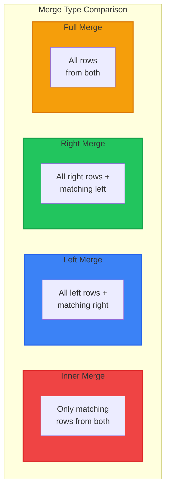

Learn how to combine DataFrames using various merge strategies in GPandas, similar to SQL JOIN operations.

<!-- IMAGE_PLACEHOLDER: Venn diagram style illustration showing different join types -->

&nbsp;

## Overview

The `Merge()` function combines two DataFrames based on a common column (key). GPandas supports four merge types:

| Merge Type | Constant | Description |
|------------|----------|-------------|
| Inner | `InnerMerge` | Only matching rows from both DataFrames |
| Left | `LeftMerge` | All rows from left, matching from right |
| Right | `RightMerge` | All rows from right, matching from left |
| Full Outer | `FullMerge` | All rows from both DataFrames |

&nbsp;

## Function Signature

```go
func (df *DataFrame) Merge(other *DataFrame, on string, how MergeHow) (*DataFrame, error)
```

&nbsp;

## Parameters

| Parameter | Type | Description |
|-----------|------|-------------|
| `other` | `*DataFrame` | The right DataFrame to merge with |
| `on` | `string` | Column name to join on (must exist in both DataFrames) |
| `how` | `MergeHow` | Type of merge: `InnerMerge`, `LeftMerge`, `RightMerge`, `FullMerge` |

&nbsp;

## Returns

| Type | Description |
|------|-------------|
| `*DataFrame` | New merged DataFrame |
| `error` | Error if merge fails |

&nbsp;

---

&nbsp;

## Sample Data

All examples use these two DataFrames:

### Left DataFrame (df1) - Employees

| ID | Name | Department |
|----|------|------------|
| 1 | Alice | Engineering |
| 2 | Bob | Marketing |
| 3 | Charlie | Engineering |
| 4 | Diana | Sales |

&nbsp;

### Right DataFrame (df2) - Salaries

| ID | Salary | Bonus |
|----|--------|-------|
| 1 | 85000 | 5000 |
| 2 | 72000 | 3000 |
| 5 | 95000 | 8000 |
| 6 | 68000 | 2000 |

&nbsp;

### Setup Code

```go
package main

import (
    "fmt"
    "log"

    "github.com/apoplexi24/gpandas"
    "github.com/apoplexi24/gpandas/dataframe"
)

func main() {
    gp := gpandas.GoPandas{}
    
    // Create employees DataFrame
    df1, _ := gp.DataFrame(
        []string{"ID", "Name", "Department"},
        []gpandas.Column{
            {int64(1), int64(2), int64(3), int64(4)},
            {"Alice", "Bob", "Charlie", "Diana"},
            {"Engineering", "Marketing", "Engineering", "Sales"},
        },
        map[string]any{
            "ID":         gpandas.IntCol{},
            "Name":       gpandas.StringCol{},
            "Department": gpandas.StringCol{},
        },
    )
    
    // Create salaries DataFrame
    df2, _ := gp.DataFrame(
        []string{"ID", "Salary", "Bonus"},
        []gpandas.Column{
            {int64(1), int64(2), int64(5), int64(6)},
            {85000.0, 72000.0, 95000.0, 68000.0},
            {5000.0, 3000.0, 8000.0, 2000.0},
        },
        map[string]any{
            "ID":     gpandas.IntCol{},
            "Salary": gpandas.FloatCol{},
            "Bonus":  gpandas.FloatCol{},
        },
    )
    
    // Examples follow...
}
```

&nbsp;

---

&nbsp;

## Inner Merge

Returns only rows where the key exists in **both** DataFrames.

```mermaid
flowchart LR
    subgraph Left["Left DataFrame"]
        L1[ID: 1 - Alice]
        L2[ID: 2 - Bob]
        L3[ID: 3 - Charlie]
        L4[ID: 4 - Diana]
    end
    
    subgraph Right["Right DataFrame"]
        R1[ID: 1 - $85k]
        R2[ID: 2 - $72k]
        R3[ID: 5 - $95k]
        R4[ID: 6 - $68k]
    end
    
    subgraph Result["Inner Merge Result"]
        M1[ID: 1 - Alice - $85k]
        M2[ID: 2 - Bob - $72k]
    end
    
    L1 -->|match| M1
    L2 -->|match| M2
    L3 -.->|no match| X1[excluded]
    L4 -.->|no match| X2[excluded]
    R1 -->|match| M1
    R2 -->|match| M2
    R3 -.->|no match| X3[excluded]
    R4 -.->|no match| X4[excluded]
    
    style Left fill:#1e293b,stroke:#3b82f6,stroke-width:2px
    style Right fill:#1e293b,stroke:#22c55e,stroke-width:2px
    style Result fill:#1e293b,stroke:#f59e0b,stroke-width:2px
```



&nbsp;

### Inner Merge Example

```go
result, err := df1.Merge(df2, "ID", dataframe.InnerMerge)
if err != nil {
    log.Fatalf("Merge failed: %v", err)
}
fmt.Println(result.String())
```

&nbsp;

### Inner Merge Output

```
+----+-------+-------------+--------+-------+
| ID | Name  | Department  | Salary | Bonus |
+----+-------+-------------+--------+-------+
| 1  | Alice | Engineering | 85000  | 5000  |
| 2  | Bob   | Marketing   | 72000  | 3000  |
+----+-------+-------------+--------+-------+
[2 rows x 5 columns]
```

&nbsp;

---

&nbsp;

## Left Merge

Returns **all rows from the left** DataFrame, with matching data from the right. Non-matching rows have `nil` for right columns.

```mermaid
flowchart LR
    subgraph Left["Left DataFrame"]
        L1[ID: 1 - Alice]
        L2[ID: 2 - Bob]
        L3[ID: 3 - Charlie]
        L4[ID: 4 - Diana]
    end
    
    subgraph Right["Right DataFrame"]
        R1[ID: 1 - $85k]
        R2[ID: 2 - $72k]
        R3[ID: 5 - $95k]
        R4[ID: 6 - $68k]
    end
    
    subgraph Result["Left Merge Result"]
        M1[ID: 1 - Alice - $85k]
        M2[ID: 2 - Bob - $72k]
        M3[ID: 3 - Charlie - nil]
        M4[ID: 4 - Diana - nil]
    end
    
    L1 -->|match| M1
    L2 -->|match| M2
    L3 -->|kept| M3
    L4 -->|kept| M4
    R1 -->|match| M1
    R2 -->|match| M2
    R3 -.->|excluded| X1[not used]
    R4 -.->|excluded| X2[not used]
    
    style Left fill:#1e293b,stroke:#3b82f6,stroke-width:2px
    style Right fill:#1e293b,stroke:#22c55e,stroke-width:2px
    style Result fill:#1e293b,stroke:#f59e0b,stroke-width:2px
```



&nbsp;

### Left Merge Example

```go
result, err := df1.Merge(df2, "ID", dataframe.LeftMerge)
if err != nil {
    log.Fatalf("Merge failed: %v", err)
}
fmt.Println(result.String())
```

&nbsp;

### Left Merge Output

```
+----+---------+-------------+--------+-------+
| ID | Name    | Department  | Salary | Bonus |
+----+---------+-------------+--------+-------+
| 1  | Alice   | Engineering | 85000  | 5000  |
| 2  | Bob     | Marketing   | 72000  | 3000  |
| 3  | Charlie | Engineering | <nil>  | <nil> |
| 4  | Diana   | Sales       | <nil>  | <nil> |
+----+---------+-------------+--------+-------+
[4 rows x 5 columns]
```

&nbsp;

---

&nbsp;

## Right Merge

Returns **all rows from the right** DataFrame, with matching data from the left. Non-matching rows have `nil` for left columns.

```mermaid
flowchart LR
    subgraph Left["Left DataFrame"]
        L1[ID: 1 - Alice]
        L2[ID: 2 - Bob]
        L3[ID: 3 - Charlie]
        L4[ID: 4 - Diana]
    end
    
    subgraph Right["Right DataFrame"]
        R1[ID: 1 - $85k]
        R2[ID: 2 - $72k]
        R3[ID: 5 - $95k]
        R4[ID: 6 - $68k]
    end
    
    subgraph Result["Right Merge Result"]
        M1[ID: 1 - Alice - $85k]
        M2[ID: 2 - Bob - $72k]
        M3[ID: 5 - nil - $95k]
        M4[ID: 6 - nil - $68k]
    end
    
    L1 -->|match| M1
    L2 -->|match| M2
    L3 -.->|excluded| X1[not used]
    L4 -.->|excluded| X2[not used]
    R1 -->|match| M1
    R2 -->|match| M2
    R3 -->|kept| M3
    R4 -->|kept| M4
    
    style Left fill:#1e293b,stroke:#3b82f6,stroke-width:2px
    style Right fill:#1e293b,stroke:#22c55e,stroke-width:2px
    style Result fill:#1e293b,stroke:#f59e0b,stroke-width:2px
```



&nbsp;

### Right Merge Example

```go
result, err := df1.Merge(df2, "ID", dataframe.RightMerge)
if err != nil {
    log.Fatalf("Merge failed: %v", err)
}
fmt.Println(result.String())
```

&nbsp;

### Right Merge Output

```
+----+-------+-------------+--------+-------+
| ID | Name  | Department  | Salary | Bonus |
+----+-------+-------------+--------+-------+
| 1  | Alice | Engineering | 85000  | 5000  |
| 2  | Bob   | Marketing   | 72000  | 3000  |
| 5  | <nil> | <nil>       | 95000  | 8000  |
| 6  | <nil> | <nil>       | 68000  | 2000  |
+----+-------+-------------+--------+-------+
[4 rows x 5 columns]
```

&nbsp;

---

&nbsp;

## Full Outer Merge

Returns **all rows from both** DataFrames. Non-matching rows have `nil` for missing columns.

```mermaid
flowchart LR
    subgraph Left["Left DataFrame"]
        L1[ID: 1 - Alice]
        L2[ID: 2 - Bob]
        L3[ID: 3 - Charlie]
        L4[ID: 4 - Diana]
    end
    
    subgraph Right["Right DataFrame"]
        R1[ID: 1 - $85k]
        R2[ID: 2 - $72k]
        R3[ID: 5 - $95k]
        R4[ID: 6 - $68k]
    end
    
    subgraph Result["Full Merge Result"]
        M1[ID: 1 - Alice - $85k]
        M2[ID: 2 - Bob - $72k]
        M3[ID: 3 - Charlie - nil]
        M4[ID: 4 - Diana - nil]
        M5[ID: 5 - nil - $95k]
        M6[ID: 6 - nil - $68k]
    end
    
    L1 --> M1
    L2 --> M2
    L3 --> M3
    L4 --> M4
    R1 --> M1
    R2 --> M2
    R3 --> M5
    R4 --> M6
    
    style Left fill:#1e293b,stroke:#3b82f6,stroke-width:2px
    style Right fill:#1e293b,stroke:#22c55e,stroke-width:2px
    style Result fill:#1e293b,stroke:#f59e0b,stroke-width:2px
```



&nbsp;

### Full Merge Example

```go
result, err := df1.Merge(df2, "ID", dataframe.FullMerge)
if err != nil {
    log.Fatalf("Merge failed: %v", err)
}
fmt.Println(result.String())
```

&nbsp;

### Full Merge Output

```
+----+---------+-------------+--------+-------+
| ID | Name    | Department  | Salary | Bonus |
+----+---------+-------------+--------+-------+
| 1  | Alice   | Engineering | 85000  | 5000  |
| 2  | Bob     | Marketing   | 72000  | 3000  |
| 3  | Charlie | Engineering | <nil>  | <nil> |
| 4  | Diana   | Sales       | <nil>  | <nil> |
| 5  | <nil>   | <nil>       | 95000  | 8000  |
| 6  | <nil>   | <nil>       | 68000  | 2000  |
+----+---------+-------------+--------+-------+
[6 rows x 5 columns]
```

&nbsp;

---

&nbsp;

## Merge Type Comparison

Visual comparison of all merge types:



&nbsp;

| Merge Type | Left Rows | Right Rows | Result Rows (Example) |
|------------|-----------|------------|----------------------|
| Inner | Matching only | Matching only | 2 |
| Left | All (4) | Matching only | 4 |
| Right | Matching only | All (4) | 4 |
| Full | All (4) | All (4) | 6 |

&nbsp;

---

&nbsp;

## SQL Equivalent

| GPandas | SQL Equivalent |
|---------|----------------|
| `InnerMerge` | `INNER JOIN` |
| `LeftMerge` | `LEFT OUTER JOIN` |
| `RightMerge` | `RIGHT OUTER JOIN` |
| `FullMerge` | `FULL OUTER JOIN` |

```sql
-- Inner Merge equivalent
SELECT * FROM employees e
INNER JOIN salaries s ON e.ID = s.ID;

-- Left Merge equivalent
SELECT * FROM employees e
LEFT OUTER JOIN salaries s ON e.ID = s.ID;

-- Right Merge equivalent
SELECT * FROM employees e
RIGHT OUTER JOIN salaries s ON e.ID = s.ID;

-- Full Merge equivalent
SELECT * FROM employees e
FULL OUTER JOIN salaries s ON e.ID = s.ID;
```

&nbsp;

---

&nbsp;

## Handling Many-to-Many Relationships

When the key column has duplicate values, the merge produces a Cartesian product of matching rows:

```go
// df1 has duplicate IDs
// ID: 1, 1, 2
// Name: Alice, Alex, Bob

// df2 has duplicate IDs  
// ID: 1, 1, 2
// Salary: 80k, 85k, 72k

// Inner merge produces:
// ID: 1, 1, 1, 1, 2
// Name: Alice, Alice, Alex, Alex, Bob
// Salary: 80k, 85k, 80k, 85k, 72k
```

&nbsp;

---

&nbsp;

## Error Handling

### Common Errors

| Error | Cause | Solution |
|-------|-------|----------|
| "both DataFrames must be non-nil" | nil DataFrame passed | Check DataFrame initialization |
| "column 'X' not found in left DataFrame" | Key column missing | Verify column name |
| "column 'X' not found in right DataFrame" | Key column missing | Verify column name |
| "invalid merge type" | Invalid MergeHow value | Use predefined constants |

&nbsp;

### Example Error Handling

```go
result, err := df1.Merge(df2, "ID", dataframe.InnerMerge)
if err != nil {
    switch {
    case strings.Contains(err.Error(), "non-nil"):
        log.Fatal("One of the DataFrames is nil")
    case strings.Contains(err.Error(), "not found"):
        log.Fatal("Key column doesn't exist in one of the DataFrames")
    default:
        log.Fatalf("Merge error: %v", err)
    }
}
```

&nbsp;

---

&nbsp;

## Complete Example: Multi-Table Join

```go
package main

import (
    "fmt"
    "log"

    "github.com/apoplexi24/gpandas"
    "github.com/apoplexi24/gpandas/dataframe"
)

func main() {
    gp := gpandas.GoPandas{}
    
    // Load three related tables
    employees, _ := gp.Read_csv("employees.csv")       // ID, Name, DeptID
    departments, _ := gp.Read_csv("departments.csv")   // DeptID, DeptName
    salaries, _ := gp.Read_csv("salaries.csv")         // ID, Salary
    
    // First merge: employees + departments
    empDept, err := employees.Merge(departments, "DeptID", dataframe.LeftMerge)
    if err != nil {
        log.Fatalf("First merge failed: %v", err)
    }
    fmt.Println("Employees with Departments:")
    fmt.Println(empDept.String())
    
    // Second merge: result + salaries
    final, err := empDept.Merge(salaries, "ID", dataframe.LeftMerge)
    if err != nil {
        log.Fatalf("Second merge failed: %v", err)
    }
    fmt.Println("\nComplete Employee Data:")
    fmt.Println(final.String())
    
    // Export final result
    _, err = final.ToCSV("complete_employee_data.csv", ",")
    if err != nil {
        log.Printf("Export warning: %v", err)
    }
}
```

&nbsp;

## See Also

- [DataFrame Operations]() - Select and transform data
- [Creating DataFrames]() - Build DataFrames from scratch
- [SQL Integration]() - Use SQL JOINs directly

