Learn how to handle missing values in GPandas. Detect nulls with `IsNA`/`NotNA`, replace them with `FillNA` (constant or propagation), or remove incomplete rows with `DropNA`.

<!-- IMAGE_PLACEHOLDER: Visual showing null cells being filled and incomplete rows being dropped -->

&nbsp;

## Overview

GPandas provides null-aware cleaning operations:

| Operation | Method | Description |
|-----------|--------|-------------|
| Detect | `IsNA()`, `NotNA()` | Boolean DataFrames of null / non-null cells |
| Fill (constant) | `FillNA()`, `FillNAColumn()` | Replace nulls with a value |
| Fill (propagation) | `FillNAMethod()` | Forward or backward fill |
| Drop | `DropNA()` | Remove rows containing nulls |

All methods return a new DataFrame; the original is never modified.

&nbsp;

---

&nbsp;

## Sample Data

All examples use this DataFrame with missing values:

| Name | Math | Science |
|------|------|---------|
| Alice | 90 | 85 |
| Bob | null | 70 |
| Charlie | null | null |
| Diana | 60 | null |

&nbsp;

### Setup Code

```go
package main

import (
    "fmt"
    "log"

    "github.com/apoplexi24/gpandas/dataframe"
    "github.com/apoplexi24/gpandas/utils/collection"
)

func main() {
    name, _ := collection.NewStringSeriesFromData(
        []string{"Alice", "Bob", "Charlie", "Diana"}, nil)
    math, _ := collection.NewFloat64SeriesFromData(
        []float64{90, 0, 0, 60}, []bool{false, true, true, false})
    sci, _ := collection.NewFloat64SeriesFromData(
        []float64{85, 70, 0, 0}, []bool{false, false, true, true})

    df := &dataframe.DataFrame{
        Columns: map[string]collection.Series{
            "Name": name, "Math": math, "Science": sci,
        },
        ColumnOrder: []string{"Name", "Math", "Science"},
        Index:       []string{"0", "1", "2", "3"},
    }

    // Examples follow...
}
```

```
+---------+------+---------+
| Name    | Math | Science |
+---------+------+---------+
| Alice   | 90   | 85      |
| Bob     | null | 70      |
| Charlie | null | null    |
| Diana   | 60   | null    |
+---------+------+---------+
[4 rows x 3 columns]
```

**Note:** In the boolean mask passed to a Series constructor, `true` marks a value as null.

&nbsp;

---

&nbsp;

## Detecting Nulls

`IsNA` returns a boolean DataFrame where each cell is true if the original cell is null. `NotNA` is the inverse.

```go
fmt.Println(df.IsNA().String())
```

&nbsp;

### Output

```
+-------+-------+---------+
| Name  | Math  | Science |
+-------+-------+---------+
| false | false | false   |
| false | true  | false   |
| false | true  | true    |
| false | false | true    |
+-------+-------+---------+
[4 rows x 3 columns]
```

&nbsp;

---

&nbsp;

## FillNA

Replaces nulls with a constant across all compatible columns. For each column, the value is coerced to the column dtype; columns whose type is incompatible with the value are left unchanged.

&nbsp;

### Function Signature

```go
func (df *DataFrame) FillNA(value any) (*DataFrame, error)
```

&nbsp;

### Example

```go
filled, err := df.FillNA(0.0)
if err != nil {
    log.Fatalf("FillNA failed: %v", err)
}
fmt.Println(filled.String())
```

&nbsp;

### Output

```
+---------+------+---------+
| Name    | Math | Science |
+---------+------+---------+
| Alice   | 90   | 85      |
| Bob     | 0    | 70      |
| Charlie | 0    | 0       |
| Diana   | 60   | 0       |
+---------+------+---------+
[4 rows x 3 columns]
```

**Note:** The `Name` column is a string column, so the float fill value does not apply to it and it is left unchanged. To fill a single column explicitly, use `FillNAColumn`.

&nbsp;

### FillNAColumn

Fill nulls in a single column. An error is returned if the value is incompatible with the column's type.

```go
func (df *DataFrame) FillNAColumn(column string, value any) (*DataFrame, error)

// Example
filled, _ := df.FillNAColumn("Math", 0.0)
```

&nbsp;

---

&nbsp;

## FillNAMethod

Fills nulls by propagation instead of a constant:

| Method | Behaviour |
|--------|-----------|
| `"ffill"` | Forward fill: propagate the last valid value forward |
| `"bfill"` | Backward fill: propagate the next valid value backward |

&nbsp;

### Function Signature

```go
func (df *DataFrame) FillNAMethod(method string) (*DataFrame, error)
```

&nbsp;

### Example

```go
filled, err := df.FillNAMethod("ffill")
if err != nil {
    log.Fatalf("FillNAMethod failed: %v", err)
}
fmt.Println(filled.String())
```

&nbsp;

### Output

```
+---------+------+---------+
| Name    | Math | Science |
+---------+------+---------+
| Alice   | 90   | 85      |
| Bob     | 90   | 70      |
| Charlie | 90   | 70      |
| Diana   | 60   | 70      |
+---------+------+---------+
[4 rows x 3 columns]
```

**Note:** Leading nulls for `ffill` (and trailing nulls for `bfill`) that have no valid neighbour remain null.

&nbsp;

---

&nbsp;

## DropNA

Removes rows that contain null values. Index labels of the surviving rows are preserved.

&nbsp;

### Function Signature

```go
func (df *DataFrame) DropNA(how string, subset []string) (*DataFrame, error)
```

&nbsp;

### Parameters

| Parameter | Description |
|-----------|-------------|
| `how` | `"any"` (default): drop a row if any considered column is null. `"all"`: drop a row only if every considered column is null. |
| `subset` | Columns to consider. If empty, all columns are considered. |

&nbsp;

### Drop with how="any"

```go
cleaned, _ := df.DropNA("any", nil)
fmt.Println(cleaned.String())
```

```
+-------+------+---------+
| Name  | Math | Science |
+-------+------+---------+
| Alice | 90   | 85      |
+-------+------+---------+
[1 rows x 3 columns]
```

Only Alice's row has no nulls across all columns.

&nbsp;

### Drop with how="all" and a subset

```go
cleaned, _ := df.DropNA("all", []string{"Math", "Science"})
fmt.Println(cleaned.String())
```

```
+-------+------+---------+
| Name  | Math | Science |
+-------+------+---------+
| Alice | 90   | 85      |
| Bob   | null | 70      |
| Diana | 60   | null    |
+-------+------+---------+
[3 rows x 3 columns]
```

Only Charlie (null in both `Math` and `Science`) is dropped.

&nbsp;

### DropNA Decision Flow

```mermaid
flowchart TD
    subgraph Row["Each Row"]
        R[Count nulls in<br/>considered columns]
    end

    subgraph Decide["how?"]
        D1{how == any}
        D2{how == all}
    end

    subgraph Action["Keep or Drop"]
        K1[Drop if any null]
        K2[Drop if all null]
        K3[Keep row]
    end

    R --> D1
    D1 -->|null count > 0| K1
    D1 -->|else| K3
    R --> D2
    D2 -->|null count == considered| K2
    D2 -->|else| K3

    style Row fill:#1e293b,stroke:#3b82f6,stroke-width:2px
    style Decide fill:#1e293b,stroke:#f59e0b,stroke-width:2px
    style Action fill:#1e293b,stroke:#22c55e,stroke-width:2px
```



&nbsp;

---

&nbsp;

## Error Handling

### Common Errors

| Error | Cause | Solution |
|-------|-------|----------|
| "DataFrame is nil" | Operating on nil DataFrame | Check DataFrame initialization |
| "fill value must not be nil" | `FillNA(nil)` | Provide a non-nil value |
| "value ... incompatible with column" | `FillNAColumn` type mismatch | Use a value matching the column type |
| "method must be 'ffill' or 'bfill'" | Invalid `FillNAMethod` argument | Use `"ffill"` or `"bfill"` |
| "how must be 'any' or 'all'" | Invalid `DropNA` argument | Use `"any"` or `"all"` |
| "column 'X' not found" | Missing subset/target column | Verify the column exists |

&nbsp;

---

&nbsp;

## Thread Safety

Missing-data operations are thread-safe and read-only with respect to the source:

| Method | Lock Type | Description |
|--------|-----------|-------------|
| `FillNA()` / `FillNAColumn()` / `FillNAMethod()` | RLock | Read lock during construction of the new DataFrame |
| `DropNA()` | RLock | Read lock during row evaluation |
| `IsNA()` / `NotNA()` | RLock | Read lock during mask construction |

&nbsp;

---

&nbsp;

## Complete Example: Cleaning Pipeline

```go
package main

import (
    "fmt"
    "log"

    "github.com/apoplexi24/gpandas"
)

func main() {
    gp := gpandas.GoPandas{}

    df, err := gp.Read_csv_typed("survey.csv", map[string]any{
        "Score": gpandas.FloatCol{},
    })
    if err != nil {
        log.Fatalf("Failed to load data: %v", err)
    }

    // Inspect null distribution
    fmt.Printf("Null counts: %v\n", df.NullCount())

    // Forward-fill gaps, then drop any rows still incomplete
    filled, err := df.FillNAMethod("ffill")
    if err != nil {
        log.Fatalf("FillNAMethod failed: %v", err)
    }

    clean, err := filled.DropNA("any", nil)
    if err != nil {
        log.Fatalf("DropNA failed: %v", err)
    }

    fmt.Println(clean.String())
}
```

&nbsp;

---

&nbsp;

## See Also

- [Summary Statistics]() - NullCount and other aggregations
- [Type Casting]() - Convert column types after loading
- [Unique Values & Deduplication]() - Remove duplicate rows
- [Filtering Data]() - Subset rows by condition
