```mermaid
flowchart LR
    subgraph Input["DataFrame"]
        X["xCol (labels)"]
        Y["yCol (numeric)"]
    end
    
    subgraph PlotBar["PlotBar()"]
        OP["Generate\nBar Chart"]
    end
    
    subgraph Output["Output"]
        HTML["Interactive\nHTML File"]
    end
    
    X --> OP
    Y --> OP
    OP --> HTML
    
    style Input fill:#1e293b,stroke:#3b82f6,stroke-width:2px
    style PlotBar fill:#1e293b,stroke:#f59e0b,stroke-width:2px
    style Output fill:#1e293b,stroke:#22c55e,stroke-width:2px
```

```mermaid
flowchart LR
    subgraph Input["DataFrame"]
        X["xCol (labels)"]
        Y1["yCol 1 (numeric)"]
        Y2["yCol 2 (numeric)"]
        YN["yCol N..."]
    end
    
    subgraph PlotLine["PlotLine()"]
        OP["Generate\nLine Chart"]
    end
    
    subgraph Output["Output"]
        HTML["Interactive\nHTML File"]
    end
    
    X --> OP
    Y1 --> OP
    Y2 --> OP
    YN --> OP
    OP --> HTML
    
    style Input fill:#1e293b,stroke:#3b82f6,stroke-width:2px
    style PlotLine fill:#1e293b,stroke:#f59e0b,stroke-width:2px
    style Output fill:#1e293b,stroke:#22c55e,stroke-width:2px
```

```mermaid
flowchart LR
    subgraph Input["DataFrame"]
        L["labelCol (names)"]
        V["valueCol (numeric)"]
    end
    
    subgraph PlotPie["PlotPie()"]
        OP["Generate\nPie Chart"]
    end
    
    subgraph Output["Output"]
        HTML["Interactive\nHTML File"]
    end
    
    L --> OP
    V --> OP
    OP --> HTML
    
    style Input fill:#1e293b,stroke:#3b82f6,stroke-width:2px
    style PlotPie fill:#1e293b,stroke:#f59e0b,stroke-width:2px
    style Output fill:#1e293b,stroke:#22c55e,stroke-width:2px
```

Learn how to create interactive charts directly from your DataFrames using GPandas' built-in plotting capabilities, powered by [go-echarts](https://github.com/go-echarts/go-echarts).

<!-- IMAGE_PLACEHOLDER: Visual showing different chart types (bar, line, pie) generated from DataFrame data -->

&nbsp;

## Overview

GPandas provides three chart types that render as interactive HTML files:

| Chart Type | Method | Description |
|------------|--------|-------------|
| Bar Chart | `PlotBar()` | Compare categorical data with vertical bars |
| Line Chart | `PlotLine()` | Visualize trends and changes over time |
| Pie Chart | `PlotPie()` | Show proportional distribution of categories |

All charts are rendered using the [go-echarts](https://github.com/go-echarts/go-echarts) library and output self-contained HTML files with interactive features like tooltips and legends.

&nbsp;

---

&nbsp;

## ChartOptions

Every plot method accepts a `ChartOptions` struct to configure chart appearance and output.

&nbsp;

### Struct Definition

```go
import "github.com/apoplexi24/gpandas/plot"

type ChartOptions struct {
    Title      string   // Chart title displayed at the top
    Width      int      // Chart width in pixels (default: 900)
    Height     int      // Chart height in pixels (default: 500)
    OutputPath string   // File path for HTML output (required)
    Theme      string   // Chart theme (optional, e.g., "light", "dark")
}
```

&nbsp;

### Fields

| Field | Type | Description | Default |
|-------|------|-------------|---------|
| `Title` | `string` | Chart title displayed at the top | `""` (no title) |
| `Width` | `int` | Chart width in pixels | `900` |
| `Height` | `int` | Chart height in pixels | `500` |
| `OutputPath` | `string` | File path for the generated HTML file | **Required** |
| `Theme` | `string` | Visual theme for styling | `""` (go-echarts default) |

&nbsp;

### Default Options

Use `DefaultChartOptions()` to get a pre-configured options struct:

```go
opts := plot.DefaultChartOptions()
// Width: 900, Height: 500, Title: "", Theme: ""

// Override specific fields
opts.Title = "My Chart"
opts.OutputPath = "output/chart.html"
```

&nbsp;

---

&nbsp;

## Bar Chart

Creates a vertical bar chart from two DataFrame columns — one for x-axis labels and one for y-axis values.

&nbsp;

### Function Signature

```go
func (df *DataFrame) PlotBar(xCol, yCol string, opts *plot.ChartOptions) error
```

&nbsp;

### Parameters

| Parameter | Type | Description |
|-----------|------|-------------|
| `xCol` | `string` | Column name for x-axis labels |
| `yCol` | `string` | Column name for y-axis values (must be numeric) |
| `opts` | `*plot.ChartOptions` | Chart configuration |

&nbsp;

### Data Flow



&nbsp;

### Example

```go
package main

import (
    "fmt"
    "log"

    "github.com/apoplexi24/gpandas"
    "github.com/apoplexi24/gpandas/plot"
)

func main() {
    gp := gpandas.GoPandas{}
    
    // Create sales DataFrame
    df, _ := gp.DataFrame(
        []string{"Month", "Revenue"},
        []gpandas.Column{
            {"Jan", "Feb", "Mar", "Apr", "May", "Jun"},
            {45230.5, 52100.75, 48900.25, 61500.0, 58700.5, 67800.25},
        },
        map[string]any{
            "Month":   gpandas.StringCol{},
            "Revenue": gpandas.FloatCol{},
        },
    )
    
    // Create bar chart
    err := df.PlotBar("Month", "Revenue", &plot.ChartOptions{
        Title:      "Monthly Sales Revenue",
        Width:      900,
        Height:     500,
        OutputPath: "output/bar_chart.html",
    })
    if err != nil {
        log.Fatalf("PlotBar failed: %v", err)
    }
    
    fmt.Println("Bar chart saved to output/bar_chart.html")
}
```

&nbsp;

### Output

The generated HTML file renders an interactive bar chart:

<iframe src="/examples/plot/barchart_example.html" width="100%" height="550" style="border:1px solid #334155; border-radius:8px;" loading="lazy"></iframe>

&nbsp;

---

&nbsp;

## Line Chart

Creates a line chart from DataFrame columns. Supports plotting **multiple series** on the same chart — ideal for comparing trends.

&nbsp;

### Function Signature

```go
func (df *DataFrame) PlotLine(xCol string, yCols []string, opts *plot.ChartOptions) error
```

&nbsp;

### Parameters

| Parameter | Type | Description |
|-----------|------|-------------|
| `xCol` | `string` | Column name for x-axis labels |
| `yCols` | `[]string` | One or more column names for y-axis values (must be numeric) |
| `opts` | `*plot.ChartOptions` | Chart configuration |

&nbsp;

### Data Flow



&nbsp;

### Single Series Example

```go
// Plot a single line
err := df.PlotLine("Month", []string{"Temperature"}, &plot.ChartOptions{
    Title:      "Monthly Temperature",
    OutputPath: "output/temperature.html",
})
```

&nbsp;

### Multiple Series Example

```go
package main

import (
    "fmt"
    "log"

    "github.com/apoplexi24/gpandas"
    "github.com/apoplexi24/gpandas/plot"
)

func main() {
    gp := gpandas.GoPandas{}
    
    // Create weather DataFrame
    df, _ := gp.DataFrame(
        []string{"Month", "Temperature", "Humidity"},
        []gpandas.Column{
            {"Jan", "Feb", "Mar", "Apr", "May", "Jun", "Jul", "Aug", "Sep", "Oct", "Nov", "Dec"},
            {5.2, 7.1, 12.3, 16.8, 21.5, 25.3, 28.1, 27.4, 23.2, 17.5, 11.2, 6.8},
            {78.5, 72.3, 68.1, 65.4, 62.8, 58.2, 55.6, 57.3, 63.5, 70.2, 75.8, 80.1},
        },
        map[string]any{
            "Month":       gpandas.StringCol{},
            "Temperature": gpandas.FloatCol{},
            "Humidity":    gpandas.FloatCol{},
        },
    )
    
    // Plot multiple series on one chart
    err := df.PlotLine("Month", []string{"Temperature", "Humidity"}, &plot.ChartOptions{
        Title:      "Monthly Temperature and Humidity Trends",
        Width:      1000,
        Height:     500,
        OutputPath: "output/line_chart.html",
    })
    if err != nil {
        log.Fatalf("PlotLine failed: %v", err)
    }
    
    fmt.Println("Line chart saved to output/line_chart.html")
}
```

&nbsp;

### Output

The generated HTML file renders an interactive line chart with legends:

<iframe src="/examples/plot/line_chart_example.html" width="100%" height="550" style="border:1px solid #334155; border-radius:8px;" loading="lazy"></iframe>

&nbsp;

---

&nbsp;

## Pie Chart

Creates a pie chart showing proportional distribution. Uses one column for slice labels and another for slice values.

&nbsp;

### Function Signature

```go
func (df *DataFrame) PlotPie(labelCol, valueCol string, opts *plot.ChartOptions) error
```

&nbsp;

### Parameters

| Parameter | Type | Description |
|-----------|------|-------------|
| `labelCol` | `string` | Column name for pie slice labels |
| `valueCol` | `string` | Column name for pie slice values (must be numeric) |
| `opts` | `*plot.ChartOptions` | Chart configuration |

&nbsp;

### Data Flow



&nbsp;

### Example

```go
package main

import (
    "fmt"
    "log"

    "github.com/apoplexi24/gpandas"
    "github.com/apoplexi24/gpandas/plot"
)

func main() {
    gp := gpandas.GoPandas{}
    
    // Create product sales DataFrame
    df, _ := gp.DataFrame(
        []string{"Category", "Sales"},
        []gpandas.Column{
            {"Electronics", "Clothing", "Home & Garden", "Sports", "Books", "Toys", "Food & Beverage", "Health & Beauty"},
            {2850.0, 1920.0, 1450.0, 980.0, 720.0, 1100.0, 1680.0, 1340.0},
        },
        map[string]any{
            "Category": gpandas.StringCol{},
            "Sales":    gpandas.FloatCol{},
        },
    )
    
    // Create pie chart
    err := df.PlotPie("Category", "Sales", &plot.ChartOptions{
        Title:      "Product Category Sales Distribution",
        Width:      1000,
        Height:     600,
        OutputPath: "output/pie_chart.html",
    })
    if err != nil {
        log.Fatalf("PlotPie failed: %v", err)
    }
    
    fmt.Println("Pie chart saved to output/pie_chart.html")
}
```

&nbsp;

### Output

The generated HTML file renders an interactive pie chart with a vertical legend:

<iframe src="/examples/plot/pie_example.html" width="100%" height="650" style="border:1px solid #334155; border-radius:8px;" loading="lazy"></iframe>

&nbsp;

---

&nbsp;

## Data Requirements

### Y-Axis / Value Columns

All plot methods require numeric columns for values:

| Supported Type | Go Type | Description |
|----------------|---------|-------------|
| Integer | `int64` | Whole numbers, automatically converted to `float64` |
| Float | `float64` | Decimal numbers |

&nbsp;

### Null Value Handling

| Scenario | Behavior |
|----------|----------|
| Null in x-axis / label column | Row is skipped |
| Null in y-axis / value column | Row is skipped |
| Both null | Row is skipped |

&nbsp;

---

&nbsp;

## Theming

Charts support theming via the `Theme` field in `ChartOptions`. Themes are provided by go-echarts.

```go
// Default theme (light)
opts := &plot.ChartOptions{
    Title:      "My Chart",
    OutputPath: "chart.html",
}

// Dark theme
opts := &plot.ChartOptions{
    Title:      "My Chart",
    OutputPath: "chart.html",
    Theme:      "dark",
}
```

&nbsp;

---

&nbsp;

## Plotting Pipeline

Combine DataFrame operations with plotting for end-to-end analysis:

```mermaid
flowchart TD
    subgraph Load["1. Load Data"]
        CSV[Read CSV]
        SQL[Query SQL]
    end
    
    subgraph Transform["2. Transform"]
        SEL[Select Columns]
        REN[Rename Columns]
        PIV["Pivot / Aggregate"]
    end
    
    subgraph Visualize["3. Visualize"]
        BAR[PlotBar]
        LINE[PlotLine]
        PIE[PlotPie]
    end
    
    subgraph Output["4. Output"]
        HTML1["bar_chart.html"]
        HTML2["line_chart.html"]
        HTML3["pie_chart.html"]
    end
    
    CSV --> SEL
    SQL --> SEL
    SEL --> REN
    REN --> PIV
    PIV --> BAR
    PIV --> LINE
    PIV --> PIE
    BAR --> HTML1
    LINE --> HTML2
    PIE --> HTML3
    
    style Load fill:#1e293b,stroke:#22c55e,stroke-width:2px
    style Transform fill:#1e293b,stroke:#3b82f6,stroke-width:2px
    style Visualize fill:#1e293b,stroke:#f59e0b,stroke-width:2px
    style Output fill:#1e293b,stroke:#8b5cf6,stroke-width:2px
```



&nbsp;

---

&nbsp;

## Error Handling

### Common Errors

| Error | Cause | Solution |
|-------|-------|----------|
| "DataFrame is nil" | Operating on nil DataFrame | Check DataFrame initialization |
| "cannot plot empty DataFrame" | DataFrame has no rows or columns | Verify data was loaded correctly |
| "column 'X' not found in DataFrame" | Invalid column name | Check column exists with `df.String()` |
| "ySeries validation failed" | Value column is not numeric | Ensure value column is `int64` or `float64` |
| "output path is required" | `OutputPath` not set in `ChartOptions` | Set `OutputPath` in options |
| "failed to create output file" | File system error | Check directory exists and permissions |
| "yCols cannot be empty" | Empty `yCols` slice in `PlotLine` | Provide at least one y-axis column |

&nbsp;

### Error Handling Example

```go
err := df.PlotBar("Category", "Revenue", &plot.ChartOptions{
    Title:      "Sales Report",
    OutputPath: "output/sales.html",
})
if err != nil {
    switch {
    case strings.Contains(err.Error(), "not found"):
        log.Fatal("Column doesn't exist in DataFrame")
    case strings.Contains(err.Error(), "not numeric"):
        log.Fatal("Value column must be int64 or float64")
    case strings.Contains(err.Error(), "output path"):
        log.Fatal("Please specify an output file path")
    default:
        log.Fatalf("Plot error: %v", err)
    }
}
```

&nbsp;

---

&nbsp;

## Complete Example: Sales Dashboard

```go
package main

import (
    "fmt"
    "log"

    "github.com/apoplexi24/gpandas"
    "github.com/apoplexi24/gpandas/plot"
)

func main() {
    gp := gpandas.GoPandas{}
    
    // Load sales data
    sales, err := gp.Read_csv("sales_data.csv")
    if err != nil {
        log.Fatalf("Failed to load data: %v", err)
    }
    
    fmt.Println("Sales Data:")
    fmt.Println(sales.String())
    
    // 1. Bar chart: Revenue by category
    err = sales.PlotBar("Category", "Revenue", &plot.ChartOptions{
        Title:      "Revenue by Category",
        Width:      900,
        Height:     500,
        OutputPath: "output/revenue_bar.html",
    })
    if err != nil {
        log.Printf("Bar chart error: %v", err)
    }
    
    // 2. Line chart: Monthly trends
    err = sales.PlotLine("Month", []string{"Revenue", "Profit"}, &plot.ChartOptions{
        Title:      "Monthly Revenue vs Profit",
        Width:      1000,
        Height:     500,
        OutputPath: "output/trends_line.html",
    })
    if err != nil {
        log.Printf("Line chart error: %v", err)
    }
    
    // 3. Pie chart: Market share distribution
    err = sales.PlotPie("Product", "MarketShare", &plot.ChartOptions{
        Title:      "Market Share Distribution",
        Width:      1000,
        Height:     600,
        OutputPath: "output/share_pie.html",
    })
    if err != nil {
        log.Printf("Pie chart error: %v", err)
    }
    
    fmt.Println("\nDashboard charts generated in output/ directory")
}
```

&nbsp;

## See Also

- [DataFrame Operations]() - Select and transform data before plotting
- [Pivot and Melt]() - Reshape data for visualization
- [Creating DataFrames]() - Build DataFrames from scratch
- [Loading CSV Files]() - Load data from CSV files
