The `Read_csv()` function is one of the most commonly used functions in GPandas. It allows you to efficiently load data from CSV files into a DataFrame for analysis and manipulation.

<!-- IMAGE_PLACEHOLDER: Diagram showing CSV file being transformed into DataFrame columns -->

&nbsp;

## Function Signature

```go
func (GoPandas) Read_csv(filepath string) (*dataframe.DataFrame, error)
```

&nbsp;

## Parameters

| Parameter | Type | Description |
|-----------|------|-------------|
| `filepath` | `string` | The path to the CSV file to be read |

&nbsp;

## Returns

| Type | Description |
|------|-------------|
| `*dataframe.DataFrame` | A pointer to a DataFrame containing the CSV data |
| `error` | An error if the file cannot be read or parsed |

&nbsp;

## Basic Usage

Here's a simple example of loading a CSV file:

```go
package main

import (
    "fmt"
    "log"

    "github.com/apoplexi24/gpandas"
)

func main() {
    // Create a GPandas instance
    gp := gpandas.GoPandas{}

    // Read CSV file into DataFrame
    df, err := gp.Read_csv("data.csv")
    if err != nil {
        log.Fatalf("Error reading CSV: %v", err)
    }

    // Print the DataFrame
    fmt.Println(df.String())
}
```

&nbsp;

## Example with Sample Data

Suppose you have a CSV file named `employees.csv` with the following content:

```csv
name,department,salary,years
Alice,Engineering,85000,5
Bob,Marketing,72000,3
Charlie,Engineering,92000,7
Diana,Sales,68000,2
```

&nbsp;

You can load and work with this data:

```go
package main

import (
    "fmt"
    "log"

    "github.com/apoplexi24/gpandas"
)

func main() {
    gp := gpandas.GoPandas{}

    // Load the CSV file
    df, err := gp.Read_csv("employees.csv")
    if err != nil {
        log.Fatalf("Error reading CSV: %v", err)
    }

    // Display the DataFrame
    fmt.Println("Employee Data:")
    fmt.Println(df.String())

    // Access specific columns
    names, _ := df.SelectCol("name")
    fmt.Printf("Employee names: %v\n", names)

    // Select multiple columns
    subset, err := df.Select("name", "salary")
    if err != nil {
        log.Fatal(err)
    }
    fmt.Println("Name and Salary:")
    fmt.Println(subset.String())
}
```

&nbsp;

## How It Works

The `Read_csv()` function uses a concurrent architecture for optimal performance:

```mermaid
flowchart LR
    subgraph Input
        FILE[CSV File]
    end
    
    subgraph Processing["Parallel Processing"]
        OPEN[Open File]
        HDR[Read Headers]
        
        subgraph Workers["Worker Pool"]
            W1[Worker 1]
            W2[Worker 2]
            W3[Worker N]
        end
        
        CHAN[Buffered Channel]
        COMB[Combine Results]
    end
    
    subgraph Output
        DF[DataFrame]
        SER1[Series 1]
        SER2[Series 2]
        SERN[Series N]
    end
    
    FILE --> OPEN
    OPEN --> HDR
    HDR --> CHAN
    CHAN --> W1
    CHAN --> W2
    CHAN --> W3
    W1 --> COMB
    W2 --> COMB
    W3 --> COMB
    COMB --> DF
    DF --> SER1
    DF --> SER2
    DF --> SERN
    
    style Processing fill:#1e293b,stroke:#3b82f6,stroke-width:2px
    style Workers fill:#0f172a,stroke:#22c55e,stroke-width:2px
```



&nbsp;

### Processing Steps

| Step | Description |
|------|-------------|
| 1. Open File | Opens the CSV file at the specified path |
| 2. Read Headers | Extracts column names from the first row |
| 3. Parallel Processing | Uses `runtime.NumCPU()` workers for concurrent row parsing |
| 4. Build Columns | Creates a Series for each column with parsed data |
| 5. Return DataFrame | Constructs DataFrame with columnar storage |

&nbsp;

## Performance Features

`Read_csv()` is optimized for performance with these key features:

| Feature | Benefit |
|---------|---------|
| **Concurrent Processing** | Uses goroutines and buffered channels to parse rows in parallel |
| **Efficient Memory** | Pre-allocates buffers to minimize memory allocations |
| **Columnar Storage** | Stores data in column-major format for efficient column operations |
| **Worker Pool** | Scales with available CPU cores |

&nbsp;

## Error Handling

The function returns an error in the following cases:

| Error Condition | Description |
|-----------------|-------------|
| File not found | The specified file path does not exist |
| Permission denied | No read access to the file |
| Empty file | The CSV file has no headers |
| Malformed CSV | The CSV structure is invalid |

&nbsp;

### Example with Error Handling

```go
package main

import (
    "log"
    "os"

    "github.com/apoplexi24/gpandas"
)

func main() {
    gp := gpandas.GoPandas{}
    
    df, err := gp.Read_csv("data.csv")
    if err != nil {
        switch {
        case os.IsNotExist(err):
            log.Fatal("File not found")
        case os.IsPermission(err):
            log.Fatal("Permission denied")
        default:
            log.Fatalf("Error: %v", err)
        }
    }
    
    // Continue processing...
    _ = df
}
```

&nbsp;

## Working with the Result

Once you have loaded data into a DataFrame, you can perform various operations:

&nbsp;

### Access Data by Position (iLoc)

```go
// Get a single value at row 0, column 1
value, _ := df.ILoc().At(0, 1)

// Get a row by position
row, _ := df.ILoc().Row(0)

// Get a range of rows [0, 5)
rows, _ := df.ILoc().Range(0, 5)
```

&nbsp;

### Access Data by Label (Loc)

```go
// Get value by row label and column name
value, _ := df.Loc().At("0", "name")

// Get a column by name
col, _ := df.Loc().Col("salary")

// Get multiple rows by labels
rows, _ := df.Loc().Rows([]string{"0", "2", "4"})
```

&nbsp;

### Export Back to CSV

```go
// Export to file
_, err := df.ToCSV("output.csv", ",")

// Or get as string
csvString, _ := df.ToCSV("", ",")
```

&nbsp;

## Column Types

By default, `Read_csv()` reads all columns as strings. The resulting DataFrame stores data in Series with `nil` dtype, which accepts any type.

For type-specific operations, you may need to convert column values after loading.

&nbsp;

## See Also

- [Creating DataFrames]() - Create DataFrames with specific column types
- [SQL Integration]() - Load data from SQL databases
- [DataFrame Operations]() - Select, rename, and export data
