Learn how to subset DataFrame rows in GPandas with four high-frequency selection helpers: `Isin` for set membership, `Between` for value ranges, and `Nlargest`/`Nsmallest` for top-n selection. Each one is a step in the same chainable, error-deferred `FilterChain` used by `Filter` and `Where`, so they compose freely with the filters you already use.

{/* IMAGE_PLACEHOLDER: Visual showing a DataFrame narrowed by a value set, a range band, and a top-n cut */}

## Overview

| Operation | Method | Description |
|-----------|--------|-------------|
| Set Membership | `Isin()` | Keep rows whose column value appears in a set of values |
| Range | `Between()` | Keep rows whose column value falls between two bounds |
| Top N | `Nlargest()` | Keep the n rows with the largest values, largest first |
| Bottom N | `Nsmallest()` | Keep the n rows with the smallest values, smallest first |

All four start (or extend) a `FilterChain` that is terminated with `Result()`, `MustResult()`, or `Err()`.

---

## Sample Data

All examples use this employee DataFrame:

### Employees DataFrame

| Name | Department | Age | Salary |
|------|------------|-----|--------|
| Alice | Engineering | 30 | 95000 |
| Bob | Sales | 25 | 55000 |
| Charlie | Engineering | 35 | 105000 |
| Diana | Sales | 28 | 62000 |
| Eve | Marketing | 32 | 72000 |
| Frank | Engineering | 27 | 88000 |

### Setup Code

```go
package main

import (
    "fmt"
    "log"

    "github.com/apoplexi24/gpandas"
    "github.com/apoplexi24/gpandas/dataframe"
)

func main() {
    gp := gpandas.GoPandas{}

    // Create employee DataFrame
    df, _ := gp.DataFrame(
        []string{"Name", "Department", "Age", "Salary"},
        []gpandas.Column{
            {"Alice", "Bob", "Charlie", "Diana", "Eve", "Frank"},
            {"Engineering", "Sales", "Engineering", "Sales", "Marketing", "Engineering"},
            {int64(30), int64(25), int64(35), int64(28), int64(32), int64(27)},
            {95000.0, 55000.0, 105000.0, 62000.0, 72000.0, 88000.0},
        },
        map[string]any{
            "Name":       gpandas.StringCol{},
            "Department": gpandas.StringCol{},
            "Age":        gpandas.IntCol{},
            "Salary":     gpandas.FloatCol{},
        },
    )

    // Examples follow...
}
```

---

## Isin

Keeps rows whose value in a column appears in the supplied set, similar to pandas `df[df["Department"].isin([...])]`.

### Function Signature

```go
func (df *DataFrame) Isin(column string, values []any) *FilterChain
```

### Matching Rules

| Value Type | Matching |
|------------|----------|
| `float64` / `int64` / `int` | Numeric, across types (an `int` column matches `float64` members and vice versa) |
| `string` | Exact equality |
| `bool` | Exact equality |
| Other comparable types | Exact equality |

**Note:** The set is built once per call, so matching costs one hash lookup per row rather than a scan of `values`.

### Basic Example

Keep employees in Engineering or Marketing:

```go
result, err := df.Isin("Department", []any{"Engineering", "Marketing"}).Result()
if err != nil {
    log.Fatalf("Isin failed: %v", err)
}
fmt.Println(result.String())
```

#### Output

```
+---------+-------------+-----+--------+
| Name    | Department  | Age | Salary |
+---------+-------------+-----+--------+
| Alice   | Engineering | 30  | 95000  |
| Charlie | Engineering | 35  | 105000 |
| Eve     | Marketing   | 32  | 72000  |
| Frank   | Engineering | 27  | 88000  |
+---------+-------------+-----+--------+
[4 rows x 4 columns]
```

### Mixed Numeric Members

Numeric members do not have to match the column's exact Go type. Here an `int64` column is matched against an `int`, a `float64`, and an `int64` literal:

```go
result, err := df.Isin("Age", []any{25, 30.0, int64(35)}).Result()
if err != nil {
    log.Fatalf("Isin failed: %v", err)
}
fmt.Println(result.String())
```

#### Output

```
+---------+-------------+-----+--------+
| Name    | Department  | Age | Salary |
+---------+-------------+-----+--------+
| Alice   | Engineering | 30  | 95000  |
| Bob     | Sales       | 25  | 55000  |
| Charlie | Engineering | 35  | 105000 |
+---------+-------------+-----+--------+
[3 rows x 4 columns]
```

**Note:** Matching is numeric only between numeric types. A string member such as `"30"` never matches a numeric column.

### Empty Set

An empty (or `nil`) set selects no rows, matching pandas where `isin([])` is `False` everywhere:

```go
result, _ := df.Isin("Department", []any{}).Result()
fmt.Println(result.String())
```

#### Output

```
+------+------------+-----+--------+
| Name | Department | Age | Salary |
+------+------------+-----+--------+
+------+------------+-----+--------+
[0 rows x 4 columns]
```

---

## Between

Keeps rows whose value in a column falls between two bounds, similar to pandas `df[df["Age"].between(low, high)]`.

### Function Signature

```go
func (df *DataFrame) Between(column string, low, high any, inclusive Inclusive) *FilterChain
```

### Inclusive Constants

The `inclusive` argument selects which bounds belong to the range:

| Constant | Range | Keeps rows where |
|----------|-------|------------------|
| `InclusiveBoth` | `[low, high]` | `low <= value <= high` |
| `InclusiveNeither` | `(low, high)` | `low < value < high` |
| `InclusiveLeft` | `[low, high)` | `low <= value < high` |
| `InclusiveRight` | `(low, high]` | `low < value <= high` |

**Note:** The zero value (`""`) behaves as `InclusiveBoth`, so `df.Between("Age", 27, 32, "")` includes both bounds.

### Comparison Rules

Bounds follow the same comparison rules as `Filter`: numeric bounds compare across `int`, `int64`, and `float64`, strings compare lexicographically, and booleans order `false < true`.

### Basic Example

Ages from 27 through 32, both bounds included:

```go
result, err := df.Between("Age", 27, 32, dataframe.InclusiveBoth).Result()
if err != nil {
    log.Fatalf("Between failed: %v", err)
}
fmt.Println(result.String())
```

#### Output

```
+-------+-------------+-----+--------+
| Name  | Department  | Age | Salary |
+-------+-------------+-----+--------+
| Alice | Engineering | 30  | 95000  |
| Diana | Sales       | 28  | 62000  |
| Eve   | Marketing   | 32  | 72000  |
| Frank | Engineering | 27  | 88000  |
+-------+-------------+-----+--------+
[4 rows x 4 columns]
```

### Excluding Bounds

The same range with different `inclusive` settings selects different rows. Ages present in the data are 25, 27, 28, 30, 32, and 35:

```go
neither, _ := df.Between("Age", 27, 32, dataframe.InclusiveNeither).Result()
left, _    := df.Between("Age", 27, 32, dataframe.InclusiveLeft).Result()
right, _   := df.Between("Age", 27, 32, dataframe.InclusiveRight).Result()
```

#### Results Compared

| Setting | Range | Rows kept |
|---------|-------|-----------|
| `InclusiveBoth` | `[27, 32]` | Alice (30), Diana (28), Eve (32), Frank (27) |
| `InclusiveNeither` | `(27, 32)` | Alice (30), Diana (28) |
| `InclusiveLeft` | `[27, 32)` | Alice (30), Diana (28), Frank (27) |
| `InclusiveRight` | `(27, 32]` | Alice (30), Diana (28), Eve (32) |

#### Output for InclusiveNeither

```
+-------+-------------+-----+--------+
| Name  | Department  | Age | Salary |
+-------+-------------+-----+--------+
| Alice | Engineering | 30  | 95000  |
| Diana | Sales       | 28  | 62000  |
+-------+-------------+-----+--------+
[2 rows x 4 columns]
```

### String Bounds

Ranges work on text columns too, using lexicographic order:

```go
result, err := df.Between("Name", "B", "D", dataframe.InclusiveBoth).Result()
if err != nil {
    log.Fatalf("Between failed: %v", err)
}
fmt.Println(result.String())
```

#### Output

```
+---------+-------------+-----+--------+
| Name    | Department  | Age | Salary |
+---------+-------------+-----+--------+
| Bob     | Sales       | 25  | 55000  |
| Charlie | Engineering | 35  | 105000 |
+---------+-------------+-----+--------+
[2 rows x 4 columns]
```

**Note:** A `low` greater than `high` is not an error; it simply matches nothing and returns an empty DataFrame.

---

## Nlargest & Nsmallest

Keep the n highest or lowest rows of a column, ordered best first, similar to pandas `df.nlargest(n, "Salary")` and `df.nsmallest(n, "Age")`.

### Function Signatures

```go
func (df *DataFrame) Nlargest(n int, column string) *FilterChain
func (df *DataFrame) Nsmallest(n int, column string) *FilterChain
```

### Selection Rules

| Aspect | Behaviour |
|--------|-----------|
| Result order | Ranked, not original row order: largest first for `Nlargest`, smallest first for `Nsmallest` |
| Ties | The row appearing earliest in the DataFrame wins (equivalent to pandas `keep="first"`) |
| Nulls | Never ranked, so they are always excluded |
| `n` greater than row count | Returns every non-null row instead of an error |
| `n` equal to `0` | Returns an empty DataFrame |
| Negative `n` | Returns an error |

### Top N Example

The three highest salaries:

```go
result, err := df.Nlargest(3, "Salary").Result()
if err != nil {
    log.Fatalf("Nlargest failed: %v", err)
}
fmt.Println(result.String())
```

#### Output

```
+---------+-------------+-----+--------+
| Name    | Department  | Age | Salary |
+---------+-------------+-----+--------+
| Charlie | Engineering | 35  | 105000 |
| Alice   | Engineering | 30  | 95000  |
| Frank   | Engineering | 27  | 88000  |
+---------+-------------+-----+--------+
[3 rows x 4 columns]
```

### Bottom N Example

The two youngest employees:

```go
result, err := df.Nsmallest(2, "Age").Result()
if err != nil {
    log.Fatalf("Nsmallest failed: %v", err)
}
fmt.Println(result.String())
```

#### Output

```
+-------+-------------+-----+--------+
| Name  | Department  | Age | Salary |
+-------+-------------+-----+--------+
| Bob   | Sales       | 25  | 55000  |
| Frank | Engineering | 27  | 88000  |
+-------+-------------+-----+--------+
[2 rows x 4 columns]
```

### Requesting More Rows Than Exist

`n` larger than the number of rows returns everything available, fully ranked:

```go
result, _ := df.Nlargest(10, "Age").Result()
fmt.Println(result.String())
```

#### Output

```
+---------+-------------+-----+--------+
| Name    | Department  | Age | Salary |
+---------+-------------+-----+--------+
| Charlie | Engineering | 35  | 105000 |
| Eve     | Marketing   | 32  | 72000  |
| Alice   | Engineering | 30  | 95000  |
| Diana   | Sales       | 28  | 62000  |
| Frank   | Engineering | 27  | 88000  |
| Bob     | Sales       | 25  | 55000  |
+---------+-------------+-----+--------+
[6 rows x 4 columns]
```

### Ties

When values tie, earlier rows win. In this standings DataFrame, Red, Blue, and Green all have 10 points:

| Team | Points |
|------|--------|
| Red | 10 |
| Blue | 10 |
| Green | 10 |
| Gold | 4 |

```go
result, _ := standings.Nlargest(2, "Points").Result()
fmt.Println(result.String())
```

#### Output

```
+------+--------+
| Team | Points |
+------+--------+
| Red  | 10     |
| Blue | 10     |
+------+--------+
[2 rows x 2 columns]
```

### Supported Column Types

| Column Type | Ranking |
|-------------|---------|
| `float64` / `int64` / `int` | Numeric |
| `string` | Lexicographic |
| `bool` and mixed-type columns | Not supported; returns an error |

The ranking key is chosen from the column's first non-null value, so a column mixing numbers and text returns an error rather than an arbitrary order.

### Performance

`Nlargest` and `Nsmallest` do not sort the column. They stream rows through a bounded heap that holds at most `n` entries, which keeps the cost proportional to the size of your result rather than the size of your data:

| Approach | Time | Extra Space |
|----------|------|-------------|
| Sort, then take n | O(rows × log rows) | O(rows) |
| `Nlargest` / `Nsmallest` | O(rows × log n) | O(n) |

For a small `n` over a large DataFrame, this is substantially cheaper than sorting. When you need the whole column ordered instead of a top slice, use [`SortValues`](/docs/selection-filtering/sorting-data).

---

## Null Handling

Nulls are consistently excluded from every helper on this page, mirroring pandas where comparisons against `NaN` are `False`:

| Method | Null Behaviour |
|--------|----------------|
| `Isin()` | Nulls never match, even when `nil` is included in `values` |
| `Between()` | Nulls never fall inside a range |
| `Nlargest()` | Nulls are never ranked |
| `Nsmallest()` | Nulls are never ranked |

### Example

Using a DataFrame where `Score` contains two nulls:

| Name | Score |
|------|-------|
| Ana | 88 |
| Ben | *null* |
| Cleo | 95 |
| Dev | *null* |
| Ela | 72 |

```go
// Range: nulls are dropped even though the bounds are wide
inRange, _ := scores.Between("Score", 0.0, 100.0, dataframe.InclusiveBoth).Result()

// Top N: only the three non-null rows can be ranked
top, _ := scores.Nlargest(4, "Score").Result()
```

#### Output for Nlargest

```
+------+-------+
| Name | Score |
+------+-------+
| Cleo | 95    |
| Ana  | 88    |
| Ela  | 72    |
+------+-------+
[3 rows x 2 columns]
```

Note that `Nlargest(4, ...)` returned three rows: nulls are excluded rather than sorted to one end.

To select rows where a value *is* null, use `Where`:

```go
missing, _ := scores.Where(func(row map[string]any) bool {
    return row["Score"] == nil
}).Result()
```

---

## Chaining

Every helper returns a `FilterChain`, so they combine with each other and with `Filter` and `Where` to form an `AND` of all conditions. Order matters for `Nlargest`/`Nsmallest`: they rank whatever rows survive the preceding steps.

```go
result, err := df.
    Isin("Department", []any{"Engineering", "Sales"}).
    Between("Age", 25, 30, dataframe.InclusiveBoth).
    Nlargest(2, "Salary").
    Result()
if err != nil {
    log.Fatalf("selection failed: %v", err)
}
fmt.Println(result.String())
```

### Output

```
+-------+-------------+-----+--------+
| Name  | Department  | Age | Salary |
+-------+-------------+-----+--------+
| Alice | Engineering | 30  | 95000  |
| Frank | Engineering | 27  | 88000  |
+-------+-------------+-----+--------+
[2 rows x 4 columns]
```

### Chain Evaluation Flow

```mermaid
flowchart LR
    subgraph Start["df"]
        D[6 rows]
    end

    subgraph F1["Isin: Department in Engineering, Sales"]
        S1[5 rows]
    end

    subgraph F2["Between: 25 <= Age <= 30"]
        S2[4 rows]
    end

    subgraph F3["Nlargest: 2 by Salary"]
        S3[2 rows]
    end

    subgraph End["Result()"]
        R[DataFrame, error]
    end

    D --> S1
    S1 --> S2
    S2 --> S3
    S3 --> R

    style Start fill:#1e293b,stroke:#3b82f6,stroke-width:2px
    style F1 fill:#1e293b,stroke:#f59e0b,stroke-width:2px
    style F2 fill:#1e293b,stroke:#8b5cf6,stroke-width:2px
    style F3 fill:#1e293b,stroke:#ec4899,stroke-width:2px
    style End fill:#1e293b,stroke:#22c55e,stroke-width:2px
```



### Mixing with Filter and Where

```go
result, err := df.
    Filter("Salary", dataframe.GreaterThan, 60000.0).
    Isin("Department", []any{"Engineering"}).
    Where(func(row map[string]any) bool {
        age, _ := row["Age"].(int64)
        return age < 35
    }).
    Result()
```

#### Output

```
+-------+-------------+-----+--------+
| Name  | Department  | Age | Salary |
+-------+-------------+-----+--------+
| Alice | Engineering | 30  | 95000  |
| Frank | Engineering | 27  | 88000  |
+-------+-------------+-----+--------+
[2 rows x 4 columns]
```

### Terminating a Chain

| Method | Returns | Behaviour |
|--------|---------|-----------|
| `Result()` | `(*DataFrame, error)` | Returns the result and the first error (if any) |
| `Err()` | `error` | Returns the first error only |
| `MustResult()` | `*DataFrame` | Returns the result, panics if the chain holds an error |

The first error is carried through the chain and later steps become no-ops:

```go
_, err := df.
    Isin("Department", []any{"Engineering"}).
    Between("Missing", 1, 2, dataframe.InclusiveBoth). // error captured here
    Nlargest(2, "Salary").                            // skipped
    Result()
// err: "Between: column 'Missing' not found"
```

---

## Index Preservation

`Isin` and `Between` keep matching rows in their original order with their original index labels. `Nlargest` and `Nsmallest` reorder rows by rank, and each row keeps its original label:

```go
// Original index: 0, 1, 2, 3, 4, 5
membership, _ := df.Isin("Department", []any{"Sales"}).Result()
fmt.Println(membership.Index) // [1 3]

ranked, _ := df.Nlargest(3, "Salary").Result()
fmt.Println(ranked.Index) // [2 0 5]
```

Use `ResetIndex()` if you want the result renumbered from zero.

---

## Error Handling

### Common Errors

| Error | Cause | Solution |
|-------|-------|----------|
| "DataFrame is nil" | Operating on a nil DataFrame | Check DataFrame initialization |
| "column 'X' not found" | Invalid column name | Verify the column exists |
| "value of type X cannot be compared for membership" | An `Isin` member is not a comparable type, such as a slice | Pass comparable values (numbers, strings, booleans) |
| "low and high must not be nil" | A `nil` bound passed to `Between` | Provide both bounds |
| "unsupported inclusive option 'X'" | An `Inclusive` value outside the defined constants | Use `InclusiveBoth`, `InclusiveNeither`, `InclusiveLeft`, or `InclusiveRight` |
| "type mismatch: cannot compare" | `Between` bounds are a different type from the column | Compare against values of the column's type |
| "n must not be negative" | Negative `n` passed to `Nlargest`/`Nsmallest` | Pass zero or a positive `n` |
| "cannot be ranked" | Ranking a boolean or mixed-type column | Rank a numeric or string column |

### Error Handling Example

```go
result, err := df.
    Isin("Department", []any{"Engineering"}).
    Nlargest(3, "Salary").
    Result()
if err != nil {
    switch {
    case strings.Contains(err.Error(), "not found"):
        log.Fatal("Column doesn't exist in DataFrame")
    case strings.Contains(err.Error(), "cannot be ranked"):
        log.Fatal("Column type does not support ranking")
    default:
        log.Fatalf("Selection error: %v", err)
    }
}
fmt.Println(result.String())
```

---

## Thread Safety

All four helpers are thread-safe:

| Method | Lock Type | Description |
|--------|-----------|-------------|
| `Isin()` | RLock | Read lock during row evaluation |
| `Between()` | RLock | Read lock during row evaluation |
| `Nlargest()` | RLock | Read lock during ranking |
| `Nsmallest()` | RLock | Read lock during ranking |

Each step produces a new DataFrame, so the original is never mutated and concurrent selection is safe.

---

## Complete Example

```go
package main

import (
    "fmt"
    "log"

    "github.com/apoplexi24/gpandas"
    "github.com/apoplexi24/gpandas/dataframe"
)

func main() {
    gp := gpandas.GoPandas{}

    df, err := gp.Read_csv("employees.csv")
    if err != nil {
        log.Fatalf("Failed to load data: %v", err)
    }

    // Target departments only
    target, err := df.Isin("Department", []any{"Engineering", "Marketing"}).Result()
    if err != nil {
        log.Fatalf("Isin failed: %v", err)
    }
    fmt.Println("Target departments:")
    fmt.Println(target.String())

    // Mid-career band within those departments
    midCareer, err := target.Between("Age", 27, 35, dataframe.InclusiveBoth).Result()
    if err != nil {
        log.Fatalf("Between failed: %v", err)
    }
    fmt.Println("Aged 27 to 35:")
    fmt.Println(midCareer.String())

    // Five highest earners in that band, in one chain
    topEarners, err := df.
        Isin("Department", []any{"Engineering", "Marketing"}).
        Between("Age", 27, 35, dataframe.InclusiveBoth).
        Nlargest(5, "Salary").
        Result()
    if err != nil {
        log.Fatalf("Selection failed: %v", err)
    }

    fmt.Println("Top 5 earners:")
    fmt.Println(topEarners.String())

    if _, err := topEarners.ToCSV("top_earners.csv", ","); err != nil {
        log.Printf("Export warning: %v", err)
    }
}
```

---

## See Also

- [Filtering Data](/docs/selection-filtering/filtering-data) - Subset rows by comparison or predicate
- [Sorting Data](/docs/selection-filtering/sorting-data) - Order rows by values or index labels
- [Label-based Indexing (Loc)](/docs/selection-filtering/indexing-loc) - Access data by labels
- [Summary Statistics](/docs/computation/summary-statistics) - Describe and aggregate numeric data
- [Handling Missing Data](/docs/cleaning-types/missing-data) - Detect, fill, and drop null values
