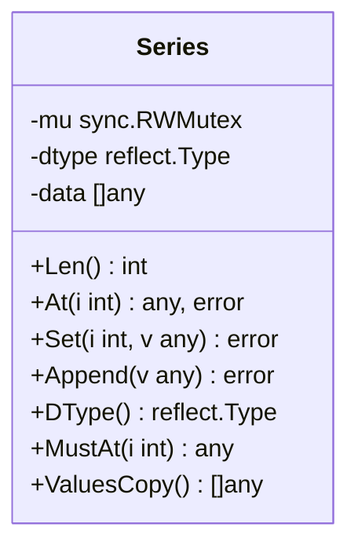

Series is the fundamental column type in GPandas. Each column in a DataFrame is stored as a Series, providing type enforcement and thread-safe operations.

<!-- IMAGE_PLACEHOLDER: Visual showing a Series as a typed column with dtype enforcement -->

&nbsp;

## Overview

A Series is a one-dimensional array-like structure with:

| Feature | Description |
|---------|-------------|
| **Homogeneous Type** | All values must be the same type (dtype) |
| **Thread-Safe** | RWMutex protection for concurrent access |
| **Dynamic Size** | Can append new values |
| **Nil Support** | Can contain nil values |

&nbsp;

## Series Structure



&nbsp;

### Internal Structure

| Field | Type | Description |
|-------|------|-------------|
| `mu` | `sync.RWMutex` | Mutex for thread-safe operations |
| `dtype` | `reflect.Type` | The enforced data type |
| `data` | `[]any` | The underlying data slice |

&nbsp;

---

&nbsp;

## Creating Series

Series are typically created automatically when loading data or creating DataFrames. You can also create them directly:

&nbsp;

### NewSeriesOfType

Create an empty Series with a declared type:

```go
import (
    "reflect"
    "github.com/apoplexi24/gpandas/utils/collection"
)

// Create empty Series for float64 values with capacity 100
floatSeries := collection.NewSeriesOfType(reflect.TypeOf(float64(0)), 100)

// Create empty Series for strings
stringSeries := collection.NewSeriesOfType(reflect.TypeOf(""), 50)
```

&nbsp;

### NewSeriesWithData

Create a Series from existing data:

```go
// Create Series with inferred type
values := []any{"Alice", "Bob", "Charlie"}
series, err := collection.NewSeriesWithData(nil, values)
if err != nil {
    log.Fatal(err)
}
// dtype is inferred as string from first non-nil value

// Create Series with explicit type
intValues := []any{int64(1), int64(2), int64(3)}
intSeries, err := collection.NewSeriesWithData(reflect.TypeOf(int64(0)), intValues)
if err != nil {
    log.Fatal(err)
}
```

&nbsp;

---

&nbsp;

## Series Methods

### Len() - Get Length

Returns the number of elements in the Series.

```go
func (s *Series) Len() int
```

&nbsp;

#### Example

```go
series, _ := collection.NewSeriesWithData(nil, []any{"a", "b", "c", "d"})
fmt.Printf("Series length: %d\n", series.Len())  // Output: 4
```

&nbsp;

---

&nbsp;

### At() - Get Value at Index

Safely retrieves a value at the specified index.

```go
func (s *Series) At(i int) (any, error)
```

&nbsp;

#### Parameters

| Parameter | Type | Description |
|-----------|------|-------------|
| `i` | `int` | Index position (0-based) |

&nbsp;

#### Example

```go
series, _ := collection.NewSeriesWithData(nil, []any{100, 200, 300})

// Get value at index 1
value, err := series.At(1)
if err != nil {
    log.Fatal(err)
}
fmt.Printf("Value at index 1: %v\n", value)  // Output: 200

// Handle out of range
_, err = series.At(10)
if err != nil {
    fmt.Println("Error:", err)  // Output: Error: index out of range
}
```

&nbsp;

---

&nbsp;

### MustAt() - Get Value (Panics on Error)

Retrieves a value at the index, panicking if out of range. Use for internal operations where bounds are guaranteed.

```go
func (s *Series) MustAt(i int) any
```

&nbsp;

#### Example

```go
// Only use when you're certain the index is valid
value := series.MustAt(0)
fmt.Printf("First value: %v\n", value)
```

&nbsp;

---

&nbsp;

### Set() - Update Value

Updates the value at a specific index with type enforcement.

```go
func (s *Series) Set(i int, v any) error
```

&nbsp;

#### Parameters

| Parameter | Type | Description |
|-----------|------|-------------|
| `i` | `int` | Index position to update |
| `v` | `any` | New value (must match dtype) |

&nbsp;

#### Example

```go
series, _ := collection.NewSeriesWithData(nil, []any{"Alice", "Bob", "Charlie"})

// Update value at index 1
err := series.Set(1, "Robert")
if err != nil {
    log.Fatal(err)
}

// Type mismatch error
err = series.Set(0, 12345)  // Trying to set int in string Series
if err != nil {
    fmt.Println("Type error:", err)
    // Output: Type error: type mismatch: expected string, got int
}
```

&nbsp;

---

&nbsp;

### Append() - Add Value

Adds a new value to the end of the Series with type enforcement.

```go
func (s *Series) Append(v any) error
```

&nbsp;

#### Example

```go
series, _ := collection.NewSeriesWithData(nil, []any{1.0, 2.0, 3.0})

// Append new value
err := series.Append(4.0)
if err != nil {
    log.Fatal(err)
}
fmt.Printf("New length: %d\n", series.Len())  // Output: 4

// Type mismatch
err = series.Append("not a float")
if err != nil {
    fmt.Println("Error:", err)
    // Output: Error: type mismatch: expected float64, got string
}
```

&nbsp;

---

&nbsp;

### DType() - Get Data Type

Returns the reflect.Type of the Series elements.

```go
func (s *Series) DType() reflect.Type
```

&nbsp;

#### Example

```go
series, _ := collection.NewSeriesWithData(nil, []any{int64(1), int64(2)})

dtype := series.DType()
fmt.Printf("Series dtype: %v\n", dtype)  // Output: int64
```

&nbsp;

---

&nbsp;

### ValuesCopy() - Get Data Copy

Returns a shallow copy of the underlying data slice.

```go
func (s *Series) ValuesCopy() []any
```

&nbsp;

#### Example

```go
series, _ := collection.NewSeriesWithData(nil, []any{"a", "b", "c"})

// Get copy of data
dataCopy := series.ValuesCopy()

// Modifying copy doesn't affect original
dataCopy[0] = "modified"

original, _ := series.At(0)
fmt.Printf("Original: %v\n", original)  // Output: a (unchanged)
```

&nbsp;

---

&nbsp;

## Type Enforcement

Series enforce homogeneous types to ensure data integrity:

```mermaid
flowchart TD
    subgraph Input["New Value"]
        VAL[Value to Add/Set]
    end
    
    subgraph Check["Type Check"]
        GET_TYPE[Get Value Type]
        COMPARE[Compare with dtype]
        MATCH{Types Match?}
    end
    
    subgraph Result["Result"]
        SUCCESS[Value Stored]
        ERROR[Error Returned]
    end
    
    VAL --> GET_TYPE
    GET_TYPE --> COMPARE
    COMPARE --> MATCH
    MATCH -->|Yes| SUCCESS
    MATCH -->|No| ERROR
    
    style Input fill:#1e293b,stroke:#3b82f6,stroke-width:2px
    style Check fill:#1e293b,stroke:#f59e0b,stroke-width:2px
    style Result fill:#1e293b,stroke:#22c55e,stroke-width:2px
```



&nbsp;

### Type Inference Rules

| Scenario | Behavior |
|----------|----------|
| dtype is nil, value is nil | dtype remains nil |
| dtype is nil, value is non-nil | dtype set from value type |
| dtype is set, value is nil | Allowed (nil values ok) |
| dtype is set, value matches | Allowed |
| dtype is set, value differs | Error returned |

&nbsp;

### Example: Type Enforcement

```go
// Create Series with inferred string type
series, _ := collection.NewSeriesWithData(nil, []any{"hello", "world"})

// These work
series.Append("!")      // OK: string matches
series.Append(nil)      // OK: nil is always allowed

// This fails
err := series.Append(123)
// Error: type mismatch: expected string, got int
```

&nbsp;

---

&nbsp;

## Thread Safety

Series use `sync.RWMutex` for thread-safe operations:

| Method | Lock Type | Concurrent Behavior |
|--------|-----------|---------------------|
| `Len()` | RLock | Multiple readers allowed |
| `At()` | RLock | Multiple readers allowed |
| `MustAt()` | RLock | Multiple readers allowed |
| `DType()` | RLock | Multiple readers allowed |
| `ValuesCopy()` | RLock | Multiple readers allowed |
| `Set()` | Lock | Exclusive access |
| `Append()` | Lock | Exclusive access |

&nbsp;

### Concurrent Read Example

```go
var wg sync.WaitGroup

series, _ := collection.NewSeriesWithData(nil, []any{1, 2, 3, 4, 5})

// Multiple goroutines can read simultaneously
for i := 0; i < 10; i++ {
    wg.Add(1)
    go func(id int) {
        defer wg.Done()
        
        // Safe concurrent read
        val, _ := series.At(id % series.Len())
        fmt.Printf("Goroutine %d read: %v\n", id, val)
    }(i)
}

wg.Wait()
```

&nbsp;

### Concurrent Write Safety

```go
var wg sync.WaitGroup
var mu sync.Mutex  // Additional mutex for append ordering

series, _ := collection.NewSeriesWithData(nil, []any{0})

for i := 1; i <= 10; i++ {
    wg.Add(1)
    go func(val int) {
        defer wg.Done()
        
        // Series.Append is thread-safe
        series.Append(val)
    }(i)
}

wg.Wait()
fmt.Printf("Final length: %d\n", series.Len())
```

&nbsp;

---

&nbsp;

## Working with Series from DataFrames

### Getting Series from DataFrame

```go
df, _ := gp.Read_csv("data.csv")

// Using Loc
salarySeries, _ := df.Loc().Col("salary")

// Using SelectCol
nameSeries, _ := df.SelectCol("name")

// Using ILoc
firstColSeries, _ := df.ILoc().Col(0)
```

&nbsp;

### Series Operations

```go
// Get statistics manually
series, _ := df.SelectCol("salary")

// Calculate sum
sum := 0.0
for i := 0; i < series.Len(); i++ {
    val, _ := series.At(i)
    if v, ok := val.(float64); ok {
        sum += v
    }
}
fmt.Printf("Total salary: %.2f\n", sum)

// Find max
max := 0.0
for i := 0; i < series.Len(); i++ {
    val, _ := series.At(i)
    if v, ok := val.(float64); ok && v > max {
        max = v
    }
}
fmt.Printf("Max salary: %.2f\n", max)
```

&nbsp;

---

&nbsp;

## Handling Nil Values

Series can contain nil values regardless of dtype:

```go
// Create Series with some nil values
values := []any{"Alice", nil, "Charlie", nil, "Eve"}
series, _ := collection.NewSeriesWithData(nil, values)

// Check for nil when accessing
for i := 0; i < series.Len(); i++ {
    val, _ := series.At(i)
    if val == nil {
        fmt.Printf("Index %d: <nil>\n", i)
    } else {
        fmt.Printf("Index %d: %v\n", i, val)
    }
}

// Output:
// Index 0: Alice
// Index 1: <nil>
// Index 2: Charlie
// Index 3: <nil>
// Index 4: Eve
```

&nbsp;

---

&nbsp;

## Error Reference

| Error | Cause | Solution |
|-------|-------|----------|
| "index out of range" | Invalid index to At/Set | Check Len() before access |
| "type mismatch: expected X, got Y" | Wrong type for Set/Append | Ensure value matches dtype |

&nbsp;

## Best Practices

| Practice | Description |
|----------|-------------|
| **Check dtype** | Use DType() to verify expected type |
| **Handle nil** | Always check for nil values when processing |
| **Use At() over MustAt()** | Prefer error handling over panics |
| **Copy for iteration** | Use ValuesCopy() for safe iteration with modifications |
| **Bounds check** | Verify index with Len() before access |

&nbsp;

## See Also

- [Creating DataFrames]() - How Series are used in DataFrames
- [Indexing (Loc)]() - Get Series by column name
- [Indexing (iLoc)]() - Get Series by position
- [DataFrame Operations]() - SelectCol method

