Learn how to sort DataFrames by column values or index labels in GPandas, with support for multi-column sorting, null handling, and in-place modifications.

<!-- IMAGE_PLACEHOLDER: Visual showing data being sorted in ascending/descending order -->

&nbsp;

## Overview

GPandas provides two sorting methods:

| Operation | Method | Description |
|-----------|--------|-------------|
| Sort by Values | `SortValues()` | Sort by one or more column values |
| Sort by Index | `SortIndex()` | Sort by index labels |

&nbsp;

---

&nbsp;

## SortValues

Sorts the DataFrame by the values in one or more columns, similar to pandas' `df.sort_values()`.

&nbsp;

### Function Signature

```go
func (df *DataFrame) SortValues(opts SortOptions) (*DataFrame, error)
```

&nbsp;

### SortOptions

| Field | Type | Description | Default |
|-------|------|-------------|---------|
| `By` | `[]string` | Column names to sort by | Required |
| `Ascending` | `[]bool` | Sort order for each column | All `true` |
| `NaPosition` | `NaPosition` | Where to place null values | `NaLast` |
| `Inplace` | `bool` | Modify DataFrame in place | `false` |
| `IgnoreIndex` | `bool` | Reset index after sorting | `false` |

&nbsp;

### NaPosition Constants

| Constant | Description |
|----------|-------------|
| `NaLast` | Place null values at the end (default) |
| `NaFirst` | Place null values at the beginning |

&nbsp;

### Supported Types

| Type | Comparison |
|------|------------|
| `float64` | Numeric comparison |
| `int64` | Numeric comparison |
| `string` | Lexicographic comparison |
| `bool` | `false < true` |

&nbsp;

---

&nbsp;

## Sample Data

All examples use this employee DataFrame:

### Employees DataFrame

| Name | Department | Age | Salary |
|------|------------|-----|--------|
| Alice | Engineering | 30 | 95000 |
| Bob | Sales | 25 | 55000 |
| Charlie | Engineering | 35 | 105000 |
| Diana | Sales | 28 | 62000 |
| Eve | Marketing | 32 | 72000 |
| Frank | Engineering | 27 | 88000 |

&nbsp;

### Setup Code

```go
package main

import (
    "fmt"
    "log"

    "github.com/apoplexi24/gpandas"
    "github.com/apoplexi24/gpandas/dataframe"
)

func main() {
    gp := gpandas.GoPandas{}
    
    // Create employee DataFrame
    df, _ := gp.DataFrame(
        []string{"Name", "Department", "Age", "Salary"},
        []gpandas.Column{
            {"Alice", "Bob", "Charlie", "Diana", "Eve", "Frank"},
            {"Engineering", "Sales", "Engineering", "Sales", "Marketing", "Engineering"},
            {int64(30), int64(25), int64(35), int64(28), int64(32), int64(27)},
            {95000.0, 55000.0, 105000.0, 62000.0, 72000.0, 88000.0},
        },
        map[string]any{
            "Name":       gpandas.StringCol{},
            "Department": gpandas.StringCol{},
            "Age":        gpandas.IntCol{},
            "Salary":     gpandas.FloatCol{},
        },
    )
    
    // Examples follow...
}
```

&nbsp;

---

&nbsp;

## Single Column Sort (Ascending)

Sort by a single column in ascending order:

```mermaid
flowchart LR
    subgraph Original["Original DataFrame"]
        O1[Salary: 95000]
        O2[Salary: 55000]
        O3[Salary: 105000]
        O4[Salary: 62000]
    end
    
    subgraph Sort["SortValues Operation"]
        OP[Sort by Salary<br/>Ascending]
    end
    
    subgraph Result["Sorted DataFrame"]
        R1[Salary: 55000]
        R2[Salary: 62000]
        R3[Salary: 88000]
        R4[Salary: 95000]
    end
    
    O1 --> OP
    O2 --> OP
    O3 --> OP
    O4 --> OP
    OP --> R1
    OP --> R2
    OP --> R3
    OP --> R4
    
    style Original fill:#1e293b,stroke:#3b82f6,stroke-width:2px
    style Sort fill:#1e293b,stroke:#f59e0b,stroke-width:2px
    style Result fill:#1e293b,stroke:#22c55e,stroke-width:2px
```



&nbsp;

### Example

```go
sorted, err := df.SortValues(dataframe.SortOptions{
    By: []string{"Salary"},
})
if err != nil {
    log.Fatalf("Sort failed: %v", err)
}
fmt.Println(sorted.String())
```

&nbsp;

### Output

```
+------+-------------+-----+--------+
| Name | Department  | Age | Salary |
+------+-------------+-----+--------+
| Bob  | Sales       | 25  | 55000  |
| Diana| Sales       | 28  | 62000  |
| Eve  | Marketing   | 32  | 72000  |
| Frank| Engineering | 27  | 88000  |
| Alice| Engineering | 30  | 95000  |
| Charlie | Engineering | 35 | 105000 |
+------+-------------+-----+--------+
[6 rows x 4 columns]
```

&nbsp;

---

&nbsp;

## Single Column Sort (Descending)

Sort by a single column in descending order:

```go
sorted, err := df.SortValues(dataframe.SortOptions{
    By:        []string{"Age"},
    Ascending: []bool{false},
})
if err != nil {
    log.Fatalf("Sort failed: %v", err)
}
fmt.Println(sorted.String())
```

&nbsp;

### Output

```
+---------+-------------+-----+--------+
| Name    | Department  | Age | Salary |
+---------+-------------+-----+--------+
| Charlie | Engineering | 35  | 105000 |
| Eve     | Marketing   | 32  | 72000  |
| Alice   | Engineering | 30  | 95000  |
| Diana   | Sales       | 28  | 62000  |
| Frank   | Engineering | 27  | 88000  |
| Bob     | Sales       | 25  | 55000  |
+---------+-------------+-----+--------+
[6 rows x 4 columns]
```

&nbsp;

---

&nbsp;

## Multi-Column Sort

Sort by multiple columns with independent sort orders:

```go
sorted, err := df.SortValues(dataframe.SortOptions{
    By:        []string{"Department", "Salary"},
    Ascending: []bool{true, false},  // Dept ascending, Salary descending
})
if err != nil {
    log.Fatalf("Sort failed: %v", err)
}
fmt.Println(sorted.String())
```

&nbsp;

### Output

```
+---------+-------------+-----+--------+
| Name    | Department  | Age | Salary |
+---------+-------------+-----+--------+
| Charlie | Engineering | 35  | 105000 |
| Alice   | Engineering | 30  | 95000  |
| Frank   | Engineering | 27  | 88000  |
| Eve     | Marketing   | 32  | 72000  |
| Diana   | Sales       | 28  | 62000  |
| Bob     | Sales       | 25  | 55000  |
+---------+-------------+-----+--------+
[6 rows x 4 columns]
```

&nbsp;

### Multi-Column Sort Flow

```mermaid
flowchart TD
    subgraph Input["Original Data"]
        I[Mixed departments<br/>and salaries]
    end
    
    subgraph Primary["Primary Sort"]
        P[Sort by Department<br/>ascending]
    end
    
    subgraph Secondary["Secondary Sort"]
        S[Within each department<br/>sort by Salary descending]
    end
    
    subgraph Result["Sorted Result"]
        R[Engineering: 105k, 95k, 88k<br/>Marketing: 72k<br/>Sales: 62k, 55k]
    end
    
    I --> P
    P --> S
    S --> R
    
    style Input fill:#1e293b,stroke:#3b82f6,stroke-width:2px
    style Primary fill:#1e293b,stroke:#f59e0b,stroke-width:2px
    style Secondary fill:#1e293b,stroke:#8b5cf6,stroke-width:2px
    style Result fill:#1e293b,stroke:#22c55e,stroke-width:2px
```



&nbsp;

---

&nbsp;

## Ascending Options

The `Ascending` field provides flexible sort order control:

| Configuration | Behavior |
|---------------|----------|
| Empty `[]bool{}` | All columns ascending |
| Single value `[]bool{false}` | Applies to all columns |
| Multiple values | Must match length of `By` |

&nbsp;

### Examples

```go
// All ascending (default)
sorted, _ := df.SortValues(dataframe.SortOptions{
    By: []string{"Age", "Salary"},
    // Ascending not specified - defaults to all true
})

// All descending
sorted, _ := df.SortValues(dataframe.SortOptions{
    By:        []string{"Age", "Salary"},
    Ascending: []bool{false},  // Single value applies to all
})

// Mixed order
sorted, _ := df.SortValues(dataframe.SortOptions{
    By:        []string{"Age", "Salary"},
    Ascending: []bool{true, false},  // Age asc, Salary desc
})
```

&nbsp;

---

&nbsp;

## Null Handling

Control where null values appear in sorted results:

```go
// Nulls at the end (default)
sorted, _ := df.SortValues(dataframe.SortOptions{
    By:         []string{"Score"},
    NaPosition: dataframe.NaLast,
})

// Nulls at the beginning
sorted, _ := df.SortValues(dataframe.SortOptions{
    By:         []string{"Score"},
    NaPosition: dataframe.NaFirst,
})
```

&nbsp;

### Null Positioning

| NaPosition | Ascending Sort | Descending Sort |
|------------|----------------|-----------------|
| `NaLast` | `1, 2, 3, nil` | `3, 2, 1, nil` |
| `NaFirst` | `nil, 1, 2, 3` | `nil, 3, 2, 1` |

&nbsp;

---

&nbsp;

## In-Place Sorting

Modify the DataFrame directly instead of creating a copy:

```go
// Sort in place (modifies original DataFrame)
_, err := df.SortValues(dataframe.SortOptions{
    By:      []string{"Salary"},
    Inplace: true,
})
if err != nil {
    log.Fatalf("Sort failed: %v", err)
}

// df is now sorted, no new DataFrame created
fmt.Println(df.String())
```

&nbsp;

### In-Place vs Copy

| Option | Returns | Original DataFrame | Use Case |
|--------|---------|-------------------|----------|
| `Inplace: false` | New sorted DataFrame | Unchanged | Need both versions |
| `Inplace: true` | `nil` | Modified | Save memory |

&nbsp;

---

&nbsp;

## Index Reset

Reset the index to sequential integers after sorting:

```go
sorted, err := df.SortValues(dataframe.SortOptions{
    By:          []string{"Salary"},
    Ascending:   []bool{false},
    IgnoreIndex: true,
})
if err != nil {
    log.Fatalf("Sort failed: %v", err)
}
fmt.Println(sorted.String())
```

&nbsp;

### Without IgnoreIndex

```
+---------+-------------+-----+--------+
| Index   | Name        | Age | Salary |
+---------+-------------+-----+--------+
| 2       | Charlie     | 35  | 105000 |
| 0       | Alice       | 30  | 95000  |
| 5       | Frank       | 27  | 88000  |
+---------+-------------+-----+--------+
```

&nbsp;

### With IgnoreIndex

```
+---------+-------------+-----+--------+
| Index   | Name        | Age | Salary |
+---------+-------------+-----+--------+
| 0       | Charlie     | 35  | 105000 |
| 1       | Alice       | 30  | 95000  |
| 2       | Frank       | 27  | 88000  |
+---------+-------------+-----+--------+
```

&nbsp;

---

&nbsp;

## SortIndex

Sorts the DataFrame by its index labels in lexicographic order.

&nbsp;

### Function Signature

```go
func (df *DataFrame) SortIndex(ascending bool) (*DataFrame, error)
```

&nbsp;

### Parameters

| Parameter | Type | Description |
|-----------|------|-------------|
| `ascending` | `bool` | `true` for ascending, `false` for descending |

&nbsp;

### Example

```go
// Set custom index labels
err := df.SetIndex([]string{"f", "b", "e", "a", "d", "c"})
if err != nil {
    log.Fatalf("SetIndex failed: %v", err)
}

fmt.Println("Before sorting by index:")
fmt.Println(df.String())

// Sort by index (ascending)
sorted, err := df.SortIndex(true)
if err != nil {
    log.Fatalf("SortIndex failed: %v", err)
}

fmt.Println("\nAfter sorting by index:")
fmt.Println(sorted.String())
```

&nbsp;

### Output

```
Before sorting by index:
+-------+---------+-------------+-----+--------+
| Index | Name    | Department  | Age | Salary |
+-------+---------+-------------+-----+--------+
| f     | Alice   | Engineering | 30  | 95000  |
| b     | Bob     | Sales       | 25  | 55000  |
| e     | Charlie | Engineering | 35  | 105000 |
+-------+---------+-------------+-----+--------+

After sorting by index:
+-------+---------+-------------+-----+--------+
| Index | Name    | Department  | Age | Salary |
+-------+---------+-------------+-----+--------+
| a     | Diana   | Sales       | 28  | 62000  |
| b     | Bob     | Sales       | 25  | 55000  |
| c     | Frank   | Engineering | 27  | 88000  |
| e     | Charlie | Engineering | 35  | 105000 |
| f     | Alice   | Engineering | 30  | 95000  |
+-------+---------+-------------+-----+--------+
```

&nbsp;

---

&nbsp;

## Sort Stability

GPandas uses stable sorting, preserving the relative order of equal elements:

```go
// DataFrame with duplicate ages
// Name: Alice, Bob, Charlie, Diana
// Age:  30,   30,  25,      25

sorted, _ := df.SortValues(dataframe.SortOptions{
    By: []string{"Age"},
})

// Result preserves original order for equal ages:
// Name: Charlie, Diana, Alice, Bob
// Age:  25,      25,    30,    30
```

&nbsp;

---

&nbsp;

## Alphabetical Sort

Sort string columns alphabetically:

```go
sorted, err := df.SortValues(dataframe.SortOptions{
    By: []string{"Name"},
})
if err != nil {
    log.Fatalf("Sort failed: %v", err)
}
fmt.Println(sorted.String())
```

&nbsp;

### Output

```
+---------+-------------+-----+--------+
| Name    | Department  | Age | Salary |
+---------+-------------+-----+--------+
| Alice   | Engineering | 30  | 95000  |
| Bob     | Sales       | 25  | 55000  |
| Charlie | Engineering | 35  | 105000 |
| Diana   | Sales       | 28  | 62000  |
| Eve     | Marketing   | 32  | 72000  |
| Frank   | Engineering | 27  | 88000  |
+---------+-------------+-----+--------+
[6 rows x 4 columns]
```

&nbsp;

---

&nbsp;

## Sorting Workflow

```mermaid
flowchart TD
    subgraph Input["Original DataFrame"]
        I[Unsorted data]
    end
    
    subgraph Validate["Validation"]
        V1[Check columns exist]
        V2[Validate options]
    end
    
    subgraph Process["Sort Process"]
        P1[Extract column values]
        P2[Build sort indices]
        P3[Apply stable sort]
    end
    
    subgraph Output["Result"]
        O1{Inplace?}
        O2[Modify original]
        O3[Return new DataFrame]
    end
    
    I --> V1
    V1 --> V2
    V2 --> P1
    P1 --> P2
    P2 --> P3
    P3 --> O1
    O1 -->|Yes| O2
    O1 -->|No| O3
    
    style Input fill:#1e293b,stroke:#3b82f6,stroke-width:2px
    style Validate fill:#1e293b,stroke:#f59e0b,stroke-width:2px
    style Process fill:#1e293b,stroke:#8b5cf6,stroke-width:2px
    style Output fill:#1e293b,stroke:#22c55e,stroke-width:2px
```



&nbsp;

---

&nbsp;

## Error Handling

### Common Errors

| Error | Cause | Solution |
|-------|-------|----------|
| "DataFrame is nil" | Operating on nil DataFrame | Check DataFrame initialization |
| "'By' must contain at least one column" | Empty `By` slice | Provide at least one column name |
| "column 'X' not found" | Invalid column name | Verify column exists |
| "length of 'Ascending' must match 'By'" | Mismatched lengths | Match lengths or use single value |
| "NaPosition must be 'last' or 'first'" | Invalid NaPosition | Use `NaLast` or `NaFirst` |
| "type mismatch: cannot compare" | Mixed types in column | Ensure column has consistent types |

&nbsp;

### Error Handling Example

```go
sorted, err := df.SortValues(dataframe.SortOptions{
    By:        []string{"Department", "Salary"},
    Ascending: []bool{true, false},
})
if err != nil {
    switch {
    case strings.Contains(err.Error(), "not found"):
        log.Fatal("Column doesn't exist in DataFrame")
    case strings.Contains(err.Error(), "must match"):
        log.Fatal("Ascending slice length mismatch")
    case strings.Contains(err.Error(), "type mismatch"):
        log.Fatal("Cannot compare values of different types")
    default:
        log.Fatalf("Sort error: %v", err)
    }
}
```

&nbsp;

---

&nbsp;

## Thread Safety

Sorting operations are thread-safe:

| Method | Lock Type | Description |
|--------|-----------|-------------|
| `SortValues()` | RLock | Read lock during value extraction |
| `SortIndex()` | RLock | Read lock during index extraction |
| In-place sort | Lock | Write lock when modifying original |

&nbsp;

### Concurrent Sorting Example

```go
package main

import (
    "fmt"
    "sync"

    "github.com/apoplexi24/gpandas"
    "github.com/apoplexi24/gpandas/dataframe"
)

func main() {
    gp := gpandas.GoPandas{}
    df, _ := gp.Read_csv("data.csv")
    
    var wg sync.WaitGroup
    
    // Multiple goroutines can sort simultaneously
    for i := 0; i < 3; i++ {
        wg.Add(1)
        go func(id int, col string) {
            defer wg.Done()
            
            // Safe concurrent sort (creates new DataFrame)
            sorted, _ := df.SortValues(dataframe.SortOptions{
                By: []string{col},
            })
            fmt.Printf("Goroutine %d sorted by %s: %d rows\n", 
                id, col, len(sorted.Index))
        }(i, []string{"Age", "Salary", "Name"}[i])
    }
    
    wg.Wait()
}
```

&nbsp;

---

&nbsp;

## Complete Example: Data Analysis Pipeline

```go
package main

import (
    "fmt"
    "log"

    "github.com/apoplexi24/gpandas"
    "github.com/apoplexi24/gpandas/dataframe"
)

func main() {
    gp := gpandas.GoPandas{}
    
    // Load employee data
    df, err := gp.Read_csv("employees.csv")
    if err != nil {
        log.Fatalf("Failed to load data: %v", err)
    }
    
    fmt.Println("Original Data:")
    fmt.Println(df.String())
    
    // Step 1: Sort by department and salary
    sorted, err := df.SortValues(dataframe.SortOptions{
        By:        []string{"Department", "Salary"},
        Ascending: []bool{true, false},
    })
    if err != nil {
        log.Fatalf("Sort failed: %v", err)
    }
    
    fmt.Println("\nSorted by Department (asc) and Salary (desc):")
    fmt.Println(sorted.String())
    
    // Step 2: Select top earners per department
    topEarners, _ := sorted.Select("Name", "Department", "Salary")
    
    // Step 3: Export results
    _, err = topEarners.ToCSV("top_earners.csv", ",")
    if err != nil {
        log.Printf("Export warning: %v", err)
    }
    
    fmt.Println("\nExported to top_earners.csv")
}
```

&nbsp;

---

&nbsp;

## Performance Considerations

| Scenario | Performance | Recommendation |
|----------|-------------|----------------|
| Small DataFrames (<1000 rows) | Fast | Use any sort configuration |
| Large DataFrames (>10000 rows) | Moderate | Consider `Inplace: true` to save memory |
| Multi-column sort | Slower than single | Minimize number of sort columns |
| String columns | Slower than numeric | Use numeric keys when possible |

&nbsp;

---

&nbsp;

## See Also

- [DataFrame Operations]() - Select and transform data
- [Indexing (Loc)]() - Label-based data access
- [Merging Data]() - Join multiple DataFrames
- [Pivot and Melt]() - Reshape data structures
