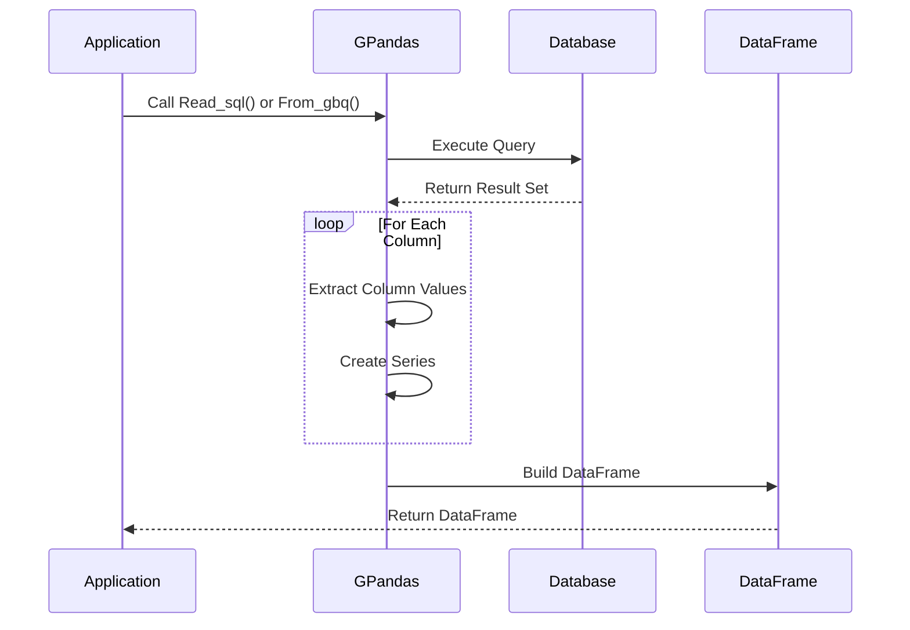

GPandas provides seamless integration with SQL databases and Google BigQuery, allowing you to query data directly into DataFrames.

<!-- IMAGE_PLACEHOLDER: Database icons (SQL Server, PostgreSQL, BigQuery) connecting to DataFrame -->

&nbsp;

## Overview

GPandas supports two main data sources for SQL integration:

| Function | Data Source | Use Case |
|----------|-------------|----------|
| `Read_sql()` | SQL Databases | SQL Server, PostgreSQL, and other database/sql compatible databases |
| `From_gbq()` | Google BigQuery | Large-scale analytics on BigQuery tables |

&nbsp;

## Architecture

```mermaid
flowchart LR
    subgraph Databases["Data Sources"]
        MSSQL[(SQL Server)]
        PG[(PostgreSQL)]
        GBQ[(BigQuery)]
    end
    
    subgraph GPandas["GPandas"]
        CONFIG[DbConfig]
        RSQL[Read_sql]
        FGBQ[From_gbq]
    end
    
    subgraph Output["Output"]
        DF[DataFrame]
        SER[Series Columns]
    end
    
    MSSQL --> CONFIG
    PG --> CONFIG
    CONFIG --> RSQL
    GBQ --> FGBQ
    RSQL --> DF
    FGBQ --> DF
    DF --> SER
    
    style Databases fill:#1e293b,stroke:#f59e0b,stroke-width:2px
    style GPandas fill:#1e293b,stroke:#3b82f6,stroke-width:2px
    style Output fill:#1e293b,stroke:#22c55e,stroke-width:2px
```



&nbsp;

---

&nbsp;

## Read_sql() - SQL Databases

The `Read_sql()` function executes a SQL query against a relational database and returns results as a DataFrame.

&nbsp;

### Function Signature

```go
func (GoPandas) Read_sql(query string, db_config DbConfig) (*dataframe.DataFrame, error)
```

&nbsp;

### DbConfig Structure

Configure your database connection using the `DbConfig` struct:

```go
type DbConfig struct {
    Database_server string  // Database type: "sqlserver" or "postgres"
    Server          string  // Hostname or IP address
    Port            string  // Port number
    Database        string  // Database name
    Username        string  // Database user
    Password        string  // Database password
}
```

&nbsp;

### Parameters

| Parameter | Type | Description |
|-----------|------|-------------|
| `query` | `string` | SQL query to execute |
| `db_config` | `DbConfig` | Database connection configuration |

&nbsp;

### Returns

| Type | Description |
|------|-------------|
| `*dataframe.DataFrame` | Query results as a DataFrame |
| `error` | Error if connection or query fails |

&nbsp;

### SQL Server Example

```go
package main

import (
    "fmt"
    "log"
    "os"

    "github.com/apoplexi24/gpandas"
)

func main() {
    gp := gpandas.GoPandas{}

    // Configure connection (prefer environment variables)
    config := gpandas.DbConfig{
        Database_server: "sqlserver",
        Server:          os.Getenv("DB_SERVER"),
        Port:            "1433",
        Database:        os.Getenv("DB_NAME"),
        Username:        os.Getenv("DB_USER"),
        Password:        os.Getenv("DB_PASSWORD"),
    }

    // Execute query
    query := `
        SELECT 
            employee_id,
            first_name,
            last_name,
            department,
            salary
        FROM employees
        WHERE department = 'Engineering'
        ORDER BY salary DESC
    `

    df, err := gp.Read_sql(query, config)
    if err != nil {
        log.Fatalf("Query failed: %v", err)
    }

    fmt.Println("Engineering Team:")
    fmt.Println(df.String())
}
```

&nbsp;

### PostgreSQL Example

```go
package main

import (
    "fmt"
    "log"
    "os"

    "github.com/apoplexi24/gpandas"
)

func main() {
    gp := gpandas.GoPandas{}

    config := gpandas.DbConfig{
        Database_server: "postgres",  // Use "postgres" for PostgreSQL
        Server:          os.Getenv("PG_HOST"),
        Port:            "5432",
        Database:        os.Getenv("PG_DATABASE"),
        Username:        os.Getenv("PG_USER"),
        Password:        os.Getenv("PG_PASSWORD"),
    }

    query := `
        SELECT 
            product_name,
            category,
            price,
            stock_quantity
        FROM products
        WHERE price > 50.00
        LIMIT 100
    `

    df, err := gp.Read_sql(query, config)
    if err != nil {
        log.Fatalf("Query failed: %v", err)
    }

    fmt.Println(df.String())
}
```

&nbsp;

### Connection String Formats

GPandas builds connection strings based on the `Database_server` value:

| Database | Format |
|----------|--------|
| SQL Server | `server=X;user id=X;password=X;port=X;database=X` |
| PostgreSQL | `host=X port=X user=X password=X dbname=X sslmode=disable` |

&nbsp;

---

&nbsp;

## From_gbq() - Google BigQuery

The `From_gbq()` function queries Google BigQuery and returns results as a DataFrame.

&nbsp;

### Function Signature

```go
func (GoPandas) From_gbq(query string, projectID string) (*dataframe.DataFrame, error)
```

&nbsp;

### Parameters

| Parameter | Type | Description |
|-----------|------|-------------|
| `query` | `string` | BigQuery SQL query |
| `projectID` | `string` | Google Cloud Project ID |

&nbsp;

### Returns

| Type | Description |
|------|-------------|
| `*dataframe.DataFrame` | Query results as a DataFrame |
| `error` | Error if query execution fails |

&nbsp;

### Prerequisites

Before using `From_gbq()`, ensure you have:

1. **Google Cloud credentials** configured
2. **BigQuery API** enabled in your project
3. **Appropriate IAM permissions** (BigQuery Data Viewer, BigQuery Job User)

&nbsp;

### Setting Up Credentials

Set the `GOOGLE_APPLICATION_CREDENTIALS` environment variable:

```bash
export GOOGLE_APPLICATION_CREDENTIALS="/path/to/service-account-key.json"
```

Or use Application Default Credentials:

```bash
gcloud auth application-default login
```

&nbsp;

### BigQuery Example

```go
package main

import (
    "fmt"
    "log"

    "github.com/apoplexi24/gpandas"
)

func main() {
    gp := gpandas.GoPandas{}

    projectID := "my-gcp-project"
    
    query := `
        SELECT 
            date,
            product_category,
            SUM(revenue) as total_revenue,
            COUNT(*) as transaction_count
        FROM ` + "`my-gcp-project.sales.transactions`" + `
        WHERE date >= '2024-01-01'
        GROUP BY date, product_category
        ORDER BY date DESC, total_revenue DESC
        LIMIT 1000
    `

    df, err := gp.From_gbq(query, projectID)
    if err != nil {
        log.Fatalf("BigQuery failed: %v", err)
    }

    fmt.Println("Sales Summary:")
    fmt.Println(df.String())

    // Export results locally
    _, err = df.ToCSV("sales_summary.csv", ",")
    if err != nil {
        log.Printf("Export warning: %v", err)
    }
}
```

&nbsp;

### BigQuery Public Datasets Example

Query public datasets without requiring your own data:

```go
package main

import (
    "fmt"
    "log"

    "github.com/apoplexi24/gpandas"
)

func main() {
    gp := gpandas.GoPandas{}

    projectID := "my-gcp-project"
    
    // Query a public dataset
    query := `
        SELECT 
            name,
            number,
            year
        FROM ` + "`bigquery-public-data.usa_names.usa_1910_current`" + `
        WHERE year = 2020
        ORDER BY number DESC
        LIMIT 10
    `

    df, err := gp.From_gbq(query, projectID)
    if err != nil {
        log.Fatalf("Query failed: %v", err)
    }

    fmt.Println("Top 10 Baby Names in 2020:")
    fmt.Println(df.String())
}
```

&nbsp;

---

&nbsp;

## Data Flow

Both functions follow a similar pattern for converting query results to DataFrames:



&nbsp;

## Type Mapping

Query result types are mapped to Go types:

| SQL Type | BigQuery Type | Go Type |
|----------|---------------|---------|
| INT, INTEGER | INT64 | `int64` |
| FLOAT, REAL | FLOAT64 | `float64` |
| VARCHAR, TEXT | STRING | `string` |
| BIT, BOOLEAN | BOOL | `bool` |
| DATE, DATETIME | DATE, TIMESTAMP | Varies |
| NULL | NULL | `nil` |

&nbsp;

## Error Handling

### SQL Database Errors

```go
df, err := gp.Read_sql(query, config)
if err != nil {
    // Common error patterns
    switch {
    case strings.Contains(err.Error(), "connection"):
        log.Fatal("Database connection failed - check server/credentials")
    case strings.Contains(err.Error(), "query execution"):
        log.Fatal("Query syntax error or permission issue")
    case strings.Contains(err.Error(), "scanning"):
        log.Fatal("Data type conversion error")
    default:
        log.Fatalf("Database error: %v", err)
    }
}
```

&nbsp;

### BigQuery Errors

```go
df, err := gp.From_gbq(query, projectID)
if err != nil {
    switch {
    case strings.Contains(err.Error(), "NewClient"):
        log.Fatal("BigQuery client creation failed - check credentials")
    case strings.Contains(err.Error(), "query.Read"):
        log.Fatal("Query execution failed - check syntax and permissions")
    case strings.Contains(err.Error(), "no rows"):
        log.Fatal("Query returned no results")
    default:
        log.Fatalf("BigQuery error: %v", err)
    }
}
```

&nbsp;

## Best Practices

| Practice | Description |
|----------|-------------|
| **Use environment variables** | Never hardcode credentials in source code |
| **Limit result sets** | Use `LIMIT` clause to avoid memory issues |
| **Use parameterized queries** | Prevent SQL injection (handle at application level) |
| **Index key columns** | Ensure database tables are properly indexed |
| **Close connections** | GPandas handles this automatically with `defer` |

&nbsp;

## Security Considerations

### Credential Management

```go
// Good: Use environment variables
config := gpandas.DbConfig{
    Database_server: "sqlserver",
    Server:          os.Getenv("DB_SERVER"),
    Port:            os.Getenv("DB_PORT"),
    Database:        os.Getenv("DB_NAME"),
    Username:        os.Getenv("DB_USER"),
    Password:        os.Getenv("DB_PASSWORD"),
}

// Bad: Hardcoded credentials
config := gpandas.DbConfig{
    Password: "my-secret-password",  // Never do this!
}
```

&nbsp;

### Query Safety

```go
// Be careful with dynamic queries
// Always validate user input before including in queries
func queryByDepartment(gp gpandas.GoPandas, config gpandas.DbConfig, dept string) (*dataframe.DataFrame, error) {
    // Validate input
    validDepts := map[string]bool{
        "Engineering": true,
        "Sales":       true,
        "Marketing":   true,
    }
    
    if !validDepts[dept] {
        return nil, fmt.Errorf("invalid department: %s", dept)
    }
    
    query := fmt.Sprintf(`
        SELECT * FROM employees 
        WHERE department = '%s'
    `, dept)
    
    return gp.Read_sql(query, config)
}
```

&nbsp;

## Complete Example: ETL Pipeline

```go
package main

import (
    "fmt"
    "log"
    "os"

    "github.com/apoplexi24/gpandas"
)

func main() {
    gp := gpandas.GoPandas{}

    // Step 1: Extract from SQL Server
    sqlConfig := gpandas.DbConfig{
        Database_server: "sqlserver",
        Server:          os.Getenv("SQL_SERVER"),
        Port:            "1433",
        Database:        os.Getenv("SQL_DATABASE"),
        Username:        os.Getenv("SQL_USER"),
        Password:        os.Getenv("SQL_PASSWORD"),
    }

    ordersDF, err := gp.Read_sql(`
        SELECT order_id, customer_id, product_id, quantity, order_date
        FROM orders
        WHERE order_date >= '2024-01-01'
    `, sqlConfig)
    if err != nil {
        log.Fatalf("Failed to fetch orders: %v", err)
    }
    fmt.Println("Orders loaded:", ordersDF.String())

    // Step 2: Extract from BigQuery
    analyticsDF, err := gp.From_gbq(`
        SELECT product_id, category, avg_rating
        FROM analytics.product_metrics
        WHERE avg_rating >= 4.0
    `, "my-project")
    if err != nil {
        log.Fatalf("Failed to fetch analytics: %v", err)
    }
    fmt.Println("Analytics loaded:", analyticsDF.String())

    // Step 3: Export combined data
    _, err = ordersDF.ToCSV("exports/orders_2024.csv", ",")
    if err != nil {
        log.Printf("Export warning: %v", err)
    }

    fmt.Println("ETL pipeline complete!")
}
```

&nbsp;

## See Also

- [Loading CSV Files]() - Alternative data loading
- [Creating DataFrames]() - Build from memory
- [Merging Data]() - Join DataFrames from different sources

