Learn how to reshape DataFrames in GPandas with `Stack` (wide → long) and `Unstack` (long → wide), and how to build a composite row index with `SetMultiIndex`. These complement the [Pivot and Melt]() operations.

<!-- IMAGE_PLACEHOLDER: Visual showing a wide table being stacked into a long table and back -->

&nbsp;

## Overview

| Operation | Method | Description |
|-----------|--------|-------------|
| Wide → long | `Stack()` | Turn every cell into a row |
| Long → wide | `Unstack()` | Inverse of `Stack` |
| Composite index | `SetMultiIndex()` | Join columns into a single index label |

All methods return a new DataFrame.

&nbsp;

---

&nbsp;

## Sample Data

The `Stack`/`Unstack` examples use this DataFrame with a custom index:

| (index) | Math | Science |
|---------|------|---------|
| Alice | 90 | 85 |
| Bob | 80 | 75 |

&nbsp;

### Setup Code

```go
package main

import (
    "fmt"
    "log"

    "github.com/apoplexi24/gpandas"
)

func main() {
    gp := gpandas.GoPandas{}

    df, _ := gp.DataFrame(
        []string{"Math", "Science"},
        []gpandas.Column{
            {90.0, 80.0},
            {85.0, 75.0},
        },
        map[string]any{"Math": gpandas.FloatCol{}, "Science": gpandas.FloatCol{}},
    )
    _ = df.SetIndex([]string{"Alice", "Bob"})

    // Examples follow...
}
```

&nbsp;

---

&nbsp;

## Stack

Reshapes from wide to long format, producing three columns: `index` (the original row label), `variable` (the former column name), and `value` (the cell value). Each non-null cell becomes one row; null cells are dropped.

&nbsp;

### Function Signature

```go
func (df *DataFrame) Stack() (*DataFrame, error)
```

&nbsp;

### Example

```go
long, err := df.Stack()
if err != nil {
    log.Fatalf("Stack failed: %v", err)
}
fmt.Println(long.String())
```

```
+-------+----------+-------+
| index | variable | value |
+-------+----------+-------+
| Alice | Math     | 90    |
| Alice | Science  | 85    |
| Bob   | Math     | 80    |
| Bob   | Science  | 75    |
+-------+----------+-------+
[4 rows x 3 columns]
```

&nbsp;

### Stack / Unstack Round Trip

```mermaid
flowchart LR
    subgraph Wide["Wide"]
        W["Alice: Math 90, Science 85<br/>Bob: Math 80, Science 75"]
    end

    subgraph Long["Long (index/variable/value)"]
        L["Alice/Math/90<br/>Alice/Science/85<br/>Bob/Math/80<br/>Bob/Science/75"]
    end

    W -->|Stack| L
    L -->|Unstack| W

    style Wide fill:#1e293b,stroke:#3b82f6,stroke-width:2px
    style Long fill:#1e293b,stroke:#22c55e,stroke-width:2px
```



&nbsp;

---

&nbsp;

## Unstack

Reshapes a long-format DataFrame (as produced by `Stack`) back to wide format. It expects columns named `index`, `variable`, and `value`: `index` values become row labels, distinct `variable` values become columns (sorted), and `value` fills the cells. Missing combinations are null.

&nbsp;

### Function Signature

```go
func (df *DataFrame) Unstack() (*DataFrame, error)
```

&nbsp;

### Example

```go
wide, err := long.Unstack()
if err != nil {
    log.Fatalf("Unstack failed: %v", err)
}
fmt.Println(wide.String())
```

```
+------+---------+
| Math | Science |
+------+---------+
| 90   | 85      |
| 80   | 75      |
+------+---------+
[2 rows x 2 columns]
```

The row labels (`Alice`, `Bob`) are restored as the DataFrame index.

&nbsp;

---

&nbsp;

## SetMultiIndex

Builds a composite index by joining the values of several columns with a separator (default `_`).

**Note:** Unlike pandas' true hierarchical `MultiIndex`, GPandas represents the composite index as a single joined string label per row. The source columns are kept in the DataFrame, so the operation is non-destructive.

&nbsp;

### Function Signature

```go
func (df *DataFrame) SetMultiIndex(columns []string, sep ...string) (*DataFrame, error)
```

&nbsp;

### Example

```go
mi, _ := gp.DataFrame(
    []string{"Country", "City", "Pop"},
    []gpandas.Column{
        {"USA", "USA", "UK"},
        {"NYC", "LA", "London"},
        {int64(8), int64(4), int64(9)},
    },
    map[string]any{"Country": gpandas.StringCol{}, "City": gpandas.StringCol{}, "Pop": gpandas.IntCol{}},
)

indexed, err := mi.SetMultiIndex([]string{"Country", "City"})
if err != nil {
    log.Fatalf("SetMultiIndex failed: %v", err)
}
fmt.Printf("Index = %v\n", indexed.Index)
```

```
Index = [USA_NYC USA_LA UK_London]
```

The composite labels become the row index, while the `Country`, `City`, and `Pop` columns remain available in the DataFrame.

&nbsp;

---

&nbsp;

## Error Handling

### Common Errors

| Error | Cause | Solution |
|-------|-------|----------|
| "DataFrame is nil" | Operating on nil DataFrame | Check DataFrame initialization |
| "required column 'X' not found" | `Unstack` input missing index/variable/value | Use the output of `Stack` |
| "column 'X' not found" | `SetMultiIndex` on a missing column | Verify the columns exist |
| "at least one column is required" | Empty `SetMultiIndex` columns | Provide at least one column |

&nbsp;

---

&nbsp;

## Thread Safety

Reshaping operations read under a read lock and return new DataFrames, leaving the original unchanged.

&nbsp;

---

&nbsp;

## See Also

- [Pivot and Melt]() - Aggregating pivots and id-based melts
- [Grouping & Aggregation]() - Group-wise aggregation
- [DataFrame Operations]() - Index management
- [Merging Data]() - Combine multiple DataFrames
