Learn how to perform vectorized string operations on a column in GPandas. The `Str` accessor mirrors the pandas `.str` accessor, returning a new Series that can be added back to the DataFrame with `Assign`.

<!-- IMAGE_PLACEHOLDER: Visual showing a string column being transformed by case and length operations -->

&nbsp;

## Overview

Access string operations with `df.Str(column)` (or `series.Str()` on a `*StringSeries`):

| Category | Methods | Returns |
|----------|---------|---------|
| Case | `Lower`, `Upper`, `Title` | `*StringSeries` |
| Trim / replace | `Strip`, `Replace(old, new)` | `*StringSeries` |
| Predicates | `Contains`, `StartsWith`, `EndsWith` | `*BoolSeries` |
| Length | `Len` | `*Int64Series` |
| Split | `Split(sep)` | `[][]string` |

**Note:** All operations preserve nulls — a null input maps to a null output.

&nbsp;

---

&nbsp;

## Str

Returns a string accessor for a string column.

&nbsp;

### Function Signatures

```go
func (df *DataFrame) Str(column string) (*collection.StrAccessor, error)
func (s *StringSeries) Str() *StrAccessor
```

An error is returned by the DataFrame helper if the column does not exist or is not a string column.

&nbsp;

---

&nbsp;

## Sample Data

All examples use this DataFrame (the third value has surrounding spaces, the fourth is null):

| Name |
|------|
| Alice |
| BOB |
| &nbsp;&nbsp;charlie&nbsp;&nbsp; |
| null |

&nbsp;

### Setup Code

```go
package main

import (
    "fmt"
    "log"

    "github.com/apoplexi24/gpandas/dataframe"
    "github.com/apoplexi24/gpandas/utils/collection"
)

func main() {
    names, _ := collection.NewStringSeriesFromData(
        []string{"Alice", "BOB", "  charlie  ", ""},
        []bool{false, false, false, true}, // last value is null
    )
    df := &dataframe.DataFrame{
        Columns:     map[string]collection.Series{"Name": names},
        ColumnOrder: []string{"Name"},
        Index:       []string{"0", "1", "2", "3"},
    }

    // Examples follow...
}
```

&nbsp;

---

&nbsp;

## Deriving Columns

String results are Series, so they pair naturally with `Assign` to build derived columns:

```go
acc, _ := df.Str("Name")
df.Assign("lower", acc.Lower())

acc2, _ := df.Str("Name")
df.Assign("len", acc2.Len())

acc3, _ := df.Str("Name")
df.Assign("has_e", acc3.Contains("e"))

fmt.Println(df.String())
```

&nbsp;

### Output

```
+---------+---------+------+-------+
| Name    | lower   | len  | has_e |
+---------+---------+------+-------+
| Alice   | alice   | 5    | true  |
| BOB     | bob     | 3    | false |
| charlie | charlie | 11   | true  |
| null    | null    | null | null  |
+---------+---------+------+-------+
[4 rows x 4 columns]
```

A few things to note:

- `Lower` lower-cases each value; the null row stays null.
- `Len` returns the rune length — note `"  charlie  "` is 11 because the surrounding spaces are counted (use `Strip` first to remove them).
- `Contains("e")` returns a boolean Series and is case-sensitive (`BOB` is false).

&nbsp;

---

&nbsp;

## Operation Reference

```go
acc, _ := df.Str("Name")

// Case
acc.Lower()              // "alice"
acc.Upper()              // "ALICE"
acc.Title()              // "Alice"

// Trim and replace
acc.Strip()              // "charlie" (spaces removed)
acc.Replace("o", "0")    // "b0b"

// Predicates -> *BoolSeries
acc.Contains("li")       // true for Alice, charlie
acc.StartsWith("A")      // true for Alice
acc.EndsWith("e")        // true for Alice, charlie

// Length -> *Int64Series
acc.Len()                // rune count

// Split -> [][]string
acc.Split(" ")           // splits each value on spaces
```

&nbsp;

### String Pipeline

```mermaid
flowchart LR
    subgraph Column["String Column"]
        C["Alice, BOB, charlie, null"]
    end

    subgraph Accessor["df.Str(column)"]
        A["Lower / Upper / Strip<br/>Contains / Len / Replace"]
    end

    subgraph Result["New Series"]
        R["null-preserving result"]
    end

    C --> A
    A --> R

    style Column fill:#1e293b,stroke:#3b82f6,stroke-width:2px
    style Accessor fill:#1e293b,stroke:#f59e0b,stroke-width:2px
    style Result fill:#1e293b,stroke:#22c55e,stroke-width:2px
```



&nbsp;

---

&nbsp;

## Error Handling

### Common Errors

| Error | Cause | Solution |
|-------|-------|----------|
| "DataFrame is nil" | Operating on nil DataFrame | Check DataFrame initialization |
| "column 'X' not found" | Invalid column name | Verify the column exists |
| "column 'X' is not a string column" | Column has a non-string dtype | Convert with `AsType(col, dataframe.StringCol{})` first |

&nbsp;

---

&nbsp;

## Thread Safety

`Str` reads the column under a read lock. The accessor methods build new Series and never mutate the source, so the original DataFrame is unchanged.

&nbsp;

---

&nbsp;

## See Also

- [Transforming Columns]() - General element-wise transforms
- [Adding Columns]() - Add derived columns with Assign
- [Type Casting & Inspection]() - Convert columns to string first
- [Filtering Data]() - Use boolean results to filter rows
