Learn how to explore a DataFrame in GPandas using summary statistics. `Describe` produces a full statistical overview of numeric columns, while column-level helpers return aggregations as convenient maps.

<!-- IMAGE_PLACEHOLDER: Visual showing a DataFrame summarized into count, mean, std, and quartile statistics -->

&nbsp;

## Overview

GPandas provides several statistics helpers:

| Operation | Method | Returns |
|-----------|--------|---------|
| Full summary | `Describe()` | `*DataFrame` of statistics per numeric column |
| Mean | `Mean()` | `map[string]float64` |
| Sum | `Sum()` | `map[string]float64` |
| Standard deviation | `Std()` | `map[string]float64` |
| Median | `Median()` | `map[string]float64` |
| Minimum | `Min()` | `map[string]float64` |
| Maximum | `Max()` | `map[string]float64` |
| Null counts | `NullCount()` | `map[string]int` |
| Value frequencies | `ValueCounts()` | `*DataFrame` |

**Note:** Aggregation helpers operate on numeric columns only and ignore null values. Non-numeric columns are skipped.

&nbsp;

---

&nbsp;

## Describe

Returns a new DataFrame of summary statistics for the numeric columns, similar to pandas' `df.describe()`.

&nbsp;

### Function Signature

```go
func (df *DataFrame) Describe() (*DataFrame, error)
```

&nbsp;

### Statistics Produced

| Statistic | Description |
|-----------|-------------|
| `count` | Number of non-null values |
| `mean` | Arithmetic mean |
| `std` | Sample standard deviation (ddof=1) |
| `min` | Minimum value |
| `25%` | First quartile (linear interpolation) |
| `50%` | Median (linear interpolation) |
| `75%` | Third quartile (linear interpolation) |
| `max` | Maximum value |

The result has a leading `statistic` column followed by one column per numeric column of the original DataFrame.

&nbsp;

---

&nbsp;

## Sample Data

All examples use this employee DataFrame:

### Employees DataFrame

| Name | Department | Age | Salary |
|------|------------|-----|--------|
| Alice | Engineering | 30 | 95000 |
| Bob | Sales | 25 | 55000 |
| Charlie | Engineering | 35 | 105000 |
| Diana | Sales | 28 | 62000 |
| Eve | Marketing | 32 | 72000 |
| Frank | Engineering | 27 | 88000 |

&nbsp;

### Setup Code

```go
package main

import (
    "fmt"
    "log"

    "github.com/apoplexi24/gpandas"
)

func main() {
    gp := gpandas.GoPandas{}

    // Create employee DataFrame
    df, _ := gp.DataFrame(
        []string{"Name", "Department", "Age", "Salary"},
        []gpandas.Column{
            {"Alice", "Bob", "Charlie", "Diana", "Eve", "Frank"},
            {"Engineering", "Sales", "Engineering", "Sales", "Marketing", "Engineering"},
            {int64(30), int64(25), int64(35), int64(28), int64(32), int64(27)},
            {95000.0, 55000.0, 105000.0, 62000.0, 72000.0, 88000.0},
        },
        map[string]any{
            "Name":       gpandas.StringCol{},
            "Department": gpandas.StringCol{},
            "Age":        gpandas.IntCol{},
            "Salary":     gpandas.FloatCol{},
        },
    )

    // Examples follow...
}
```

&nbsp;

---

&nbsp;

## Describing a DataFrame

Generate the full statistical summary. Non-numeric columns (like `Name` and `Department`) are automatically excluded:

```go
summary, err := df.Describe()
if err != nil {
    log.Fatalf("Describe failed: %v", err)
}
fmt.Println(summary.String())
```

&nbsp;

### Output

```
+-----------+--------------------+-------------------+
| statistic | Age                | Salary            |
+-----------+--------------------+-------------------+
| count     | 6                  | 6                 |
| mean      | 29.5               | 79500             |
| std       | 3.6193922141707713 | 19623.96494085739 |
| min       | 25                 | 55000             |
| 25%       | 27.25              | 64500             |
| 50%       | 29                 | 80000             |
| 75%       | 31.5               | 93250             |
| max       | 35                 | 105000            |
+-----------+--------------------+-------------------+
[8 rows x 3 columns]
```

&nbsp;

### Describe Flow

```mermaid
flowchart LR
    subgraph Input["DataFrame"]
        I[Name, Department,<br/>Age, Salary]
    end

    subgraph Select["Select Numeric"]
        S[Age, Salary]
    end

    subgraph Compute["Compute Per Column"]
        C[count, mean, std,<br/>min, 25%, 50%, 75%, max]
    end

    subgraph Output["Summary DataFrame"]
        O[8 rows x 3 columns]
    end

    I --> S
    S --> C
    C --> O

    style Input fill:#1e293b,stroke:#3b82f6,stroke-width:2px
    style Select fill:#1e293b,stroke:#f59e0b,stroke-width:2px
    style Compute fill:#1e293b,stroke:#8b5cf6,stroke-width:2px
    style Output fill:#1e293b,stroke:#22c55e,stroke-width:2px
```



&nbsp;

---

&nbsp;

## Column Aggregations

Each aggregation helper returns a map keyed by numeric column name. Non-numeric columns are omitted.

```go
fmt.Printf("Mean:   %v\n", df.Mean())
fmt.Printf("Sum:    %v\n", df.Sum())
fmt.Printf("Std:    %v\n", df.Std())
fmt.Printf("Median: %v\n", df.Median())
fmt.Printf("Min:    %v\n", df.Min())
fmt.Printf("Max:    %v\n", df.Max())
```

&nbsp;

### Output

```
Mean:   map[Age:29.5 Salary:79500]
Sum:    map[Age:177 Salary:477000]
Std:    map[Age:3.6193922141707713 Salary:19623.96494085739]
Median: map[Age:29 Salary:80000]
Min:    map[Age:25 Salary:55000]
Max:    map[Age:35 Salary:105000]
```

&nbsp;

### Aggregation Semantics

| Helper | Empty/all-null column | Single value |
|--------|-----------------------|--------------|
| `Mean()` | `NaN` | the value |
| `Sum()` | `0` | the value |
| `Std()` | `NaN` | `NaN` (needs ≥ 2 values) |
| `Median()` | `NaN` | the value |
| `Min()` / `Max()` | `NaN` | the value |

&nbsp;

---

&nbsp;

## Null Counts

`NullCount()` reports the number of null values per column, including non-numeric columns:

```go
fmt.Printf("Nulls: %v\n", df.NullCount())
```

&nbsp;

### Output

```
Nulls: map[Age:0 Department:0 Name:0 Salary:0]
```

**Note:** Aggregations such as `Mean` and `Sum` ignore nulls. For example, a column containing `2.0, null, 4.0` has a `Mean` of `3` and a `Sum` of `6`.

&nbsp;

---

&nbsp;

## ValueCounts

Returns a new DataFrame with the frequency of each unique (non-null) value in a column, ordered by descending count. This is similar to pandas' `df["col"].value_counts()`.

&nbsp;

### Function Signature

```go
func (df *DataFrame) ValueCounts(column string) (*DataFrame, error)
```

&nbsp;

### Example

```go
counts, err := df.ValueCounts("Department")
if err != nil {
    log.Fatalf("ValueCounts failed: %v", err)
}
fmt.Println(counts.String())
```

&nbsp;

### Output

```
+-------------+-------+
| Department  | count |
+-------------+-------+
| Engineering | 3     |
| Sales       | 2     |
| Marketing   | 1     |
+-------------+-------+
[3 rows x 2 columns]
```

The result has two columns: the original column (holding the unique values) and a `count` column with the `int64` frequencies. Ties are broken by ascending value, and null values are excluded.

&nbsp;

---

&nbsp;

## Error Handling

### Common Errors

| Error | Cause | Solution |
|-------|-------|----------|
| "DataFrame is nil" | Operating on nil DataFrame | Check DataFrame initialization |
| "no numeric columns to describe" | `Describe()` on a DataFrame with no numeric columns | Ensure at least one numeric column exists |
| "column 'X' not found" | `ValueCounts()` on a missing column | Verify the column exists |

&nbsp;

### Error Handling Example

```go
summary, err := df.Describe()
if err != nil {
    if strings.Contains(err.Error(), "no numeric columns") {
        log.Fatal("DataFrame has no numeric columns to summarize")
    }
    log.Fatalf("Describe error: %v", err)
}
fmt.Println(summary.String())
```

&nbsp;

---

&nbsp;

## Thread Safety

Statistics operations are thread-safe and read-only:

| Method | Lock Type | Description |
|--------|-----------|-------------|
| `Describe()` | RLock | Read lock during computation |
| `Mean()` / `Sum()` / `Std()` / `Median()` / `Min()` / `Max()` | RLock | Read lock during aggregation |
| `NullCount()` | RLock | Read lock during counting |
| `ValueCounts()` | RLock | Read lock during tabulation |

The original DataFrame is never mutated, so these methods are safe to call concurrently.

&nbsp;

---

&nbsp;

## Complete Example: Exploratory Analysis

```go
package main

import (
    "fmt"
    "log"

    "github.com/apoplexi24/gpandas"
)

func main() {
    gp := gpandas.GoPandas{}

    df, err := gp.Read_csv_typed("employees.csv", map[string]any{
        "Age":    gpandas.IntCol{},
        "Salary": gpandas.FloatCol{},
    })
    if err != nil {
        log.Fatalf("Failed to load data: %v", err)
    }

    // Statistical overview
    summary, err := df.Describe()
    if err != nil {
        log.Fatalf("Describe failed: %v", err)
    }
    fmt.Println("Summary statistics:")
    fmt.Println(summary.String())

    // Quick aggregations
    fmt.Printf("Average salary: %.2f\n", df.Mean()["Salary"])
    fmt.Printf("Total salary:   %.2f\n", df.Sum()["Salary"])

    // Category breakdown
    byDept, err := df.ValueCounts("Department")
    if err != nil {
        log.Fatalf("ValueCounts failed: %v", err)
    }
    fmt.Println("\nHeadcount by department:")
    fmt.Println(byDept.String())

    // Data quality check
    fmt.Printf("Null counts: %v\n", df.NullCount())
}
```

&nbsp;

---

&nbsp;

## See Also

- [DataFrame Operations]() - Select and transform data
- [Filtering Data]() - Subset rows by condition
- [Transforming Columns]() - Apply and map functions over columns
- [Sorting Data]() - Order rows by values or index
