Learn how to prepare columns for machine learning and reporting in GPandas. `Cut` and `Qcut` turn a continuous numeric column into a small set of named bins, and `GetDummies` turns any column into one boolean indicator column per value. Binned columns are stored with the [categorical type](/docs/text-time-categorical/categorical), so they chain directly into `GetDummies`.

{/* IMAGE_PLACEHOLDER: Visual showing an Age column binned into groups, then one-hot encoded into indicator columns */}

## Overview

| Operation | Method | Result | Purpose |
|-----------|--------|--------|---------|
| Fixed bins | `Cut(column, bins, labels)` | Categorical column | Bucket values using edges you choose |
| Quantile bins | `Qcut(column, q, labels)` | Categorical column | Bucket values into `q` bins of roughly equal size |
| One-hot encode | `GetDummies(column)` | One `bool` column per value | Turn a column into model-ready indicators |

Every method returns `(*DataFrame, error)`.

## Shared Behaviour

| Aspect | Behaviour |
|--------|-----------|
| Scope | A single named column |
| Other columns | Passed through unchanged |
| Column order | Preserved; the result takes the original column's position |
| Index labels | Preserved |
| Original DataFrame | Never mutated; a new DataFrame is returned |

```mermaid
flowchart LR
    subgraph Num["Numeric column"]
        A["Age: 14, 23, 35, 68"]
    end

    subgraph Bin["Cut / Qcut"]
        B["minor, young,<br/>middle, senior"]
    end

    subgraph Enc["GetDummies"]
        C["Age_minor, Age_young,<br/>Age_middle, Age_senior"]
    end

    A --> B
    B --> C

    style Num fill:#1e293b,stroke:#3b82f6,stroke-width:2px
    style Bin fill:#1e293b,stroke:#f59e0b,stroke-width:2px
    style Enc fill:#1e293b,stroke:#22c55e,stroke-width:2px
```



---

## Sample Data

The examples use this customer DataFrame. `City` has a null for Eli and `Income` has a null for Dev, so null handling is visible throughout:

| Name | Age | City | Income |
|------|-----|------|--------|
| Ana | 14 | NYC | 12000 |
| Ben | 23 | LA | 48000 |
| Cai | 35 | NYC | 61000 |
| Dev | 47 | Austin | *null* |
| Eli | 68 | *null* | 95000 |
| Fay | 71 | LA | 40000 |

`Age` is an `int64` column and `Income` is a `float64` column. Both bin the same way.

### Setup Code

```go
package main

import (
    "fmt"
    "log"
    "math"

    "github.com/apoplexi24/gpandas/dataframe"
    "github.com/apoplexi24/gpandas/utils/collection"
)

func main() {
    name, _ := collection.NewStringSeriesFromData(
        []string{"Ana", "Ben", "Cai", "Dev", "Eli", "Fay"}, nil)

    age, _ := collection.NewInt64SeriesFromData(
        []int64{14, 23, 35, 47, 68, 71}, nil)

    // The masks mark Eli's city and Dev's income as null
    city, _ := collection.NewStringSeriesFromData(
        []string{"NYC", "LA", "NYC", "Austin", "", "LA"},
        []bool{false, false, false, false, true, false})

    income, _ := collection.NewFloat64SeriesFromData(
        []float64{12000, 48000, 61000, 0, 95000, 40000},
        []bool{false, false, false, true, false, false})

    df := &dataframe.DataFrame{
        Columns: map[string]collection.Series{
            "Name": name, "Age": age, "City": city, "Income": income,
        },
        ColumnOrder: []string{"Name", "Age", "City", "Income"},
        Index:       []string{"0", "1", "2", "3", "4", "5"},
    }

    // Examples follow...
}
```

---

## Cut

Replaces a numeric column with a categorical column naming the bin each value falls into, similar to pandas' `pd.cut(df[column], bins, labels=labels)`.

### Function Signature

```go
func (df *DataFrame) Cut(column string, bins []float64, labels []string) (*DataFrame, error)
```

### Parameters

| Parameter | Description |
|-----------|-------------|
| `column` | The numeric column to bin |
| `bins` | Bin edges, strictly increasing. `n + 1` edges make `n` bins |
| `labels` | One name per bin, or `nil` for interval names such as `"(0, 10]"` |

### Example

Infinite outer edges make sure every age lands in a group:

```go
bins := []float64{math.Inf(-1), 17, 34, 64, math.Inf(1)}
labels := []string{"minor", "young", "middle", "senior"}

byAge, err := df.Cut("Age", bins, labels)
if err != nil {
    log.Fatalf("Cut failed: %v", err)
}
fmt.Println(byAge.String())
```

#### Output

```
+------+--------+--------+--------+
| Name | Age    | City   | Income |
+------+--------+--------+--------+
| Ana  | minor  | NYC    | 12000  |
| Ben  | young  | LA     | 48000  |
| Cai  | middle | NYC    | 61000  |
| Dev  | middle | Austin | null   |
| Eli  | senior | null   | 95000  |
| Fay  | senior | LA     | 40000  |
+------+--------+--------+--------+
[6 rows x 4 columns]
```

`Age` keeps its position between `Name` and `City`, and the other columns are untouched.

### Bins Are Right-Closed

Each bin is `(low, high]`: it includes its upper edge and excludes its lower edge, exactly as in pandas. Two consequences are easy to miss:

- A value equal to the **lowest** edge falls outside every bin.
- A value above the **highest** edge falls outside every bin.

Both become null. With interval labels you can see it directly:

```go
intervals, _ := df.Cut("Age", []float64{14, 30, 50, 70}, nil)
fmt.Println(intervals.String())
```

#### Output

```
+------+----------+--------+--------+
| Name | Age      | City   | Income |
+------+----------+--------+--------+
| Ana  | null     | NYC    | 12000  |
| Ben  | (14, 30] | LA     | 48000  |
| Cai  | (30, 50] | NYC    | 61000  |
| Dev  | (30, 50] | Austin | null   |
| Eli  | (50, 70] | null   | 95000  |
| Fay  | null     | LA     | 40000  |
+------+----------+--------+--------+
[6 rows x 4 columns]
```

Ana's `14` sits exactly on the lowest edge, so it is excluded, and Fay's `71` is past the top edge. Use `math.Inf(-1)` and `math.Inf(1)` as the outer edges, as in the first example, when every value should get a bin.

### Empty Bins Are Kept

The categories of the result list **every** bin in edge order, including bins no value landed in:

```go
decades, _ := df.Cut("Age", []float64{10, 20, 30, 40, 50, 60, 70, 80}, nil)
cats, _ := decades.Categories("Age")
fmt.Printf("categories = %v\n", cats)
```

#### Output

```
categories = [(10, 20] (20, 30] (30, 40] (40, 50] (50, 60] (60, 70] (70, 80]]
```

No customer is in their fifties, but `(50, 60]` is still a category. This keeps the set of bins stable regardless of which values happen to be present, which matters when the bins become model features through [`GetDummies`](#getdummies).

---

## Qcut

Replaces a numeric column with a categorical column that splits its values into `q` bins holding roughly the same number of rows, similar to pandas' `pd.qcut(df[column], q, labels=labels)`.

### Function Signature

```go
func (df *DataFrame) Qcut(column string, q int, labels []string) (*DataFrame, error)
```

### Parameters

| Parameter | Description |
|-----------|-------------|
| `column` | The numeric column to bin |
| `q` | The number of bins; at least 1. `4` gives quartiles, `10` gives deciles |
| `labels` | `q` bin names, or `nil` for interval names |

### How the Edges Are Chosen

The bin edges are the column's quantiles at `0, 1/q, 2/q, ..., 1`, computed with the same linear interpolation as [`Quantile`](/docs/computation/reductions) and `Describe`. The first bin is closed on both sides so the minimum is included, and the rest are right-closed. Every non-null value therefore lands in exactly one bin.

### Example

```go
quartiles, err := df.Qcut("Income", 4, []string{"Q1", "Q2", "Q3", "Q4"})
if err != nil {
    log.Fatalf("Qcut failed: %v", err)
}
fmt.Println(quartiles.String())
```

#### Output

```
+------+-----+--------+--------+
| Name | Age | City   | Income |
+------+-----+--------+--------+
| Ana  | 14  | NYC    | Q1     |
| Ben  | 23  | LA     | Q2     |
| Cai  | 35  | NYC    | Q3     |
| Dev  | 47  | Austin | null   |
| Eli  | 68  | null   | Q4     |
| Fay  | 71  | LA     | Q1     |
+------+-----+--------+--------+
[6 rows x 4 columns]
```

Dev's null income stays null and is left out of the quantile calculation.

### Inspecting the Edges

Pass `nil` labels to see where the edges fell:

```go
edges, _ := df.Qcut("Income", 4, nil)
cats, _ := edges.Categories("Income")
fmt.Printf("categories = %v\n", cats)
```

#### Output

```
categories = [[12000, 40000] (40000, 48000] (48000, 61000] (61000, 95000]]
```

The first bin opens with `[` because it includes the minimum, `12000`. With five non-null incomes and four bins, `Q1` holds two rows and the others hold one each. The bins are equal in size only when the row count divides evenly.

### Too Few Distinct Values

A column dominated by one value produces repeated quantiles, which cannot form distinct bins. `Qcut` returns an error rather than silently giving you fewer bins than you asked for:

```go
// Flag holds 0, 0, 0, 0, 1
_, err := flags.Qcut("Flag", 4, nil)
fmt.Println(err)
```

#### Output

```
Qcut: column 'Flag': bin edges [0 0 0 0 1] are not unique; the column has too few distinct values for 4 bins
```

Lower `q`, or use `Cut` with edges you choose.

---

## GetDummies

One-hot encodes a column, similar to pandas' `pd.get_dummies(df, columns=[column])`. The column is replaced by one `bool` indicator column per distinct value, named `<column>_<value>`, which is `true` on the rows holding that value.

### Function Signature

```go
func (df *DataFrame) GetDummies(column string) (*DataFrame, error)
```

### Example

```go
encoded, err := df.GetDummies("City")
if err != nil {
    log.Fatalf("GetDummies failed: %v", err)
}
fmt.Println(encoded.String())
```

#### Output

```
+------+-----+-------------+---------+----------+--------+
| Name | Age | City_Austin | City_LA | City_NYC | Income |
+------+-----+-------------+---------+----------+--------+
| Ana  | 14  | false       | false   | true     | 12000  |
| Ben  | 23  | false       | true    | false    | 48000  |
| Cai  | 35  | false       | false   | true     | 61000  |
| Dev  | 47  | true        | false   | false    | null   |
| Eli  | 68  | false       | false   | false    | 95000  |
| Fay  | 71  | false       | true    | false    | 40000  |
+------+-----+-------------+---------+----------+--------+
[6 rows x 6 columns]
```

The indicators take `City`'s position rather than moving to the end as they do in pandas.

### Nulls Are False Everywhere

Eli's city is null, so Eli's row is `false` in every indicator, matching pandas. The indicator columns never contain nulls, so they can go straight into a model, and a null row is still recognisable as the only kind of row with no `true` indicator.

### Indicator Order

| Source column | Indicator order |
|---------------|-----------------|
| Categorical (from `AsCategorical`, `Cut`, or `Qcut`) | Category order, including unused categories |
| Numeric | Ascending by value |
| Anything else | Ascending by string |

Numeric columns sort by value, so `2` comes before `10`:

```go
// Rooms holds 10, 2, 3, 2
byRooms, _ := rooms.GetDummies("Rooms")
fmt.Println(byRooms.String())
```

#### Output

```
+---------+---------+----------+
| Rooms_2 | Rooms_3 | Rooms_10 |
+---------+---------+----------+
| false   | false   | true     |
| true    | false   | false    |
| false   | true    | false    |
| true    | false   | false    |
+---------+---------+----------+
[4 rows x 3 columns]
```

### Encoding Binned Columns

On a binned column the indicators follow the bins rather than the alphabet, and a bin with no rows still gets a column:

```go
kids, _ := df.Cut("Age", []float64{0, 12, 18, 120}, []string{"child", "teen", "adult"})
subset, _ := kids.Select("Name", "Age")
encoded, _ := subset.GetDummies("Age")
fmt.Println(encoded.String())
```

#### Output

```
+------+-----------+----------+-----------+
| Name | Age_child | Age_teen | Age_adult |
+------+-----------+----------+-----------+
| Ana  | false     | true     | false     |
| Ben  | false     | false    | true      |
| Cai  | false     | false    | true      |
| Dev  | false     | false    | true      |
| Eli  | false     | false    | true      |
| Fay  | false     | false    | true      |
+------+-----------+----------+-----------+
[6 rows x 4 columns]
```

Nobody is under 12, but `Age_child` is still present. A model trained on this data and later run on data that does contain children sees the same columns in the same order.

**Note:** Indicator names are built from the value's string form. If a name collides with an existing column, for example encoding `City` when a `City_LA` column already exists, `GetDummies` returns an error instead of overwriting it.

---

## Working With Other Operations

A binned column is an ordinary categorical column, so the rest of the API works on it. Counting customers per age group with [`ValueCounts`](/docs/computation/summary-statistics):

```go
counts, _ := byAge.ValueCounts("Age")
fmt.Println(counts.String())
```

#### Output

```
+--------+-------+
| Age    | count |
+--------+-------+
| middle | 2     |
| senior | 2     |
| minor  | 1     |
| young  | 1     |
+--------+-------+
[4 rows x 2 columns]
```

Grouping by it with [`GroupBy`](/docs/computation/grouping-aggregation):

```go
gb, _ := byAge.GroupBy([]string{"Age"}, 0)
summary, _ := gb.Agg(map[string][]dataframe.AggFunc{
    "Income": {dataframe.AggMean, dataframe.AggCount},
})
fmt.Println(summary.String())
```

#### Output

```
+--------+-------------+--------------+
| Age    | Income_mean | Income_count |
+--------+-------------+--------------+
| middle | 61000       | 1            |
| minor  | 12000       | 1            |
| senior | 67500       | 2            |
| young  | 48000       | 1            |
+--------+-------------+--------------+
[4 rows x 3 columns]
```

`middle` has two customers but an `Income_count` of 1, because Dev's income is null. Note that `GroupBy` orders groups by their label, not by bin order.

---

## Null Handling

| Method | Null behaviour |
|--------|----------------|
| `Cut()` | Nulls, `NaN`, and values outside the edges become null |
| `Qcut()` | Nulls and `NaN` stay null and are excluded from the quantile calculation |
| `GetDummies()` | A null row is `false` in every indicator; indicators never hold nulls |

To give missing values their own bin or indicator, fill them first with [`FillNAColumn`](/docs/cleaning-types/missing-data).

---

## Error Handling

### Common Errors

| Error | Cause | Solution |
|-------|-------|----------|
| "column 'X' not found" | Invalid column name | Verify the column exists |
| "column 'X' is not numeric" | `Cut` or `Qcut` on a string or boolean column | Convert with `AsType`, or use `GetDummies` directly |
| "need at least two bin edges" | Fewer than two edges passed to `Cut` | Pass `n + 1` edges for `n` bins |
| "bin edges must be strictly increasing" | Edges out of order or repeated | Sort the edges and remove duplicates |
| "bin edge N is NaN" | A `NaN` edge | Validate the edges before the call |
| "got N labels for M bins" | `labels` length does not match the number of bins | Pass one label per bin, or `nil` |
| "labels: duplicate category" | The same label used twice | Make the labels unique |
| "Qcut: q must be at least 1" | `q` of zero or less | Pass a positive bin count |
| "bin edges [...] are not unique" | Too few distinct values for `q` bins | Lower `q` or use `Cut` |
| "column has no non-null values" | `Qcut` on an all-null column | Fill or drop the column first |
| "indicator column 'X' already exists" | A `GetDummies` name collides with an existing column | Rename or drop the existing column |

### Error Handling Example

```go
binned, err := df.Qcut("Income", 10, nil)
if err != nil {
    switch {
    case strings.Contains(err.Error(), "not unique"):
        // Not enough distinct incomes for deciles; fall back to quartiles
        binned, err = df.Qcut("Income", 4, nil)
    case strings.Contains(err.Error(), "not numeric"):
        log.Fatal("Income must be numeric; convert it with AsType first")
    }
    if err != nil {
        log.Fatalf("Qcut error: %v", err)
    }
}
fmt.Println(binned.String())
```

---

## Thread Safety

All three methods are thread-safe and read-only:

| Method | Lock type | Description |
|--------|-----------|-------------|
| `Cut()` / `Qcut()` | RLock | Read lock while reading the column and assigning bins |
| `GetDummies()` | RLock | Read lock while building the indicator columns |

Each call builds a new DataFrame and never mutates the source, so concurrent calls are safe. Untouched columns are shared with the source rather than copied, which is why they must not be mutated afterwards.

---

## Complete Example: Preparing Model Features

```go
package main

import (
    "fmt"
    "log"
    "math"

    "github.com/apoplexi24/gpandas"
)

func main() {
    gp := gpandas.GoPandas{}

    df, err := gp.Read_csv_typed("customers.csv", map[string]any{
        "Age":    gpandas.IntCol{},
        "City":   gpandas.StringCol{},
        "Income": gpandas.FloatCol{},
    })
    if err != nil {
        log.Fatalf("Failed to load data: %v", err)
    }

    // 1. Age groups with fixed, meaningful edges
    features, err := df.Cut("Age",
        []float64{math.Inf(-1), 17, 34, 64, math.Inf(1)},
        []string{"minor", "young", "middle", "senior"})
    if err != nil {
        log.Fatalf("Cut failed: %v", err)
    }

    // 2. Income quartiles, so each band holds a similar number of customers
    features, err = features.Qcut("Income", 4, []string{"Q1", "Q2", "Q3", "Q4"})
    if err != nil {
        log.Fatalf("Qcut failed: %v", err)
    }

    // 3. One-hot encode everything categorical
    for _, column := range []string{"Age", "Income", "City"} {
        features, err = features.GetDummies(column)
        if err != nil {
            log.Fatalf("GetDummies(%s) failed: %v", column, err)
        }
    }

    fmt.Println(features.String())
}
```

---

## See Also

- [Categorical Data](/docs/text-time-categorical/categorical) - The categorical type that backs binned columns
- [Reductions & Distribution Shape](/docs/computation/reductions) - `Quantile`, which `Qcut` uses to place its edges
- [Summary Statistics](/docs/computation/summary-statistics) - `ValueCounts` for counting rows per bin
- [Grouping & Aggregation](/docs/computation/grouping-aggregation) - Aggregate by bin
- [Handling Missing Data](/docs/cleaning-types/missing-data) - Fill nulls before binning or encoding
- [Type Casting & Inspection](/docs/cleaning-types/type-casting) - Convert a string column to numeric before `Cut`
