Learn how to transform DataFrame data in GPandas. `Apply` transforms a column element-wise, `Map` remaps values from a lookup table, and `ApplyRow` operates on whole rows to derive new columns.

<!-- IMAGE_PLACEHOLDER: Visual showing column values being transformed through a function -->

&nbsp;

## Overview

GPandas provides three transformation methods:

| Operation | Method | Description |
|-----------|--------|-------------|
| Element-wise | `Apply()` | Transform each value of a column with a function |
| Value remap | `Map()` | Replace values using a lookup table |
| Row-wise | `ApplyRow()` | Transform whole rows and derive new columns |

Each method returns a new DataFrame; the original is never mutated. Null values are passed to functions as `nil` and preserved unless explicitly changed.

&nbsp;

---

&nbsp;

## Type Inference

Transformation results build a new typed Series inferred from the returned values:

| Returned values | Resulting column type |
|-----------------|-----------------------|
| All `int` / `int64` | `int64` |
| All `float64` (or mixed `int` + `float64`) | `float64` |
| All `string` | `string` |
| All `bool` | `bool` |
| Mixed incompatible kinds (e.g. string + number) | `any` |

**Note:** Mixed integer and floating-point results are promoted to `float64`, mirroring pandas.

&nbsp;

---

&nbsp;

## Sample Data

All examples use this employee DataFrame:

### Employees DataFrame

| Name | Department | Age | Salary |
|------|------------|-----|--------|
| Alice | Engineering | 30 | 95000 |
| Bob | Sales | 25 | 55000 |
| Charlie | Engineering | 35 | 105000 |
| Diana | Sales | 28 | 62000 |
| Eve | Marketing | 32 | 72000 |
| Frank | Engineering | 27 | 88000 |

&nbsp;

### Setup Code

```go
package main

import (
    "fmt"
    "log"

    "github.com/apoplexi24/gpandas"
)

func main() {
    gp := gpandas.GoPandas{}

    // Create employee DataFrame
    df, _ := gp.DataFrame(
        []string{"Name", "Department", "Age", "Salary"},
        []gpandas.Column{
            {"Alice", "Bob", "Charlie", "Diana", "Eve", "Frank"},
            {"Engineering", "Sales", "Engineering", "Sales", "Marketing", "Engineering"},
            {int64(30), int64(25), int64(35), int64(28), int64(32), int64(27)},
            {95000.0, 55000.0, 105000.0, 62000.0, 72000.0, 88000.0},
        },
        map[string]any{
            "Name":       gpandas.StringCol{},
            "Department": gpandas.StringCol{},
            "Age":        gpandas.IntCol{},
            "Salary":     gpandas.FloatCol{},
        },
    )

    // Examples follow...
}
```

&nbsp;

---

&nbsp;

## Apply

Transforms each value of a column element-wise, similar to pandas' `df["col"].apply(fn)`.

&nbsp;

### Function Signature

```go
func (df *DataFrame) Apply(column string, fn func(any) any) (*DataFrame, error)
```

The function receives each cell value (`nil` for nulls) and returns the new value (return `nil` to produce a null).

&nbsp;

### Example

Give everyone a 10% raise:

```go
raised, err := df.Apply("Salary", func(v any) any {
    if v == nil {
        return nil
    }
    return v.(float64) * 1.10
})
if err != nil {
    log.Fatalf("Apply failed: %v", err)
}
fmt.Println(raised.String())
```

&nbsp;

### Output

```
+---------+-------------+-----+--------------------+
| Name    | Department  | Age | Salary             |
+---------+-------------+-----+--------------------+
| Alice   | Engineering | 30  | 104500.00000000001 |
| Bob     | Sales       | 25  | 60500.00000000001  |
| Charlie | Engineering | 35  | 115500.00000000001 |
| Diana   | Sales       | 28  | 68200              |
| Eve     | Marketing   | 32  | 79200              |
| Frank   | Engineering | 27  | 96800.00000000001  |
+---------+-------------+-----+--------------------+
[6 rows x 4 columns]
```

&nbsp;

### Changing Types

The result column type is inferred from the returned values, so `Apply` can change a column's type:

```go
// Replace each Name with its length (string -> int64 column)
lengths, _ := df.Apply("Name", func(v any) any {
    return int64(len(v.(string)))
})
```

&nbsp;

---

&nbsp;

## Map

Replaces values in a column using a lookup table, similar to pandas' `df["col"].map(mapping)`. Values present as keys are substituted; values not present are kept unchanged. Null values remain null.

&nbsp;

### Function Signature

```go
func (df *DataFrame) Map(column string, mapping map[any]any) (*DataFrame, error)
```

&nbsp;

### Example

Abbreviate department names:

```go
abbreviated, err := df.Map("Department", map[any]any{
    "Engineering": "ENG",
    "Sales":       "SAL",
    "Marketing":   "MKT",
})
if err != nil {
    log.Fatalf("Map failed: %v", err)
}
fmt.Println(abbreviated.String())
```

&nbsp;

### Output

```
+---------+------------+-----+--------+
| Name    | Department | Age | Salary |
+---------+------------+-----+--------+
| Alice   | ENG        | 30  | 95000  |
| Bob     | SAL        | 25  | 55000  |
| Charlie | ENG        | 35  | 105000 |
| Diana   | SAL        | 28  | 62000  |
| Eve     | MKT        | 32  | 72000  |
| Frank   | ENG        | 27  | 88000  |
+---------+------------+-----+--------+
[6 rows x 4 columns]
```

**Note:** Unmapped values are preserved. If a mapping replaces some values with one type and leaves others as another type (for example mapping some strings to booleans), the column falls back to an `any` Series.

&nbsp;

---

&nbsp;

## ApplyRow

Transforms whole rows, similar to pandas' `df.apply(fn, axis=1)`. The function receives a `map[string]any` for each row (nulls as `nil`) and returns a map describing the transformed row. This is ideal for deriving new columns from existing ones.

&nbsp;

### Function Signature

```go
func (df *DataFrame) ApplyRow(fn func(map[string]any) map[string]any) (*DataFrame, error)
```

Keys present in the original column order keep their position; new keys introduced by the function are appended in sorted order. Missing keys for a row produce a null in that cell.

&nbsp;

### Example

Derive a `Tax` column from `Salary`:

```go
withTax, err := df.ApplyRow(func(row map[string]any) map[string]any {
    row["Tax"] = row["Salary"].(float64) * 0.30
    return row
})
if err != nil {
    log.Fatalf("ApplyRow failed: %v", err)
}
fmt.Println(withTax.String())
```

&nbsp;

### Output

```
+---------+-------------+-----+--------+-------+
| Name    | Department  | Age | Salary | Tax   |
+---------+-------------+-----+--------+-------+
| Alice   | Engineering | 30  | 95000  | 28500 |
| Bob     | Sales       | 25  | 55000  | 16500 |
| Charlie | Engineering | 35  | 105000 | 31500 |
| Diana   | Sales       | 28  | 62000  | 18600 |
| Eve     | Marketing   | 32  | 72000  | 21600 |
| Frank   | Engineering | 27  | 88000  | 26400 |
+---------+-------------+-----+--------+-------+
[6 rows x 5 columns]
```

&nbsp;

### Row Transformation Flow

```mermaid
flowchart TD
    subgraph Input["Each Row"]
        I[map of column -> value]
    end

    subgraph Fn["User Function"]
        F[Compute / add keys]
    end

    subgraph Collect["Collect Output"]
        C1[Keep original column order]
        C2[Append new keys sorted]
    end

    subgraph Output["New DataFrame"]
        O[Existing + derived columns]
    end

    I --> F
    F --> C1
    C1 --> C2
    C2 --> O

    style Input fill:#1e293b,stroke:#3b82f6,stroke-width:2px
    style Fn fill:#1e293b,stroke:#f59e0b,stroke-width:2px
    style Collect fill:#1e293b,stroke:#8b5cf6,stroke-width:2px
    style Output fill:#1e293b,stroke:#22c55e,stroke-width:2px
```



&nbsp;

---

&nbsp;

## Handling Nulls

All three methods pass null values to functions as `nil` and preserve nulls unless explicitly changed:

```go
// Double non-null values, leave nulls as null
result, _ := df.Apply("Score", func(v any) any {
    if v == nil {
        return nil
    }
    return v.(float64) * 2
})
```

&nbsp;

---

&nbsp;

## Error Handling

### Common Errors

| Error | Cause | Solution |
|-------|-------|----------|
| "DataFrame is nil" | Operating on nil DataFrame | Check DataFrame initialization |
| "fn must not be nil" | `Apply`/`ApplyRow` with nil function | Provide a transformation function |
| "mapping must not be nil" | `Map` with nil mapping | Provide a mapping table |
| "column 'X' not found" | Invalid column name | Verify the column exists |

&nbsp;

### Error Handling Example

```go
result, err := df.Apply("Salary", func(v any) any {
    if v == nil {
        return nil
    }
    return v.(float64) * 1.10
})
if err != nil {
    switch {
    case strings.Contains(err.Error(), "not found"):
        log.Fatal("Column doesn't exist in DataFrame")
    case strings.Contains(err.Error(), "must not be nil"):
        log.Fatal("A required argument was nil")
    default:
        log.Fatalf("Apply error: %v", err)
    }
}
```

&nbsp;

---

&nbsp;

## Thread Safety

Transformation operations are thread-safe:

| Method | Lock Type | Description |
|--------|-----------|-------------|
| `Apply()` | RLock | Read lock during transformation |
| `Map()` | RLock | Read lock during remapping |
| `ApplyRow()` | RLock | Read lock during row iteration |

Each method produces a new DataFrame, so the original is never mutated and concurrent transformation is safe.

&nbsp;

---

&nbsp;

## Complete Example: Feature Engineering

```go
package main

import (
    "fmt"
    "log"

    "github.com/apoplexi24/gpandas"
)

func main() {
    gp := gpandas.GoPandas{}

    df, err := gp.Read_csv_typed("employees.csv", map[string]any{
        "Salary": gpandas.FloatCol{},
    })
    if err != nil {
        log.Fatalf("Failed to load data: %v", err)
    }

    // 1. Normalize department codes
    df, err = df.Map("Department", map[any]any{
        "Engineering": "ENG",
        "Sales":       "SAL",
        "Marketing":   "MKT",
    })
    if err != nil {
        log.Fatalf("Map failed: %v", err)
    }

    // 2. Apply a 10% raise
    df, err = df.Apply("Salary", func(v any) any {
        if v == nil {
            return nil
        }
        return v.(float64) * 1.10
    })
    if err != nil {
        log.Fatalf("Apply failed: %v", err)
    }

    // 3. Derive a net-pay column
    df, err = df.ApplyRow(func(row map[string]any) map[string]any {
        salary := row["Salary"].(float64)
        row["NetPay"] = salary * 0.70
        return row
    })
    if err != nil {
        log.Fatalf("ApplyRow failed: %v", err)
    }

    fmt.Println(df.String())
}
```

&nbsp;

---

&nbsp;

## See Also

- [DataFrame Operations]() - Select, rename, and export data
- [Filtering Data]() - Subset rows by condition
- [Summary Statistics]() - Describe and aggregate numeric data
- [Series]() - The fundamental column type
