Learn how to convert column types in GPandas and inspect a DataFrame's structure. `AsType` casts a column to a target type, while `DTypes` and `Info` reveal column types and null counts — especially useful after loading CSV data, which arrives as strings.

<!-- IMAGE_PLACEHOLDER: Visual showing a string column being converted to numeric and boolean types -->

&nbsp;

## Overview

GPandas provides type casting and introspection methods:

| Operation | Method | Description |
|-----------|--------|-------------|
| Convert type | `AsType()` | Cast a column to a target type |
| View types | `DTypes()` | Map of column name to dtype name |
| Summary | `Info()` | Rows, columns, non-null counts, and dtypes |

&nbsp;

---

&nbsp;

## AsType

Returns a new DataFrame with a single column converted to the target type. Other columns are referenced unchanged, and null values are preserved.

&nbsp;

### Function Signature

```go
func (df *DataFrame) AsType(column string, targetType any) (*DataFrame, error)
```

&nbsp;

### Target Types

Specify the target using a column type marker or a string alias:

| Marker | String aliases | Result |
|--------|----------------|--------|
| `dataframe.FloatCol{}` | `"float64"`, `"float"` | float64 column |
| `dataframe.IntCol{}` | `"int64"`, `"int"` | int64 column |
| `dataframe.StringCol{}` | `"string"`, `"str"` | string column |
| `dataframe.BoolCol{}` | `"bool"`, `"boolean"` | bool column |

&nbsp;

### Conversion Rules

| Target | Rules |
|--------|-------|
| float64 | numbers convert directly; strings are parsed; bools become 1/0 |
| int64 | ints convert directly; floats are truncated; strings are parsed; bools become 1/0 |
| string | values are formatted with their default representation |
| bool | bools pass through; `"true"`/`"false"`/`"1"`/`"0"` parse; numbers are true when non-zero |

&nbsp;

---

&nbsp;

## Sample Data

CSV loads produce all-string columns. This example starts from such a DataFrame:

| Name | Age | Salary | Active |
|------|-----|--------|--------|
| Alice | 30 | 95000.5 | true |
| Bob | 25 | 55000.0 | false |

&nbsp;

### Setup Code

```go
package main

import (
    "fmt"
    "log"

    "github.com/apoplexi24/gpandas/dataframe"
    "github.com/apoplexi24/gpandas/utils/collection"
)

func main() {
    name, _ := collection.NewStringSeriesFromData([]string{"Alice", "Bob"}, nil)
    age, _ := collection.NewStringSeriesFromData([]string{"30", "25"}, nil)
    salary, _ := collection.NewStringSeriesFromData([]string{"95000.5", "55000.0"}, nil)
    active, _ := collection.NewStringSeriesFromData([]string{"true", "false"}, nil)

    df := &dataframe.DataFrame{
        Columns: map[string]collection.Series{
            "Name": name, "Age": age, "Salary": salary, "Active": active,
        },
        ColumnOrder: []string{"Name", "Age", "Salary", "Active"},
        Index:       []string{"0", "1"},
    }

    // Examples follow...
}
```

&nbsp;

---

&nbsp;

## DTypes

Returns a map of column name to its data type name.

&nbsp;

### Function Signature

```go
func (df *DataFrame) DTypes() map[string]string
```

&nbsp;

### Before Casting

```go
fmt.Printf("%v\n", df.DTypes())
```

```
map[Active:string Age:string Name:string Salary:string]
```

Every column is a string, as is typical right after a CSV load.

&nbsp;

---

&nbsp;

## Casting Columns

Convert each column to its appropriate type:

```go
df, _ = df.AsType("Age", dataframe.IntCol{})
df, _ = df.AsType("Salary", dataframe.FloatCol{})
df, _ = df.AsType("Active", dataframe.BoolCol{})

fmt.Printf("%v\n", df.DTypes())
```

&nbsp;

### After Casting

```
map[Active:bool Age:int64 Name:string Salary:float64]
```

&nbsp;

### Casting Flow

```mermaid
flowchart LR
    subgraph Input["String Columns"]
        I["Age: 30<br/>Salary: 95000.5<br/>Active: true"]
    end

    subgraph Cast["AsType"]
        C["parse / convert<br/>preserve nulls"]
    end

    subgraph Output["Typed Columns"]
        O["Age: int64<br/>Salary: float64<br/>Active: bool"]
    end

    I --> C
    C --> O

    style Input fill:#1e293b,stroke:#3b82f6,stroke-width:2px
    style Cast fill:#1e293b,stroke:#f59e0b,stroke-width:2px
    style Output fill:#1e293b,stroke:#22c55e,stroke-width:2px
```



**Note:** Null values are preserved across conversions. A value that cannot be parsed into the target type returns an error.

&nbsp;

---

&nbsp;

## Info

Returns a human-readable summary of the DataFrame, including the row count and each column's index, name, non-null count, and dtype.

&nbsp;

### Function Signature

```go
func (df *DataFrame) Info() string
```

&nbsp;

### Example

```go
fmt.Print(df.Info())
```

&nbsp;

### Output

```
DataFrame: 2 rows x 4 columns
 #    Column  Non-Null Count   Dtype
 0    Name    2 non-null       string
 1    Age     2 non-null       int64
 2    Salary  2 non-null       float64
 3    Active  2 non-null       bool
```

&nbsp;

---

&nbsp;

## Error Handling

### Common Errors

| Error | Cause | Solution |
|-------|-------|----------|
| "DataFrame is nil" | Operating on nil DataFrame | Check DataFrame initialization |
| "column 'X' not found" | Invalid column name | Verify the column exists |
| "unsupported target type" | Unrecognized target marker/alias | Use FloatCol/IntCol/StringCol/BoolCol or a valid alias |
| "cannot convert ... to ..." | Value not parseable into target | Clean or fill the value before casting |

&nbsp;

### Error Handling Example

```go
typed, err := df.AsType("Age", dataframe.IntCol{})
if err != nil {
    switch {
    case strings.Contains(err.Error(), "not found"):
        log.Fatal("Column doesn't exist in DataFrame")
    case strings.Contains(err.Error(), "cannot convert"):
        log.Fatal("Column contains values that can't be cast to int")
    default:
        log.Fatalf("AsType error: %v", err)
    }
}
```

&nbsp;

---

&nbsp;

## Thread Safety

Type casting and inspection are thread-safe and read-only:

| Method | Lock Type | Description |
|--------|-----------|-------------|
| `AsType()` | RLock | Read lock during conversion |
| `DTypes()` | RLock | Read lock during scan |
| `Info()` | RLock | Read lock during scan |

`AsType` produces a new DataFrame, so the original is never mutated.

&nbsp;

---

&nbsp;

## Complete Example: Typing a CSV Load

```go
package main

import (
    "fmt"
    "log"

    "github.com/apoplexi24/gpandas"
    "github.com/apoplexi24/gpandas/dataframe"
)

func main() {
    gp := gpandas.GoPandas{}

    // CSV columns load as strings
    df, err := gp.Read_csv("employees.csv")
    if err != nil {
        log.Fatalf("Failed to load data: %v", err)
    }

    fmt.Println("Before:")
    fmt.Print(df.Info())

    // Convert to appropriate types
    df, _ = df.AsType("Age", dataframe.IntCol{})
    df, _ = df.AsType("Salary", dataframe.FloatCol{})

    fmt.Println("\nAfter:")
    fmt.Print(df.Info())
}
```

&nbsp;

---

&nbsp;

## See Also

- [Loading CSV Files]() - CSV columns load as strings
- [Handling Missing Data]() - Clean nulls before casting
- [Creating DataFrames]() - Build typed DataFrames from scratch
- [Series]() - The fundamental column type
