Learn how to analyze cardinality and remove duplicate rows in GPandas. `Unique` and `NUnique` summarize distinct values, while `Duplicated` and `DropDuplicates` identify and remove repeated rows.

<!-- IMAGE_PLACEHOLDER: Visual showing duplicate rows being collapsed into unique rows -->

&nbsp;

## Overview

GPandas provides four methods for uniqueness and deduplication:

| Operation | Method | Returns |
|-----------|--------|---------|
| Distinct values | `Unique()` | `[]any` |
| Distinct count | `NUnique()` | `int` |
| Duplicate mask | `Duplicated()` | `[]bool` |
| Remove duplicates | `DropDuplicates()` | `*DataFrame` |

&nbsp;

---

&nbsp;

## Sample Data

All examples use this DataFrame with repeated rows:

| A | B |
|---|---|
| x | 1 |
| y | 2 |
| x | 1 |
| x | 9 |
| z | 3 |

&nbsp;

### Setup Code

```go
package main

import (
    "fmt"
    "log"

    "github.com/apoplexi24/gpandas/dataframe"
    "github.com/apoplexi24/gpandas/utils/collection"
)

func main() {
    a, _ := collection.NewStringSeriesFromData(
        []string{"x", "y", "x", "x", "z"}, nil)
    b, _ := collection.NewInt64SeriesFromData(
        []int64{1, 2, 1, 9, 3}, nil)

    df := &dataframe.DataFrame{
        Columns:     map[string]collection.Series{"A": a, "B": b},
        ColumnOrder: []string{"A", "B"},
        Index:       []string{"0", "1", "2", "3", "4"},
    }

    // Examples follow...
}
```

&nbsp;

---

&nbsp;

## Unique and NUnique

`Unique` returns the distinct values of a column in order of first appearance. If the column contains nulls, a single `nil` entry is included at its first occurrence. `NUnique` returns the count of distinct non-null values.

&nbsp;

### Function Signatures

```go
func (df *DataFrame) Unique(column string) ([]any, error)
func (df *DataFrame) NUnique(column string) (int, error)
```

&nbsp;

### Example

```go
values, _ := df.Unique("A")
count, _ := df.NUnique("A")
fmt.Printf("Unique(A) = %v\n", values)
fmt.Printf("NUnique(A) = %d\n", count)
```

&nbsp;

### Output

```
Unique(A) = [x y z]
NUnique(A) = 3
```

**Note:** `NUnique` excludes nulls, matching pandas' default. `Unique` includes a single `nil` entry when the column has nulls.

&nbsp;

---

&nbsp;

## Duplicated

Returns a boolean slice marking duplicate rows, aligned to row order. Rows are compared on the columns in `subset` (or all columns if `subset` is empty).

&nbsp;

### Function Signature

```go
func (df *DataFrame) Duplicated(subset []string, keep string) ([]bool, error)
```

&nbsp;

### Keep Modes

| keep | Marked as duplicate (true) |
|------|----------------------------|
| `"first"` (default) | All occurrences except the first |
| `"last"` | All occurrences except the last |
| `"none"` | All occurrences of any duplicated row |

&nbsp;

### Example

Comparing on column `A` (values `x, y, x, x, z`):

```go
first, _ := df.Duplicated([]string{"A"}, "first")
last, _  := df.Duplicated([]string{"A"}, "last")
none, _  := df.Duplicated([]string{"A"}, "none")
fmt.Printf("first: %v\n", first)
fmt.Printf("last:  %v\n", last)
fmt.Printf("none:  %v\n", none)
```

&nbsp;

### Output

```
first: [false false true true false]
last:  [true false true false false]
none:  [true false true true false]
```

The three `x` rows are at indices 0, 2, 3. With `"first"`, indices 2 and 3 are flagged; with `"last"`, indices 0 and 2; with `"none"`, all three.

&nbsp;

---

&nbsp;

## DropDuplicates

Returns a new DataFrame with duplicate rows removed, comparing on `subset` (or all columns). Index labels of the surviving rows are preserved.

&nbsp;

### Function Signature

```go
func (df *DataFrame) DropDuplicates(subset []string, keep string) (*DataFrame, error)
```

&nbsp;

### Keep Modes

| keep | Behaviour |
|------|-----------|
| `"first"` (default) | Keep the first occurrence |
| `"last"` | Keep the last occurrence |
| `"none"` | Drop all rows that have duplicates |

&nbsp;

### Single-Column Subset

```go
deduped, _ := df.DropDuplicates([]string{"A"}, "first")
fmt.Println(deduped.String())
```

```
+---+---+
| A | B |
+---+---+
| x | 1 |
| y | 2 |
| z | 3 |
+---+---+
[3 rows x 2 columns]
```

&nbsp;

### Multi-Column Subset

Considering both `A` and `B`, only `(x, 1)` is repeated, so just one row is removed:

```go
deduped, _ := df.DropDuplicates([]string{"A", "B"}, "first")
fmt.Println(deduped.String())
```

```
+---+---+
| A | B |
+---+---+
| x | 1 |
| y | 2 |
| x | 9 |
| z | 3 |
+---+---+
[4 rows x 2 columns]
```

&nbsp;

### Deduplication Flow

```mermaid
flowchart LR
    subgraph Input["Rows"]
        I[Build key from<br/>subset columns]
    end

    subgraph Group["Group by Key"]
        G[Track occurrences<br/>per key]
    end

    subgraph Keep["Apply keep"]
        K[first / last / none]
    end

    subgraph Output["Result"]
        O[Unique rows]
    end

    I --> G
    G --> K
    K --> O

    style Input fill:#1e293b,stroke:#3b82f6,stroke-width:2px
    style Group fill:#1e293b,stroke:#f59e0b,stroke-width:2px
    style Keep fill:#1e293b,stroke:#8b5cf6,stroke-width:2px
    style Output fill:#1e293b,stroke:#22c55e,stroke-width:2px
```



**Note:** Row keys handle nulls explicitly, so null values never collide with real values during comparison.

&nbsp;

---

&nbsp;

## Error Handling

### Common Errors

| Error | Cause | Solution |
|-------|-------|----------|
| "DataFrame is nil" | Operating on nil DataFrame | Check DataFrame initialization |
| "column 'X' not found" | Invalid column or subset entry | Verify the column exists |
| "keep must be 'first', 'last', or 'none'" | Invalid keep value | Use a valid keep mode |

&nbsp;

---

&nbsp;

## Thread Safety

Uniqueness operations are thread-safe and read-only:

| Method | Lock Type | Description |
|--------|-----------|-------------|
| `Unique()` / `NUnique()` | RLock | Read lock during scan |
| `Duplicated()` | RLock | Read lock during key building |
| `DropDuplicates()` | RLock | Read lock during evaluation |

&nbsp;

---

&nbsp;

## Complete Example: Cleaning a Contact List

```go
package main

import (
    "fmt"
    "log"

    "github.com/apoplexi24/gpandas"
)

func main() {
    gp := gpandas.GoPandas{}

    df, err := gp.Read_csv("contacts.csv")
    if err != nil {
        log.Fatalf("Failed to load data: %v", err)
    }

    // How many distinct email domains?
    count, err := df.NUnique("Domain")
    if err != nil {
        log.Fatalf("NUnique failed: %v", err)
    }
    fmt.Printf("Distinct domains: %d\n", count)

    // Remove duplicate contacts by email, keeping the first occurrence
    deduped, err := df.DropDuplicates([]string{"Email"}, "first")
    if err != nil {
        log.Fatalf("DropDuplicates failed: %v", err)
    }

    fmt.Printf("Rows before: %d, after dedup: %d\n", df.Len(), deduped.Len())
}
```

&nbsp;

---

&nbsp;

## See Also

- [Handling Missing Data]() - Fill and drop null values
- [Summary Statistics]() - ValueCounts and aggregations
- [Filtering Data]() - Subset rows by condition
- [Sorting Data]() - Order rows by values or index
