Learn how to compute moving and cumulative statistics in GPandas. `Rolling` computes trailing-window aggregations, `Shift` offsets values, and the cumulative methods produce running totals — all essential for time-series analysis.

<!-- IMAGE_PLACEHOLDER: Visual showing a sliding window moving across a series of values -->

&nbsp;

## Overview

| Operation | Method | Description |
|-----------|--------|-------------|
| Rolling window | `Rolling(n)` | Trailing-window `Mean`, `Sum`, `Min`, `Max`, `Std` |
| Shift | `Shift(periods)` | Offset values up or down |
| Cumulative | `CumSum`, `CumMax`, `CumMin`, `CumProd` | Running aggregations |

These operations apply to numeric columns; non-numeric columns are passed through unchanged. All methods return a new DataFrame.

&nbsp;

---

&nbsp;

## Sample Data

All examples use this DataFrame:

| Day | Sales |
|-----|-------|
| Mon | 10 |
| Tue | 20 |
| Wed | 30 |
| Thu | 40 |
| Fri | 50 |

&nbsp;

### Setup Code

```go
package main

import (
    "fmt"
    "log"

    "github.com/apoplexi24/gpandas/dataframe"
    "github.com/apoplexi24/gpandas/utils/collection"
)

func main() {
    day, _ := collection.NewStringSeriesFromData(
        []string{"Mon", "Tue", "Wed", "Thu", "Fri"}, nil)
    sales, _ := collection.NewFloat64SeriesFromData(
        []float64{10, 20, 30, 40, 50}, nil)

    df := &dataframe.DataFrame{
        Columns:     map[string]collection.Series{"Day": day, "Sales": sales},
        ColumnOrder: []string{"Day", "Sales"},
        Index:       []string{"0", "1", "2", "3", "4"},
    }

    // Examples follow...
}
```

&nbsp;

---

&nbsp;

## Rolling

Creates a fixed-size trailing window for moving aggregations.

&nbsp;

### Function Signature

```go
func (df *DataFrame) Rolling(window int) *RollingWindow
// RollingWindow methods: Mean(), Sum(), Min(), Max(), Std()
```

**Note:** A result is null for any position that does not yet have a full window of non-null values (equivalent to pandas' default `min_periods == window`).

&nbsp;

### Rolling Mean

```go
result, err := df.Rolling(3).Mean()
if err != nil {
    log.Fatalf("Rolling failed: %v", err)
}
fmt.Println(result.String())
```

```
+-----+-------+
| Day | Sales |
+-----+-------+
| Mon | null  |
| Tue | null  |
| Wed | 20    |
| Thu | 30    |
| Fri | 40    |
+-----+-------+
[5 rows x 2 columns]
```

The first two rows are null (incomplete window). Row 2 is `mean(10, 20, 30) = 20`, and so on.

&nbsp;

### Rolling Sum

```go
result, _ := df.Rolling(3).Sum()
fmt.Println(result.String())
```

```
+-----+-------+
| Day | Sales |
+-----+-------+
| Mon | null  |
| Tue | null  |
| Wed | 60    |
| Thu | 90    |
| Fri | 120   |
+-----+-------+
[5 rows x 2 columns]
```

&nbsp;

### Window Mechanics

```mermaid
flowchart LR
    subgraph Series["Sales"]
        V[10, 20, 30, 40, 50]
    end

    subgraph Windows["Rolling(3)"]
        W1[null - not enough data]
        W2[null - not enough data]
        W3[10,20,30]
        W4[20,30,40]
        W5[30,40,50]
    end

    V --> W1
    V --> W2
    V --> W3
    V --> W4
    V --> W5

    style Series fill:#1e293b,stroke:#3b82f6,stroke-width:2px
    style Windows fill:#1e293b,stroke:#22c55e,stroke-width:2px
```



&nbsp;

---

&nbsp;

## Shift

Offsets all values by a number of periods. Positive periods shift downward (toward higher indices); negative periods shift upward. Vacated cells become null. Shift applies to every column, including non-numeric ones.

&nbsp;

### Function Signature

```go
func (df *DataFrame) Shift(periods int) (*DataFrame, error)
```

&nbsp;

### Example

```go
result, err := df.Shift(1)
if err != nil {
    log.Fatalf("Shift failed: %v", err)
}
fmt.Println(result.String())
```

```
+------+-------+
| Day  | Sales |
+------+-------+
| null | null  |
| Mon  | 10    |
| Tue  | 20    |
| Wed  | 30    |
| Thu  | 40    |
+------+-------+
[5 rows x 2 columns]
```

Shifting is commonly used to compute period-over-period changes (e.g., subtract the shifted column from the original).

&nbsp;

---

&nbsp;

## Cumulative Operations

Compute running aggregations over each numeric column. Null cells remain null and are skipped in the accumulation.

&nbsp;

### Function Signatures

```go
func (df *DataFrame) CumSum() (*DataFrame, error)
func (df *DataFrame) CumMax() (*DataFrame, error)
func (df *DataFrame) CumMin() (*DataFrame, error)
func (df *DataFrame) CumProd() (*DataFrame, error)
```

&nbsp;

### Example

```go
result, err := df.CumSum()
if err != nil {
    log.Fatalf("CumSum failed: %v", err)
}
fmt.Println(result.String())
```

```
+-----+-------+
| Day | Sales |
+-----+-------+
| Mon | 10    |
| Tue | 30    |
| Wed | 60    |
| Thu | 100   |
| Fri | 150   |
+-----+-------+
[5 rows x 2 columns]
```

&nbsp;

---

&nbsp;

## Error Handling

### Common Errors

| Error | Cause | Solution |
|-------|-------|----------|
| "DataFrame is nil" | Operating on nil DataFrame | Check DataFrame initialization |
| "window must be >= 1" | `Rolling(0)` or negative | Use a window of at least 1 |

&nbsp;

---

&nbsp;

## Thread Safety

Window operations read under a read lock and return new DataFrames, so the original is never mutated.

&nbsp;

---

&nbsp;

## See Also

- [Grouping & Aggregation]() - Group-wise aggregations
- [Sorting Data]() - Order rows before windowing
- [Summary Statistics]() - Whole-column statistics
- [Transforming Columns]() - Element-wise transforms
